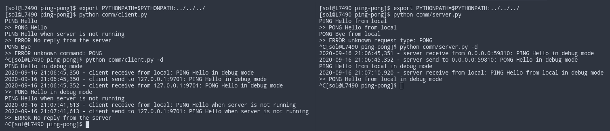

# Ping-Pong

Простой пример клиент-серверного приложения на dslib. Клиент отправляет серверу сообщения PING с произвольным телом. Сервер отправляет в ответ сообщения PING, повторяя содержимое сообщения клиента.

Для взаимодействия с клиентом используются локальные сообщения. Для отправки PING сообщения надо отправить клиенту аналогичное локальное сообщение. Это можно сделать прямо через консоль клиента, введя например строку `PING Hello!`. Полученный от сервера ответ клиент транслирует в локальное сообщение, которое выводится в консоль. С сервером также можно взаимодействовать, отправляя ему сообщения через его консоль.

С помощью флага `-d` можно включить вывод отладочной информации.

Пример запуска:

В `test.py` можно найти тесты, иллюстрирующие возможности dslib в плане тестирования приложений. При запуске тестам надо передать путь к директории с реализациями клиента и сервера, например `comm`. Имеющиеся примеры реализаций не проходят большинство тестов (тесты ожидают доставку PONG даже в случае ошибок), это сделано намеренно, чтобы показать работу тестов. Обратите также внимание, что часть тестов являются рандомизированными и поэтому недетерминированными. В качестве самостоятельного упражнения вы можете доработать одну из реализаций, чтобы она проходила все тесты.