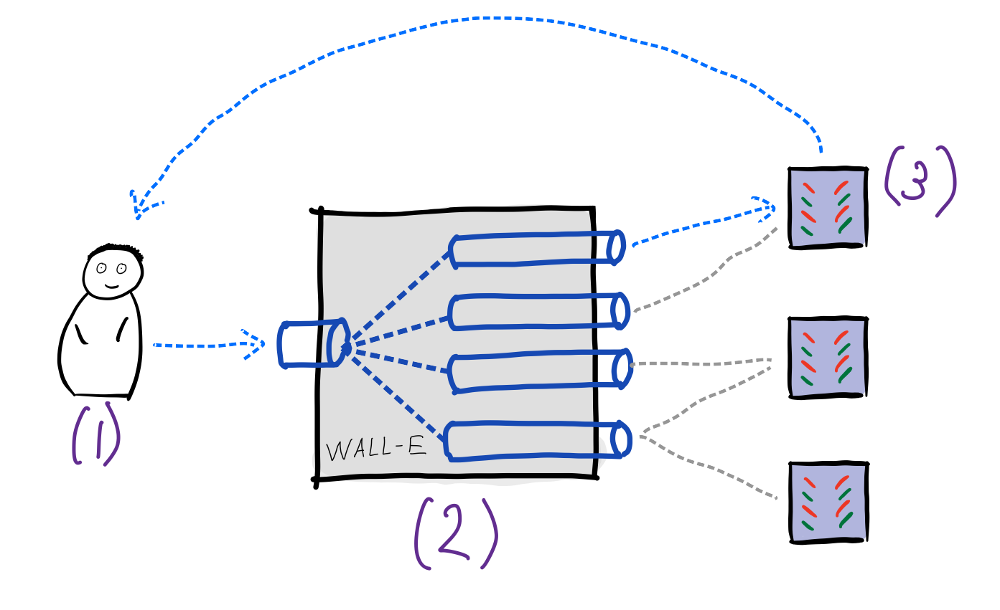

# Семинар 5. Message queue, RabbitMQ и Kafka.

## Что такое Message Queue?

Message queue, или mailbox -- технология, позволяющая в некотором смысле
упростить межпроцессное взаимодействие, происходит оно по сети между разными
машинами или же локально на одной машине. 

Здесь стоит заметить, что парадигма очереди сообщений и publisher/subscriber
являются родственными: одно можно выразить через другое и наоборот. 

## Примеры использования

Для message queue есть много различных применений:

- Асинхронная обработка запросов
- Доставка сообщений
- Real-time доставка данных
  - В частности, доставка логов с продакшен машин в базу данных

Поговорим поподробнее про каждый из этих сценариев.

### Асинхронная обработка запросов

Архитектура приложения может выглядеть следующим образом:

Пользователь (1) отправляет сообщение-запрос в брокер сообщений. Брокер (2)
определяет очередь, к которой относится запрос и записывает в конец этой
очереди. Сервер (3) по мере возможностей забирает сообщения из очереди,
обрабатывает их и дальше отправляет результат либо сразу пользователю, либо
через тот же брокер, либо пишет результат в хранилище.

### Доставка данных

Также message queue можно использовать там, где до боевого окружения необходимо
доставить много разного рода данных.

Примером может служить следующая ситуация: сервера в продакшен-окружении
отвечают на запросы пользователей. При этом, раз в некоторое время (допустим,
10-15 минут) происходит обновление данных (например, данные о пробках в картах).
Для того, чтобы упростить архитектуру, можно поставить брокер сообщений, в одну
из очередей которого продьюсеры данных пишут оперативные данные, а сервера из
продакшен-окружения читают из нужных им очередей. 

Из-за наличия уже написанных message brokerов задача доставки данных до
продакшена решается очень легко и просто.

Стоит отдельно отметить _доставку логов_. Допустим, в боевом окружении
происходит очень много событий, которые мы отслеживаем. Хочется иметь одно
место, в которое эти логи будут стягиваться, чтобы над ними делать аналитику
(например, Clickhohuse). Для этого тоже можно использовать брокеры сообщений.
Наглядный пример перед глазами -- VK и их архитектура доставки логов. Здесь рекомендуется прочитать [первоисточник](https://habr.com/ru/company/vk/blog/430168/). 

## Внутренности

Существует несколько протоколов, позволяющих реализовывать message queue. Здесь
мы быстро посмотрим на AMQP (_Advanced Message Queuing Protocol_). Как всегда,
интересующиеся могут почитать 40-страничную спецификацию и 63-страничное
описание всех возможных типов сообщений. 

### Транспорт сообщений

Протокол является бинарным протоколом над стэком TCP/IP. Таким образом из
коробки у протокола есть порядок сообщений, целостность и надежность доставки.

### Логика обработки

Протокол работает на уровне _узлов_ (англ. _peers_). Каждый узел имеет свою роль -- он может быть _клиентом_ (англ. _client_) или _сервером_ (англ. _server_). Сервер отвечает за обработку логики очередей сообщений, реализуя функции точки обмена (англ. _exchange_) и самой очереди (англ. _queue_); клиент же может как _отправить_ (англ. _produce_) сообщение в очередь, так и из очереди сообщение _забрать_ (англ. _consume_).

Продюсер подготавливает и отправляет сообщение точке обмена. Она, в свою очередь, изучает содержимое сообщения и на основании известных ей правил, отправляет сообщение в одну из очередей. С точки зрения реализации, очередь может храниться на диске или в оперативной памяти. 

Консьюмер же подписывается на очередь сообщений, читая из нее сообщения. Для этого он подключается к точке обмена и говорит ей, на какие очереди он хочет подписаться. После этого, при появлении нового сообщения, очередь отправляет консьюмеру это сообщение.

Когда консьюмер получил сообщение, он должен либо отправить подтверждение (ack), либо отрицательное подтверждение (nack), показывающее, смог ли консьюмер обработать это сообщение. Если пришел ack, то сообщение удаляется из очереди, и обработка следующего сообщения переходит к следующему консьюмеру, подписанному на ту же очередь (такая схема называется round robin). 

Если пришел nack, то сообщение может быть отброшено, отправлено другому консьюмеру или отправлено обратно продюсеру, в зависимости от настроек точки обмена и пожеланий продюсера.

### Гарантии протокола

Если message broker, который вы используете, в полной мере реализовывает AMQP, то у вас есть гарантия, что сообщения в очереди будут обработаны в порядке их поступления в очередь. То есть, если есть всего один поставщик продюсер данных, то его сообщения придут в очередь в том же порядке, что и он их отправил (по причине того, что протокол работает поверх TCP). Если же продюсеров несколько, то гарантируется порядок для сообщений каждого из них, но порядок между ними не гарантируется.

## Queue-as-a-service

Соблюдая все заповеди построения (микро)сервисных распределённых систем, реализацию очереди сообщений лучше использовать отдельно от любого вашего приложения. Для этого, конечно же, надо взять что-то популярное и широкоиспользуемое. Ещё такие сервисы называют _брокерами сообщений_.

По большому счёту, существует две наиболее популярных реализации, каждая из которых имеет свои плюсы и минусы:
- **RabbitMQ:** достаточно прост в использовании, имеет веб-интерфейс для контроля очередей сообщений, однако не умеет в честную репликацию и шардирование, а значит начиная с некоторых объёмов сообщений (очень больших) придётся искать замены;
- **Apache Kafka:** более сложна в использовании, не имеет веб-интерфейса, но умеет в репликацию и шардирование топиков (очередей), как следствие более масштабируема, чем RabbitMQ.

Туториалы и видео:
- Отличные официальные RabbitMQ Tutorials: https://www.rabbitmq.com/getstarted.html
- Большой доклад про различия RabbitMQ и Kafka: [часть 1](https://www.youtube.com/watch?v=_4CSNrIZQxU), [часть 2](https://www.youtube.com/watch?v=znZa4gaubLE).
- Официальные туториалы по Kafka от Apache: https://kafka.apache.org/intro
- Туториалы по Kafka от Confluent (частная компания, зарабатывающая на консалтинге по Kafka и распространяющая специальную версию Kafka с расширениями за деньги): https://kafka-tutorials.confluent.io

Мы подготовили небольшой пример использования RabbitMQ, чтобы было понятно, что воспользоваться RabbitMQ в своём маленьком приложении это просто: [Примеры](./examples/readme.md)
