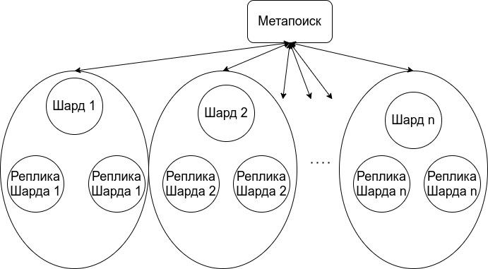
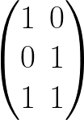
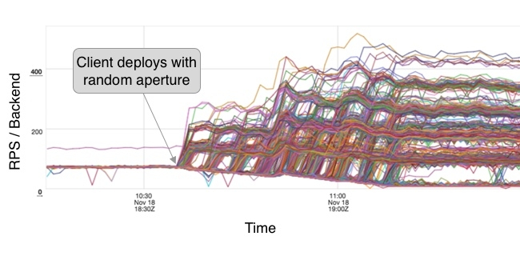
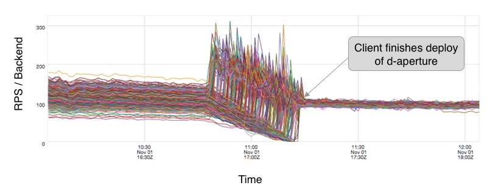

# Высоконагруженные сервисы

Когда количество трафика настолько вырастает, что становится сложно обрабатывать
запросы на одном сервере, то вскоре надо уметь реплицировать данные, правильно
обрабатывать, балансировать запросы и быть уверенным, что можно и дальше
расширять систему (что на самом деле, самое важное).

## Read-only

Так бывает, что если вы можете гарантировать, что ваша система обладает
свойством read-only продолжительное время и тем самым не будет проблем с тем, что
происходит с данными при перезаписях, что все реплики идентичны,
что если какая-то остановится или не ответит. Примерами таких систем
являются самые нагруженные системы в мире, а именно, поисковые компоненты,
сбор метрик, статистик (например, количество просмотров у видео),
где огромное количество данных не требуется обновлять каждую секунду.

### Как верхнеуровнего (был когда-то) устроен поиск у Google, Yandex, Bing, etc

Поисковые движки, по разным оценкам, обновляют большую часть своих данных раз
в день или два. Так как интернет меняет не очень много данных в день, то
индекс можно перекладывать инкрементально или отложенно, что даёт большое
пространство для манёвра в запросах, поэтому поиски в своей инженерной части
состоят из следующих компонент:

1. Scraping сайтов, добавление документов в общий пул документов.
2. Много всякой фильтрации типа склейки дублей и тд. Не относится к теме
   сегодняшнего разговора.
3. Обновление страниц, которые что-то поменяли в своём содержании. В основном
   это делается с помощью mapreduce технологий, а уже скорее pipeline
   технологиями с операциями mapreduce.
4. Подмена индекса/части индекса раз в день/два. В основном меняют балком в
   датацентрах, ночью с близлежащими регионами. Тем не менее, если старая версия
   выдалась в поиске, ничего страшного.
5. Отдельные компоненты для scraping новых документов, например, новостей. Они
   подменяются по разному, от десятков минут до нескольких часов в фоне.

Почти все поиски разбивают документы на тиры (самые горячие, менее горячие и всё
остальное) и выстраивают репликацию в зависимости от этого. Конечно, чем больше
документов, тем сложнее выполнять шарду работу, но это всегда баланс между
latency -- не очень хочется, чтобы шарды отвечали долго, а также не очень
хочется, чтобы метапоиск (который спрашивает эти шарды) открывал много
соединений.

Очень долго поиски придерживались (а Elastic такого до сих пор и придерживается)
достаточно простой схемы запроса

<p align="center"></p>

Эта система практически не расширяема на несколько тысяч запросов и 5-10
миллиардов документов, потому что ускорения поиска документов в шарде уже
становится очень сложной задачей и является узким местом в этой системе, а
увеличение количества шардов линейно с количеством запросом деградирует
метапоиск. Ещё если возникают проблемы с тем, что какая-то реплика шарда не
отвечает, метапоиск должен эту логику корректно обрабатывать, на что просто
с расширением системы не хватит ресурсов. Тем не менее, для каких-то более
простых поисковых систем такая схема очень хорошо подойдёт и до сих пор
используется в том же Elastic Search.

Как проблему расширяемости количества шардов решить? Надо балансировать запросы
и разгружать метапоиск, это можно сделать количеством увеличения метапоисков, но
такой метод не является самым эффективным на практике, а хотелось бы как-то
сублинейно расти в потребляемом ресурсе.

Давайте будем задавать запросы не всем шардам одновременно, а создадим уровневые
метапоиски, которые контролируют под собой много шардов, то есть мы будем
создавать ветвление каждого метапоиска и создадим t главных метапоисков, которые
контролируют по k обычных, которые контролируют по n шардов.

<p align="center"></p>

Так мы только добавили tk новых соединений, но значительно разгрузили
метапоиски, а при сборе информации можно удалять ненужные документы (ведь
никто дальше 1-й страницы почти никогда не пойдёт, хватит сотни документов :)).

Представьте, что мы решили сделать ветвление по 30 с 3 уровнями, тогда такая
система вполне себе живёт, и мы получаем 30^3 = 27000 шардов, шарды где-то
хранят десятки миллионов документов и в итоге получаем 270 миллиардов документов
с достаточно стабильной системой всего с 30^2 = 900 дополнительными
соединениями во всем датацентре. Так как сеть растёт (недавно приняли стандарт
на 800 гбит/c) намного быстрее и будет расти так ближайшие 10-20 лет, чем CPU,
Disk и RAM, то мы практически бесплатно сделали нашу систему в разы более
масштабируемой. *Вопрос: какая скорость увеличения соединений у одного
метапоиска при 3 уровнях с одинаковым ветвлением?*.

Создавать очень много уровней тоже не лучшая идея из-за вероятностей ошибок,
таймаутов, сложности поддержки. Но так как экспонента растёт достаточно быстро,
то 2-3 уровня -- вполне рабочая стратегия для шардированных огромных систем.

## Репликация (не только) в read-only системах

В большинстве сервисов обычно данные реплицируют на 3 реплики, это себя
зарекомендовало как стандарт (а началось это скорее всего из-за [GFS](https://static.googleusercontent.com/media/research.google.com/en//archive/gfs-sosp2003.pdf)).
Например, файловые системы Яндекса и Google ни разу за 15+ лет не потеряли ни
одного байта данных из-за того, что репликации 3 было недостаточно.

Иногда очень горячие данные реплицируют больше, чтобы разгрузить к ним доступ,
такое встречается достаточно редко, так как обычно очень горячие данные
помещаются в память и делают отдельное кэширование в этом направлении. К
счастью, такие примеры есть, например, AWS и Google Cloud предлагают такие
решения для очень горячих данных.

К сожалению, если бы Google хранил все данные честно в трёх репликациях, это
ничем хорошим бы не закончилось, так как данных ну очень много, несколько
экзабайт (10^18 байт, а оценки доходят до 2^64 байт). Пришлось бы намного больше
покупать дисков.

Опыт использования GFS в Google, Hadoop в Facebook-e, Azure в Microsoft
показывает, что это можно сделать без особых потерь надежности хранения и
эффективности использования кластера. Идея состоит в том, чтобы заменить
тройную репликацию на другой способ хранение данных так, чтобы минимизировать
overhead на хранения данных, при этом уметь переживать выпадение как минимум
двух машин кластера (дисков), и не замедлить вычисления.

### Erasure Coding

Существует классическая задача теории передачи информации -- построение кодов,
исправляющих ошибки. Код, исправляющий k ошибок, -- это такой код, который
позволяет закодировать произвольные исходные данные (то есть построить
кодирующий набор битов на основе исходного) таким образом, что внесение любых k
изменений в полученный набор битов позволяло бы однозначно восстановить исходный
текст.

В текущей задаче нужны более слабые коды, а именно не бывает ошибок в данных,
вместо этого они могут пропадать. Такие коды называются erasure кодами.
Классической конструкцией, решающей как задачу построения кодов, исправляющих
ошибки, так и erasure кодов, является код Рида-Соломона.
Пусть имеется n исходных бит. Построим k дополнительных бит так, что можно
исправить любые  ошибок или восстановить любые k пропавших бит.
Подробности можно прочитать в [википедии](https://en.wikipedia.org/wiki/Reed%E2%80%93Solomon_error_correction). Краткая идея такая: Контрольные биты
вычисляются линейным преобразованием, то есть умножением (над полем Z_2) на
битовую матрицу специального вида.

<p align="center"></p>

Остается подобрать матрицу так, чтобы при потере любых k бит можно было
восстановить исходные данные. Для этого достаточно потребовать, чтобы при
удалении из матрицы любых k строк оставшиеся строки были бы
линейно-независимыми. Почему этого достаточно? Для определенности будем считать,
что после потерь у нас осталось лишь n кодовых бит (лишние биты всегда можно
выкинуть). Рассмотрим подматрицу, построенную из строк, соответствующих
оставшимся битам. Исходя из нашего требования, эта подматрица будет
невырожденной, поэтому её можно обратить. Умножим обращенную матрицу на
выжившие кодовые биты и получим значения исходных бит.

В качестве простейшего примера можно рассмотреть матрицу кодирования для n=2, k=1:

<p align="center"></p>

Первые два кодовых бита соответствуют битам исходных данных, а третий бит будет
равен xor-у исходных. Так мы получили классический способ исправления одной
ошибки: подсчет xor-a исходных данных.

В реальности никто не работает напрямую с битами, вместо этого исходные данные
рассматриваются побайтово, где каждый байт является элементом поля Галуа GF(2^8)
(это естественный и единственный способ построения поля из 256 элементов;
сложением в поле является XOR, умножение определено сложнее, это перемножение
многочленов по модулю неприводимого над Z_2 степени 7).

Для обозначения кода Рида-Соломона с n частями входных данных и k частями parity
данных мы будет писать просто n + k).

Для работы с элементами из поля Галуа можно использовать предпросчитанную
таблицу умножения. Практически есть еще более быстрый способ: задачу можно
свести к вычислению XOR-ов, для этого надо элементы из GF(2^8) вложить в
множество битовых матриц 8 на 8, с естественной операцией сложения и умножения.
Такая разновидность называется кодами Коши-Рида-Соломона.

Основные операции, которые надо производить над erasure данными - это запись,
чтение и восстановление. Наиболее трудоемкой здесь является операция
восстановления. А именно - предположим, что мы используем схему 6 + 3 и потеряли
машинку, на которой было 4 Тб erasure данных. Для восстановления каждого из
потерянных партов необходимо прочитать как минимум 6 не потерянных, то есть
суммарно надо прочитать и обработать 4 * 6 = 24 Тб данных, причем все эти
данные придется прогнать по сети (так как все erasure парты лежат на разных
машинках). Как показывают эксперименты на кластере из 200 машин с гигабитной
сетью на восстановление такого объема данных уходит десятки минут.
Это ограничение не позволяет брать схемы с большим значением параметра n.

С другой стороны, если мы хотим overhead не больше 50%, отсюда получается ограничение
k <= n/2. Также оказывается, что при k=2 гарантии на сохранность данных ниже,
чем при тройной репликации. А именно, пока выпадает не более 2 нод, в обоих
случаях нет потерь. Однако, при выпадении трех нод количество данных, потерянных
в случае Рида-Соломона, будет существенно больше (посчитайте вероятность сами).

Поэтому многие системы выбирают репликацию 6 + 3, однако как мы написали выше,
она может быть достаточно медленной.

Однако на практике есть более эффективные решение -- одно из них опубликовала
Microsoft -- [Locally Reconstructable Codes](https://www.microsoft.com/en-us/research/wp-content/uploads/2016/02/LRC12-cheng20webpage.pdf), которые являются небольшой
модификацией кодов Рида-Соломона. В данной схеме количество партов с данными
берется равным 12, после чего подсчитываются два xor-парта - для первых 6 партов
с данными и для вторых 6. После этого подсчитываются два parity парта по схеме,
аналогичной Риду-Соломону. То есть кодовые парты так же как и в Риде-Соломоне
подсчитваются с помощью линейного преобразования, однако не выполняется условие
о том, что матрица невырождена после удаления любых 4-х строк. Данная схема
хороша по нескольким причинам:

1. При потере одного из первых 14 партов для его восстановления требуется лишь
подсчитать xor других 6 партов (при потере одного из последних двух партов, к
сожалению, приходится вычитывать все 12 партов с данными). Так как данные
разбиты на большее количество кусков, придётся прочитать максимум половину для
7/8 случаев, но в 1/8 придётся прочитать всё, что хуже, так как придётся открыть
соединение для всех машин, где лежат куски.
2. Данная схема даёт большую экономию данных, чем 6+3, а именно overhead равен
33% вместо 50%.
3. Данная схема позволяет переживать выпадение не только 3 машин, но и 4 с
минимальными потерями. А именно, только 12.5% вариантов потери отдельных партов
чанка приводят к потере всего чанка.

## Балансировка

После большой части по репликации и высоконагруженных систем с индексами,
поговорим о системах, которые не имеют под собой данных, а именно балансеры и
разберём некоторые идеи из системы балансировки в небезызвестной системе
Twitter.

Первая идея, которая приходит на ум при балансировке запросов это случайная
балансировка m запросов на n сервисов, и, к сожалению, она плоха работает. Так
происходит из-за того, что при равномерном распределении максимальная загрузка
одного из бекендов будет достаточно больше, а именно, можете попробовать
запустить [скрипт](./balancing/power_of_2_choices.py). У меня результат
получился таким, при распредлении миллиона запросов на тысячу бекендов в
случайном распределении один из бекендов получает на 10% больше запросов.

```
Max random :  1120
Max P2C    :  1002
```

К сожалению, так работает теория вероятностей и максимальная загрузка будет равна

<p align="center"></p>

P2C -- это Power of 2 Choices -- мы случайно выбираем два бекенда, смотрим у
кого меньше запросов и выбираем тот, у кого их действительно меньше. В итоге при
таком распределении максимальная загрузка будет равна

<p align="center"></p>

Такой результат впервые был продемонстрирован в 1991 году и имеет сравнительно
простое доказательство, которое вы можете почитать
[здесь](https://www.eecs.harvard.edu/~michaelm/postscripts/mythesis.pdf). Он
используется во многих балансерах, и сейчас расскажем почему.

Из хорошего, у P2C остаток независим от количества запросов, тем самым мы можем
сглаживать все неровности при любом определении понятия "загрузка бекенда". Это
может быть количество запросов или количество потребляемого CPU, всё это
будет равномерно распределено со временем при P2C.

С запросами (L7 по OSI) то всё хорошо, но когда мы доходим до L5 уровня
балансера, то надо работать с сессиями. Они хоть и являются основным побудителем
запросов, но каждый раз открывать новую сессию тоже не хочется (клиенты
могут ощущать разницу по latency), а устанавливать коннект со всеми бекендами
плохо работает, так как их становится сотни-тысячи особенно в культуре
микросервисов и расширения систем. А ещё начинаются проблемы с проверкой
здоровья сервисов, так как запросов ну очень много.

Если открывать все сессии со всеми бекендами, то такой подход называется
full-mesh topology

<p align="center"></p>

Первое и очевидное решение как побороть full-mesh открытие сессий -- не
открывать их со всеми репликами бекенда, а только со случайным подмножеством.
Правда возникает несколько вопросов, со сколькими репликами, в целом это
решается пропорционально количеству запросов от клиента и подбором распределения
при сборе "обратной связи" со всеми.

<p align="center"></p>

К сожалению, хоть такой подход и уменьшает количество открываемых сессий на 99%
в микросервисной архитектуре, но создаёт очень большой разброс, который сильно
похож на биномиальное распределение.

Получается, что такой подход является достаточно расширяемым, но не обладает
свойством честности.

Чтобы значительно увеличить честность, в балансерах любят использовать
балансировку при помощи отрезков. Тем не менее, стоит учитывать пару условий,
которые верны для всех балансеров

1. Никаких сложных консенсусов для клиентов в выборе бекендов
2. При добавление бекендов или клиентов, должно быть легко поменять, как говорят,
   топологию

Отрезки выбираются непрерывно и с переполнением по количеству бекендов, поэтому
балансеры любят обозначать клиентов и серверов как равномерными точками
координат на круге.

<p align="center"></p>

Это похоже на consistent hashing, за исключением того, что мы можем
гарантировать идеальное распределение узлов по кольцу для соответствующего
сервиса, потому что мы заранее знаем принадлежность в каждом кольце -- это
просто набор клиентов или серверов.

Далее предлагается объединить эти точки по случайной координате и для каждого
клиента по часовой стрелке выписать всех серверов

<p align="center"></p>

Это значительно улучшает распределение клиентов по бекендам и такую таблицу
достаточно легко пересчитывать. Тем не менее, оно создаёт проблемы для некоторых
бекендов из-за того, что наложение многих клиентов может привести к перенагрузке
определённых серверов. Так получается из-за дискретности пространства точек на
круге, поэтому надо брать отрезки.

<p align="center"></p>

В Twitter предложили для определённого отрезка клиента (который обозначает
количество какую часть от всех бекендов он хочет) выбирать центр дискретно,
а концы пересчитывать в их дробной части

<p align="center"></p>

Да, оно откроет на одно соединение больше. Также мы будем балансировать,
учитывая размер концов, то есть в примере сверху мы в бекенды 2 и 4 будем слать
только 2/3 нагрузки от бекенда 3.

Это почти ничем не отличается от дискретной части, только равномерно
распределяет концы. После этого мы можем спокойно применить P2C для сглаживания
нагрузки на круге и алгоритм будет таким:

1. Выберем два случайных отрезка на круге из дискретных сервисных точек на круге
2. Возьмём тот, в котором меньше суммарная нагрузка от остальных отрезков

В итоге для сессий мы выбираем P2C отрезок для выборов бекенда и для бекендов мы
выбираем их при помощи P2C.

Мы не упомянули размер подключений в этой модели, но если вы заметили, он
естественно выпадает из кругового представления. Как минимум, это 1 / N,
где N - количество инстансов в кольце. Но это не обязательно должно быть сведено
к такому числу. Можно увеличивать или уменьшать этого размер, пока делаем полный
оборот вокруг целевого кольца. Например, по-прежнему можно динамически изменять
размер в зависимости от нагрузки запросов (при условии, что все участники
однорангового кольца согласны с одинаковым размером, что потребует более
активной формы координации). По умолчанию в Твиттере эмпирически обнаружили,
что размер не менее 10 бекендов обеспечивает хороший баланс между устойчивостью
и количеством подключений.

Распределение запросов стало в разы лучше и достигло почти того же уровня, что
и full-mesh + P2C

<p align="center"></p>

Дисперсия распределения запросов тоже сильно уменьшилась

<p align="center"></p>

Количество сессий уменьшилось на 91% по сравнению с рандомизированным выбором
множества для открытия сессий, а как мы знаем, до этого с полного full-mesh, оно
уменьшилось на 99% ещё.

<p align="center"></p>

Тем не менее, и у такой модели есть несколько недостатков.

1. P2C работает идеально в предположении, что нагрузка равномерна от клиентов,
   но так не всегда бывает, поэтому стоит избавляться от слишком больших
   клиентов, предоставляя им отдельный сервис или ничего не делать, так как на
   практике вроде и так неплохо работает. Это, кстати, достаточно частая
   практика в распределённых системах и математических составляющих, ослабить
   какое-то условие, на которое есть интуиция, что оно не повлияет сильно и
   попробовать нужный метод. В итоге достаточно часто получается просто хорошо.
2. Сложности с резким увеличением количества запросов от одного клиента,
   кольца могут не успеть всё пересчитать и снова получится скос в сторону
   неравномерности.

# Полезные ссылки

1. [Оригинальная статья про балансер Твиттера](https://blog.twitter.com/engineering/en_us/topics/infrastructure/2019/daperture-load-balancer.html)
2. [Power of 2 choices](https://www.eecs.harvard.edu/~michaelm/postscripts/mythesis.pdf)
3. [Consistent Hashing](https://web.archive.org/web/20110721203235/http://www.tomkleinpeter.com/2008/03/17/programmers-toolbox-part-3-consistent-hashing/) и [ещё](http://michaelnielsen.org/blog/consistent-hashing/)
4. [LRC коды](https://www.microsoft.com/en-us/research/wp-content/uploads/2016/02/LRC12-cheng20webpage.pdf)
5. [Erasure Coding at Scale in Yandex.Tables](https://assets.ctfassets.net/oxjq45e8ilak/3xPcIZlk28eJfMuqmjQzLL/e94ada176f20dae5f117fe0221aa897c/Erasure_Coding_At_Scale.pdf)
