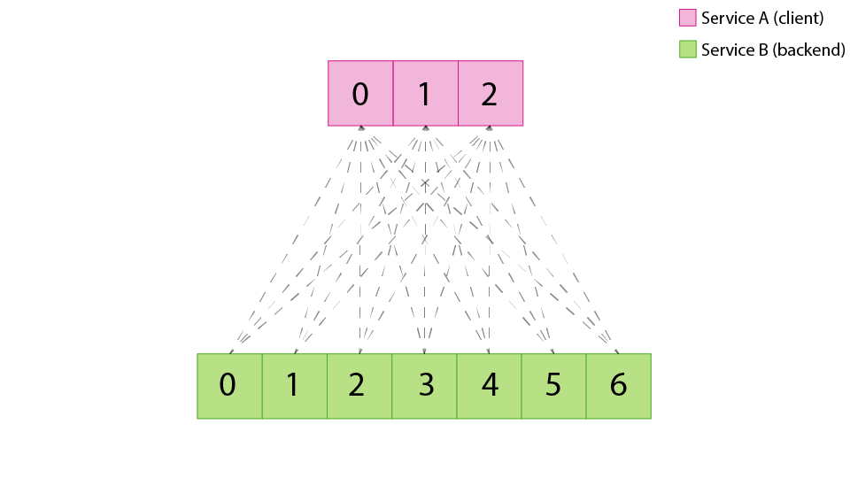
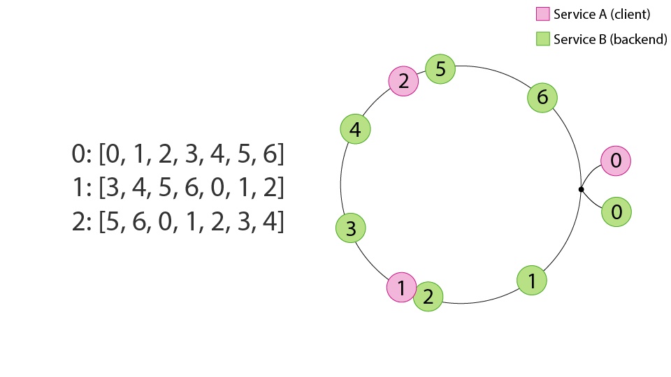
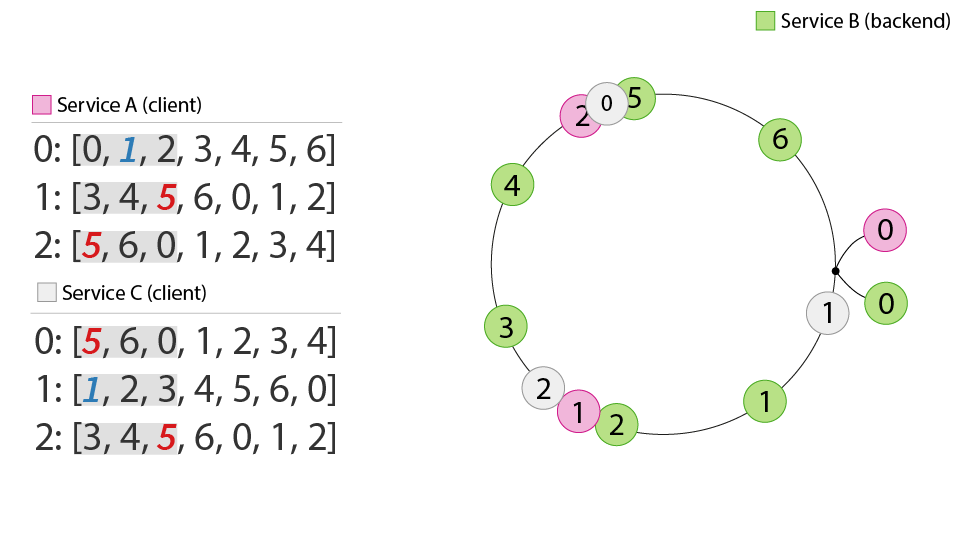
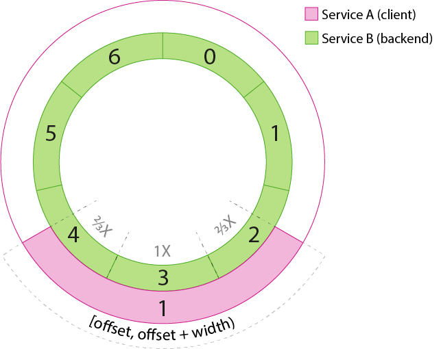
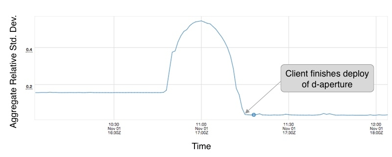
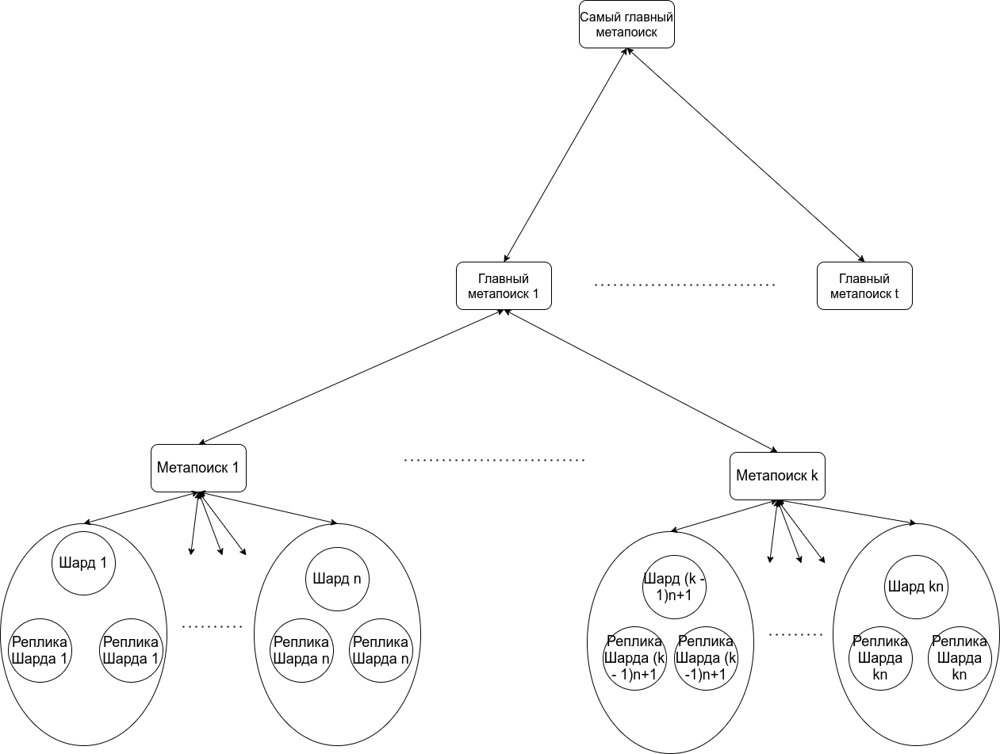

# Высоконагруженные сервисы и балансировка нагрузки

Когда количество трафика или данных настолько вырастает, что становится сложно обрабатывать
запросы на одном сервере, то вскоре надо уметь реплицировать сервисы и данные по нескольким серверам, шардировать (то есть делить) данные и запросы к ним, правильно
обрабатывать и распределять (балансировать) запросы, будучи при этом уверенным, что можно и дальше
расширять систему (что на самом деле, самое важное).

## Балансировка нагрузки на реплики

Когда у нас есть множество одинаковых read-only реплик или stateless сервис (его инстансы тоже будем называть репликами, потому что они по определению одинаковы), нам надо решить задачу балансировки нагрузки по этим репликам, причём так, чтобы нагрузка была размазана равномерно по всему кластеру. Тот факт, что все реплики одинаковы, даёт нам возможность не думать о связи запросов между собой – каждый из них может быть направлен на любую реплику и это нормальное поведение. Это самая простая конструкция для балансировки нагрузки.

Первая идея, которая приходит на ум при балансировке запросов, это случайная
балансировка m запросов на n сервисов, и, к сожалению, она плоха работает. Так
происходит из-за того, что при равномерном распределении максимальная загрузка
одного из бекендов будет достаточно больше, а именно, можете попробовать
запустить [скрипт](./balancing/power_of_2_choices.py). У меня результат
получился таким – при распредлении миллиона запросов на тысячу бекендов в
случайном распределении один из бекендов получает на 10% больше запросов.

```
Max random :  1120
Max P2C    :  1002
```

К сожалению, так работает теория вероятностей и максимальная загрузка будет равна

<p align="center"></p>

P2C это Power of 2 Choices – мы случайно выбираем два бекенда, смотрим у
кого меньше запросов и выбираем тот, у кого их действительно меньше. В итоге при
таком распределении максимальная загрузка будет равна

<p align="center"></p>

Такой результат впервые был продемонстрирован в 1991 году и имеет сравнительно
простое доказательство, которое вы можете найти
[здесь](https://www.eecs.harvard.edu/~michaelm/postscripts/mythesis.pdf). Он
используется во многих балансерах, и сейчас расскажем почему.

Из хорошего, у P2C остаток независим от количества запросов, тем самым мы можем
сглаживать все неровности при любом определении понятия "загрузка бекенда". Это
может быть количество запросов или количество потребляемого CPU, всё это
будет равномерно распределено со временем при P2C.

С запросами (L7 по OSI) то всё хорошо, но когда мы доходим до L5 уровня
балансера, то надо работать с сессиями. Они хоть и являются основным побудителем
запросов, но каждый раз открывать новую сессию тоже не хочется (клиенты
могут ощущать разницу по latency), а устанавливать коннект со всеми бекендами
плохо работает, так как их становится сотни-тысячи особенно в культуре
микросервисов и расширения систем. А ещё начинаются проблемы с проверкой
здоровья сервисов, так как запросов ну очень много.

Если открывать все сессии со всеми бекендами, то такой подход называется
full-mesh topology

<p align="center"></p>

Первое и очевидное решение как побороть full-mesh открытие сессий -- не
открывать их со всеми репликами бекенда, а только со случайным подмножеством.
Правда возникает несколько вопросов, со сколькими репликами, в целом это
решается пропорционально количеству запросов от клиента и подбором распределения
при сборе "обратной связи" со всеми.

<p align="center"></p>

К сожалению, хоть такой подход и уменьшает количество открываемых сессий на 99%
в микросервисной архитектуре, но создаёт очень большой разброс, который сильно
похож на биномиальное распределение.

Получается, что такой подход является достаточно расширяемым, но не обладает
свойством равномерности распределения нагрузки (справедливости).

Чтобы значительно улучшить справедливость, в балансерах любят использовать
балансировку при помощи отрезков. Тем не менее, стоит учитывать пару условий,
которые верны для всех балансеров

1. Никаких сложных консенсусов для клиентов в выборе бекендов
2. При добавлении бекендов или клиентов, должно быть легко поменять, как говорят,
   топологию

Отрезки выбираются непрерывно и с переполнением по количеству бекендов, поэтому
балансеры любят обозначать клиентов и серверы в виде точек 
на кольцевой системе координат.

<p align="center"></p>

Это похоже на consistent hashing, за исключением того, что мы можем
гарантировать идеальное распределение узлов по кольцу для соответствующего
сервиса, потому что мы заранее знаем принадлежность в каждом кольце -- это
просто набор клиентов или серверов.

Далее предлагается объединить эти точки по случайной координате и для каждого
клиента по часовой стрелке выписать все серверы.

<p align="center"></p>

Это значительно улучшает распределение клиентов по бекендам и такую таблицу
достаточно легко пересчитывать. Однако это также создаёт проблемы для некоторых
бекендов из-за того, что наложение многих клиентов может привести к перенагрузке
определённых серверов. Так получается из-за дискретности пространства точек на
круге, поэтому надо брать отрезки.

<p align="center"></p>

В Twitter предложили для определённого отрезка клиента (который обозначает
количество какую часть от всех бекендов он хочет) выбирать центр дискретно,
а концы пересчитывать в их дробной части

<p align="center"></p>

Да, оно откроет на одно соединение больше. Также мы будем балансировать,
учитывая размер концов, то есть в примере сверху мы в бекенды 2 и 4 будем слать
только 2/3 нагрузки от бекенда 3.

Это почти ничем не отличается от дискретной части, только равномерно
распределяет концы. После этого мы можем спокойно применить P2C для сглаживания
нагрузки на круге и алгоритм будет таким:

1. Выберем два случайных отрезка на круге из дискретных сервисных точек на круге
2. Возьмём тот, в котором меньше суммарная нагрузка от остальных отрезков

В итоге для сессий мы выбираем P2C отрезок для выборов бекенда и для бекендов мы
выбираем их при помощи P2C.

Мы не упомянули размер подключений в этой модели, но если вы заметили, он
естественно следует из кругового представления. Как минимум, это 1 / N,
где N - количество инстансов в кольце. Но это не обязательно должно быть сведено
к такому числу. Можно увеличивать или уменьшать этот размер, пока делаем полный
оборот вокруг целевого кольца. Например, по-прежнему можно динамически изменять
размер в зависимости от нагрузки запросов (при условии, что все участники
однорангового кольца согласны с одинаковым размером, что потребует более
активной формы координации). По умолчанию в Твиттере эмпирически обнаружили,
что размер не менее 10 бекендов обеспечивает хороший баланс между устойчивостью
и количеством подключений.

Распределение запросов стало в разы лучше и достигло почти того же уровня, что
и full-mesh + P2C

<p align="center"></p>

Дисперсия распределения запросов тоже сильно уменьшилась

<p align="center"></p>

Количество сессий уменьшилось на 91% по сравнению с рандомизированным выбором
множества для открытия сессий, а как мы знаем, до этого при переходе с полного full-mesh оно
уменьшилось ещё на 99%.

<p align="center"></p>

Тем не менее, и у такой модели есть несколько недостатков.

1. P2C работает идеально в предположении, что нагрузка равномерна от клиентов,
   но так не всегда бывает, поэтому стоит избавляться от слишком больших
   клиентов, предоставляя им отдельный сервис или ничего не делать, так как на
   практике вроде и так неплохо работает. Это, кстати, достаточно частая
   практика в распределённых системах и математических составляющих – ослабить
   какое-то условие, если есть интуиция, что оно не повлияет сильно, и
   попробовать нужный метод. В итоге достаточно часто получается просто хорошо.
2. Сложности с резким увеличением количества запросов от одного клиента – 
   кольца могут не успеть всё пересчитать и снова получится скос в сторону
   неравномерности.

## Шардирование

Когда у нас нет возможности сделать все инстансы сервиса одинаковыми? Например, все данные в read-only системе не лезут в память одной машины (пусть это будут терабайты данных), а надо отвечать только из памяти, потому что с диска слишком медленно. Или когда запросы к сервису имеют сильно не константную сложность и зависят между собой, то есть запросы про один объект или от одного пользователя должны приземляться на одну и ту же машину. В обоих случаях ресурсы одной машины кончатся очень быстро, а нам хочется уметь расширяться для выдерживания бОльшей нагрузки.

В таких ситуациях используют деление состояния — то есть данных и запросов, относящихся к этим данным. Это называется _шардированием_, а один инстанс называется _шардом_. Каждый шард держит разную порцию данных и умеет обслуживать только одно множество запросов, причём эти множества не должны пересекаться.

При решении задачи шардирования возникают следующие вопросы:
1. Как же нам разделить данные между шардами и как в последствии быстро делить входящий поток запросов к ним?
2. Сможем ли мы добавлять и убирать шарды с переливанием между ними данных, если в какой-то момент состояние на одном шарде опять станет слишком большим?
3. Как нам обеспечить равномерную нагрузку в такой системе, если какие-то шарды пользуются большей популярностью, чем другие?
4. Есть ли в нашей системе single point of failure? (этот вопрос надо задавать к дизайну любой распределенной системы)

При шардировании выделяется ключ шардирования, по значению которого определяется куда отправятся данные/запрос. Давайте для простоты будем шардировать key-value хранилище, запросы к нему — это GET/PUT/DELETE бинарных данных по string ключу.

### Простейшее шардирование

Самым простым способом шардирования кажется следующий. Давайте где-то держать ещё одну хэш-таблицу ключ-шард и новые ключи как-то туда добавлять. Как мы ответим на наши вопросы?

1. [шардирование запросов] Разделить данные легко, просто составим табличку с распределением. На каждый входящий запрос будем спрашивать у таблички куда идти. Если пришел новый ключ, то добавим в табличку любой инстанс для этого ключа и задача решена.

2. [динамическое количество шардов] Сможем. Выберем жирный шард, добавим новый и скопируем на него часть ключей с жирного, при этом не меняя таблицу шардирования. Тут может возникнуть гонка если кто-то начнет писать новые данные по этим ключам, в состоянии перешардирования можно писать сразу на оба шарда. Когда все данные скопируются, поменяем в таблице инстанс, а на старом шарде данные можно будет удалить, так как запросы про эти данные туда больше не поступают. При удалении шарда поступим так же.

3. [равномерность нагрузки] Выявлять популярные ключи и переносить их на отдельные шарды. Это не решит проблему слишком популярных единичных ключей, можете подумать что можно сделать в это ситуации :)

4. [spof] Есть, таблица шардирования. Ещё она может быть довольно большой, и тогда нам придется решать задачу шардирования таблицы шардирования.

Решение не идеальное, но в некоторых ситуациях оно вполне подходит, например когда пространство ключей не очень большое.

### Шардирование по остатку от деления

Как мы выяснили в предыдущем варианте, хотелось бы не хранить всю табличку с ключами. Ещё один простой пример шардирования — давайте считать хэш каждого ключа и его остаток от деления на количество шардов.

Тогда

1. [шардирование запросов] На каждый запрос будем считать хэш и остаток, в целом не сложно. Исходные данные шардируются либо один раз, либо создается пустой кластер и данные туда добавляются с помощью PUT запросов.

2. [динамическое количество шардов] Вот с этим сложнее. При изменении числа шардов получится, что перевезти надо очень много данных, так как большинство ключей поменяют свой шард. При добавлении одной новой машины придется переместить n/(n+1) от всех данных. Более того, при добавлении нового шарда нам опять придется вводить состояние "перешардирования", потому что в этом состоянии может возникнуть гонка знаний о том, сколько шардов существует. В случае с key-value мы это можем решить с помощью временной дупликации запросов, а вот в более сложной системе это может быть невозможным.

3. [равномерность нагрузки] В этой ситуации тоже особо никак не решить проблему, кроме как добавлением шардов или выделением особой группы ключей со статической таблицой шардирования.

4. [spof] Точки отказа нет, кроме самого балансера.

Как видно, такая схема тоже не очень хорошо работает, когда хочется иметь динамическое количество шардов.

### Эффективное шардирование

Есть более интересная схема шардирования — шардирование с помощью consistent hashing. Предлагается прочитать: [материал про consistent hashing](https://www.toptal.com/big-data/consistent-hashing) и [про методы шардирования](https://blog.yugabyte.com/four-data-sharding-strategies-we-analyzed-in-building-a-distributed-sql-database/), в том числе с помощью consistent hashing.

Отличная архитектурная задача — самим сформулировать ответы на четыре вопроса при использовании consistent hashing. Или их можно найти в статье про no-sql базу данных Cassandra :)

## Как (был когда-то) устроен поиск у Google, Yandex, Bing, etc

Если вы можете гарантировать, что ваша система (а вернее данные в ней) обладает свойством read-only продолжительное время, то тем самым можно избавиться от многих проблем, связанных с перезаписями данных, синхронизацией реплик или их отказами. Примерами таких систем являются самые нагруженные системы в мире, а именно, поисковые компоненты, сбор метрик, статистик (например, количество просмотров у видео), где огромное количество данных не требуется обновлять каждую секунду.

Поисковые движки, по разным оценкам, обновляют большую часть своих данных раз
в день или два. Так как в интернете за день изменяется не очень много данных, то
индекс можно перекладывать инкрементально или отложенно, что даёт большое
пространство для манёвра в запросах, поэтому поиски в своей инженерной части
состоят из следующих компонент:

1. Scraping сайтов, добавление документов в общий пул документов.
2. Много всякой фильтрации типа склейки дублей и тд. Не относится к теме
   сегодняшнего разговора.
3. Обновление страниц, которые что-то поменяли в своём содержании. В основном
   это делается с помощью mapreduce технологий, а уже скорее pipeline
   технологиями с операциями mapreduce.
4. Подмена индекса/части индекса раз в день/два. В основном меняют балком в
   датацентрах, ночью с близлежащими регионами. Тем не менее, если старая версия
   выдалась в поиске, ничего страшного.
5. Отдельные компоненты для scraping новых документов, например, новостей. Они
   подменяются по разному, от десятков минут до нескольких часов в фоне.

Почти все поиски разбивают документы на уровни-тиры (самые горячие, менее горячие и всё
остальное) и выстраивают репликацию в зависимости от этого. Конечно, чем больше
документов, тем сложнее выполнять шарду работу, но это всегда баланс между
latency -- не очень хочется, чтобы шарды отвечали долго, а также не очень
хочется, чтобы метапоиск (который спрашивает эти шарды) открывал много
соединений.

Очень долго поиски придерживались (а Elastic такого до сих пор и придерживается)
достаточно простой схемы запроса

<p align="center"></p>

Эта система практически не расширяема на несколько тысяч запросов и 5-10
миллиардов документов, потому что ускорение поиска документов в шарде уже
становится очень сложной задачей и является узким местом в этой системе, а
увеличение количества шардов линейно с количеством запросом деградирует
метапоиск. Ещё если возникают проблемы с тем, что какая-то реплика шарда не
отвечает, метапоиск должен эту логику корректно обрабатывать, на что просто
с расширением системы не хватит ресурсов. Тем не менее, для каких-то более
простых поисковых систем такая схема очень хорошо подойдёт и до сих пор
используется в том же Elastic Search.

Как проблему расширяемости количества шардов решить? Надо балансировать запросы
и разгружать метапоиск, это можно сделать количеством увеличения метапоисков, но
такой метод не является самым эффективным на практике, а хотелось бы как-то
сублинейно расти в потребляемом ресурсе.

Давайте будем задавать запросы не всем шардам одновременно, а создадим уровневые
метапоиски, которые контролируют под собой много шардов, то есть мы будем
создавать ветвление каждого метапоиска и создадим t главных метапоисков, которые
контролируют по k обычных, которые контролируют по n шардов.

<p align="center"></p>

Так мы только добавили tk новых соединений, но значительно разгрузили
метапоиски, а при сборе информации можно удалять ненужные документы (ведь
никто дальше 1-й страницы почти никогда не пойдёт, хватит сотни документов :)).

Представьте, что мы решили сделать ветвление по 30 с 3 уровнями, тогда такая
система вполне себе живёт, и мы получаем 30^3 = 27000 шардов, шарды где-то
хранят десятки миллионов документов и в итоге получаем 270 миллиардов документов
с достаточно стабильной системой всего с 30^2 = 900 дополнительными
соединениями во всем датацентре. Так как сеть растёт (недавно приняли стандарт
на 800 гбит/c) намного быстрее и будет расти так ближайшие 10-20 лет, чем CPU,
Disk и RAM, то мы практически бесплатно сделали нашу систему в разы более
масштабируемой. *Вопрос: какая скорость увеличения соединений у одного
метапоиска при 3 уровнях с одинаковым ветвлением?*.

Создавать очень много уровней тоже не лучшая идея из-за вероятностей ошибок,
таймаутов, сложности поддержки. Но так как экспонента растёт достаточно быстро,
то 2-3 уровня -- вполне рабочая стратегия для шардированных огромных систем.

# Полезные ссылки

1. [Оригинальная статья про балансер Твиттера](https://blog.twitter.com/engineering/en_us/topics/infrastructure/2019/daperture-load-balancer.html)
2. [Load Balancing in the Datacenter](https://sre.google/sre-book/load-balancing-datacenter/)
3. [Power of 2 choices](https://www.eecs.harvard.edu/~michaelm/postscripts/mythesis.pdf)
4. [Test Driving “Power of Two Random Choices” Load Balancing](https://www.haproxy.com/blog/power-of-two-load-balancing/)
5. [A Guide to Consistent Hashing](https://www.toptal.com/big-data/consistent-hashing)
6. [Consistent hashing](http://michaelnielsen.org/blog/consistent-hashing/)
7. [Consistent Hashing: Algorithmic Tradeoffs](https://dgryski.medium.com/consistent-hashing-algorithmic-tradeoffs-ef6b8e2fcae8)
8. [Sharding with consistent hashing](https://blog.yugabyte.com/four-data-sharding-strategies-we-analyzed-in-building-a-distributed-sql-database/) и [cassandra partitioning (секция 5)](https://www.cs.cornell.edu/projects/ladis2009/papers/lakshman-ladis2009.pdf)

