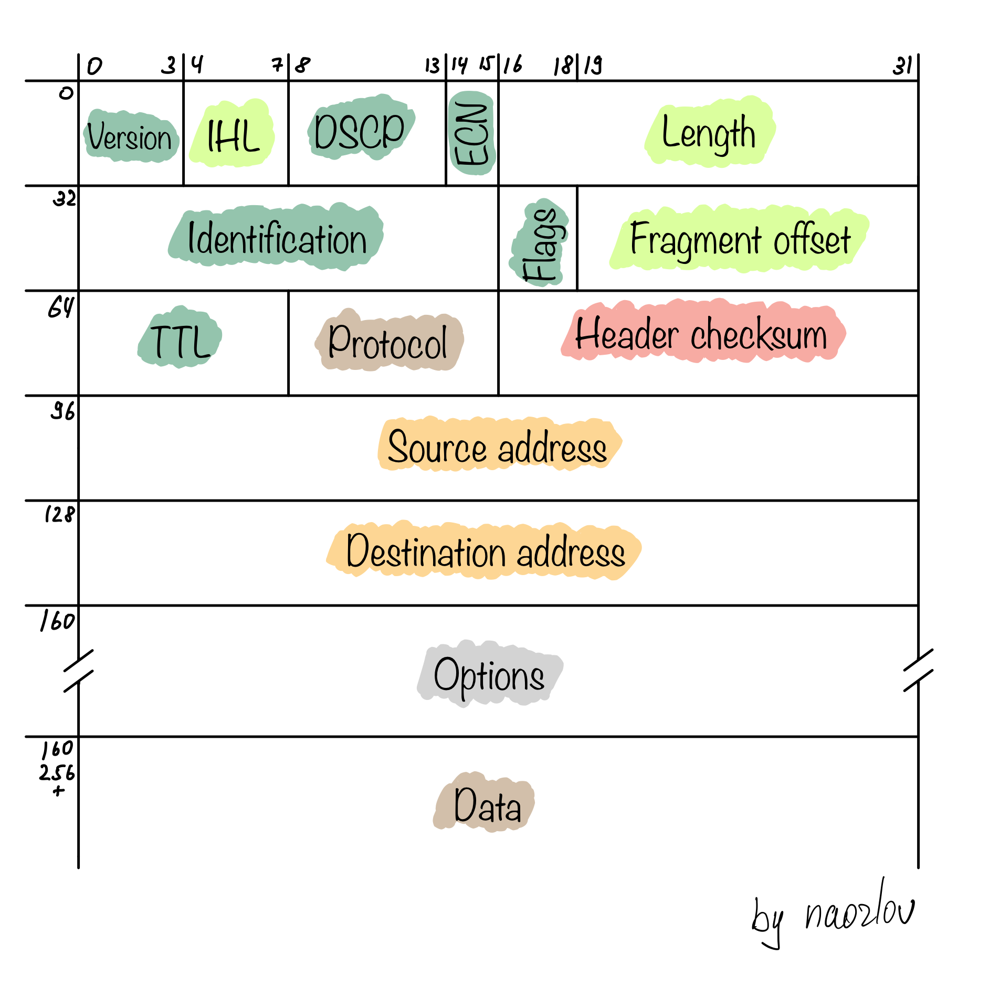
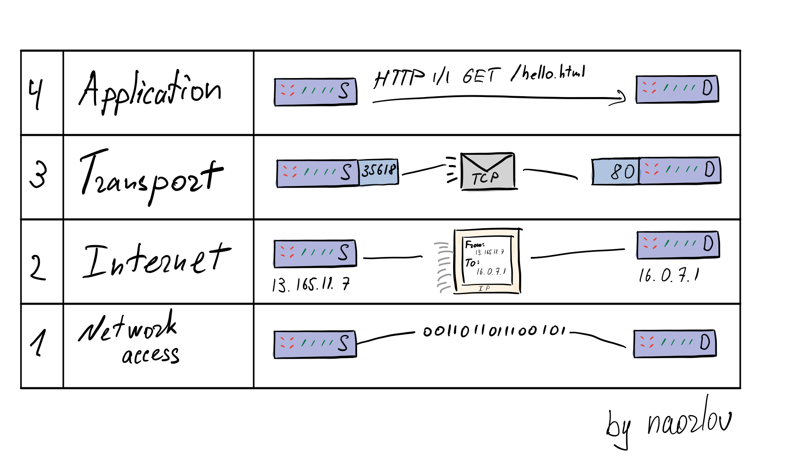

# Прикладные протколы

Что происходит, когда мы вбиваем в адресную строку браузера какой-нибудь домен?

Чтобы ответить на этот вопрос, нам надо разобраться с несколькими уровнями сетевых абстракций, на которых работают почти все современные устройства. Сразу предупреждаю, что в этом семинаре мы специально даём интуитивное понимание некоторых уровней сети, а не детали реализации, так как 1) у вас есть предмет "Компьютерные сети", на котором это должны рассказать и 2) мы не будем (за редким исключением) обращаться к деталям реализации непосредственно сетей в этом курсе.

## Физическая передача данных

Базовой компонентой всех сетей является средство передачи битов информации другим узлам. Это wifi, bluetooth, ethernet кабель, который подключает компьютер к роутеру. Понятно, что несколько медных проводов не могут ничего знать про весь остальной мир, они выполняют исключительно служебную функцию — это асфальтированная дорога, по которой можно куда-то доехать.

## Интернет: передача данных с адресами в графе

Инструменты следующего уровня абстракции, которыми мы оперируем в дорожном движении — улицы, номера домов и перекрестки для соединения разных улиц. Так и в сети: маршрутизаторы соединяют провода и радио-устройства (например, wifi) в большой граф, где вершины это маршрутизаторы или целевые устройства, а ребра это какие-то средства связи, будь то провод или беспроводной протокол. Мы даже знаем про адреса вершин в этом графе — IP адреса. Чтобы в городе отправить что-то от одного дома до другого, можно вызвать курьера, который будет знать адрес отправителя, адрес получателя. Содержимое пакета ему знать не обязательно, но то, что он этот пакет будет нести и при необходимости может в него заглянуть — это определенно недостаток системы, но эту проблему мы будем решать на следующем уровне. В интернете (графе устройств и маршрутизаторов) мы тоже обмениваемся IP-пакетами. По большому счёту, в пакете есть:
- адрес отправителя (source address),
- адрес получателя (destination address),
- какая-то служебная информация для современного IP протокола (другие заголовки),
- размер нашего IP пакета (length)
- непосредственно содержимое (data).



Подробнее про содержимое можно прочитать много где, например на википедии: https://ru.wikipedia.org/wiki/IP

Теперь мы понимаем, что со своего компьютера можем послать сообщение другому компьютеру в сети "Интернет". Однако отправляя IP-пакеты, у нас очень мало гарантий: мы знаем только то, что если пакет дойдет до адресата, то он дойдет туда с корректными заголовками (в IP-пакете есть чексумма заголовка) и он будет того размера, который заявлен в заголовке.

Мы не знаем:
- дойдет ли пакет вообще или будет, например, отброшен из-за переполнения буфера маршрутизатора
- дойдет ли пакет один раз или продублируется из-за ошибки маршрутизатора
- если мы отправим два пакета подряд, дойдут ли ни в том же порядке? в графе сети есть разные пути и какой-то из маршрутизаторов может случайно (или специально) отправить нас по другому ребру
- не изменятся ли данные внутри пакета по дороге? маршрутизатор или кто-то другой может случайно или специально подменить содержимое IP пакета

## Адресация внутри устройства и больше гарантий

Теперь предположим, что мы хотим на одном устройстве сделать много отправителей и получаталей — как в многоквартирном доме. У каждой квартиры есть свой номер. Так и на наших устройствах — есть "порт". Когда мы захотим что-то получить на конкретном порту, мы будем слушать, что туда приходит и обрабатывать входящие сообщения. Когда мы захотим что-то с него отправить — мы просто отправим, укажем его, но не будем его занимать.

На современных устройствах 2^16 = 65536 портов.

Мы почти построили удобный канал коммуникации. Осталось добавить гарантий, о которых мы говорили ранее. Существует два протокола, дающих разные уровни гарантий:
- UDP, который добавляет только гарантию того, что чексумма данных совпадет с чексуммой, указанной в заголовке UDP пакета,
- TCP, который гарантирует доставку всех данных в порядке их отправки, отсутствие дубликатов и, само собой, целостность данных (так же, как у UDP).

### UDP

UDP добавляет очень мало в IP пакет — только порты, чексумму ([опциональную в IPv4, обязательную в IPv6](https://en.wikipedia.org/wiki/User_Datagram_Protocol#UDP_datagram_structure)), длину всей UDP датаграммы (UDP заголовки + данные). Коммуникация никак не усложняется — просто шлются IP пакеты, содержащие внутри UDP датаграмму.

Подробнее можно почитать на [вики](https://en.wikipedia.org/wiki/User_Datagram_Protocol), в рамках этого курса детали реализации нам не особо нужны.

_Кстати, модель сети в dslib обладает такими же гарантиями, как у UDP: гарантируется, что сообщение будет (если будет) доставлено в том же виде, но не более._

### TCP

Этот протокол реализует надёжный канал коммуникации. TCP даёт все нужные гарантии: все отправленные пакеты будут когда-нибудь доставлены, в том же порядке и виде, без дубликатов. Важно понимать, что эти гарантии распространяются только на передачу данных пока живо соединение, после обрыва соединения никаких гарантий касательно недоставленных пока данных нет.

Чтобы гарантировать порядок и отсутствие дубликатов, нужен какой-то уникальный порядковый номер. Чтобы получатель знал, какое сообщение первое в некоторой последовательности, нужно сначала синхронизировать эти значения обеим сторонам. Это называется TCP Handshake на синхронизацию тратится один round trip, что звучит не очень эффективно. TCP взаимодействие происходит по сессиям и handshake открывает эту сессию. Именно из-за наличия handshake TCP медленнее для маленьких запросов, чем UDP. После открытия соединения стороны начинают обмениваться сообщениями, увеличивая свой порядковый номер. Другая сторона в следующем сообщении должна так же передать последний порядковый номер, до которого все сообщения приняты. Если отправитель получает какой-то старый порядковый номер, то ему нужно переотправить старые сообщения начиная с этого номера. Чтобы избежать передачи уже принятых другой стороной данных есть оптимизация [Selective Acknowledgments (SACK)](https://packetlife.net/blog/2010/jun/17/tcp-selective-acknowledgments-sack/), когда получатель сообщает о принятых данных после этого номера.

Подробнее неплохо написано в русской [вики](https://ru.wikipedia.org/wiki/Transmission_Control_Protocol#Механизм_действия_протокола).

Всё, что нам нужно понимать про TCP — он даёт нам надёжный протокол ценой чуть больших задержек и скорости. Когда мы строим распределенную систему, нам надо понимать, по какому транспортному протоколу работает наш прикладной протокол и исходя из этого мы сможем больше знать про потенциальную производительность и гарантии нашего протокола.

---

Сетевая модель, которую мы почти закончили обсуждать, называется TCP/IP стэком:



Первый уровень сетевого доступа это как раз физическая передача данных. Уровень интернета это уровень адресации в физической сети, собственно IP и значит Internet Protocol. Третий уровень с адресацией по портам это транспортный уровень, то есть TCP и UDP это транспортные протоколы, они обычно реализованы в операционной системе. А на последнем уровне находятся протоколы, которые мы с вами либо реализуем сами, либо используем существующие реализации, но самое главное — эти протоколы реализованы где-то в импортируемой библиотеке и мы можем почитать код этого протокола и даже подебажить его.

## Прикладные протоколы

Прикладные протоколы реализуются на основе UDP или TCP. То есть в качестве базовой коммуникации можно выбрать либо ненадежный, но быстрый UDP, либо надёжный но не такой быстрый TCP. Паттерн взаимодействия тоже будет продиктован протоколом — либо это будут индивидуальные сообщения (UDP) ограниченного размера, либо TCP соединение с неограниченным и упорядоченным потоком байтов в обе стороны.

### DNS

DNS это сервис, который для любого домена попытается найти IP адрес. На самом деле, упрощая, это хэшмапа `domain -> ip, ttl, createdAt` плюс некоторй алгоритм обновления этой хэшмапы. `ttl` это time-to-live, по умолчанию 12 или 24 часа.

Для ответа на вопрос "какой IP соответствует этому домену" локальный DNS идет в свой кэш. Если там есть `domain` и `now() <= createdAt + ttl`, то запись похожа на корректную и мы ей воспользуемся. Если же домена нет или `now() > createdAt + ttl`, то для этого надо воспользоваться алгоритмом обновления. Для этого в настройках DNS есть DNS сервера, которые представляют собой идентичную ноду и ведут себя точно так же, как и мы. В случае промаха мы идем в указанные у нас в настройках сети DNS сервера и получаем ответ от них. Если на пути таких обходов не встретится нода, которая знает ответ, то мы рано или поздно дойдем до корневого DNS. Но в силу ленивости самого алгоритма и того, что у большого числа узлов есть какие-то общие предки (например, Google DNS 8.8.8.8 или DNS сервер вашего провайдера интернета), то больше 99% запросов за доменами пройдут путь до какого-то из популярных общих предков. Более того, общие предки могут активно обновлять свой кэш, а не лениво.

DNS сервера для дальнейших запросов по-умолчанию приходят от вашего роутера или маршрутизатора (и скорее всего это он и есть, так как на роутере тоже есть DNS кэш, а у него DNS-fallback это DNS вашего провайдера).


Конечно, это всё упрощение. Детали современного алгоритма можно почитать, например, на [вики](https://ru.wikipedia.org/wiki/DNS).

К чему я это? DNS реализован поверх UDP, так как запросы очень простые и если timeout запроса к внешнему сервису истек, что случается крайне редко, то мы попробуем повторить запрос или пойдем к другому DNS серверу в списке указанных.

### HTTP

HTTP для пользователя это текстовый проткол общения по TCP сокету. Формат взаимодействия тоже привычный нам — запрос-ответ. Например:
```
- открыли TCP соединение

- шлём запрос, можно попробовать самим curl -v http://google.com:

GET / HTTP/1.1
Host: google.com
User-Agent: curl/7.64.1
Accept: */*

- получаем ответ:

HTTP/1.1 301 Moved Permanently
Location: http://www.google.com/
Content-Type: text/html; charset=UTF-8
Date: Sat, 25 Sep 2021 07:41:29 GMT
Expires: Mon, 25 Oct 2021 07:41:29 GMT
Cache-Control: public, max-age=2592000
Server: gws
Content-Length: 219
X-XSS-Protection: 0
X-Frame-Options: SAMEORIGIN

<HTML><HEAD><meta http-equiv="content-type" content="text/html;charset=utf-8">
<TITLE>301 Moved</TITLE></HEAD><BODY>
<H1>301 Moved</H1>
The document has moved
<A HREF="http://www.google.com/">here</A>.
</BODY></HTML>

- закрыли TCP соединение
```

У запроса и ответа есть строгий формат, которому должны следовать все участники: отправляющий запрос в TCP, читающий запрос из TCP, отправляющий ответ в TCP соединение, принимающий ответ из TCP.

Формат запроса следующий:
- в первой строке пишется HTTP-метод (один из GET, PUT, POST, DELETE, PATCH и тд), путь как в файловой системе, версия протокола: `GET /some/path/ HTTP/1.1`
- далее через `\r\n` пишутся заголовки — строковые метаданные в формате `Header-Name: header_value`. Имя заголовка идет перед `: `, значение после. Заголовков есть много разных, некоторые технические и необходимы протоколу, некоторые могут использоваться принимающей стороной как угодно.

- заголовки заканчиваются `\r\n\r\n` (то есть переносом и пустой строкой) и далее в зависимости от HTTP-метода либо заканчивается запрос (для GET, DELETE, HEAD, OPTIONS, может быть ещё каких-то), либо начинается тело запроса (любая последовательность байт, её длина указана в заголовке `Content-Length`).

Формат ответа:
- в первой строке идет: версия HTTP с которой работает сервер, она должна быть не больше той, что пришла от клиента, числовой статус и его текстовая интерпретация (все статусы можно найти на 48 странице RFC про HTTP 1.1 https://datatracker.ietf.org/doc/html/rfc7231).

- в следующих строках идут заголовки ответа так же через `\r\n`, включая Content-Length для того, чтобы клиент знал, сколько байт надо читать тело.
- после заголовков идет `\r\n\r\n` и тело ответа, если `Content-Length > 0`.

Вдаваться в детали не будем, можете потыкаться с помощью `curl -v` или WireShark в какие-нибудь ссылки.

HTTPS работает очень просто — перед обменом HTTP запросами внутри TCP соединения клиент и сервер  устанавливают защищенное соединение и по нему уже общаются с помощью обычного HTTP. Это будет у нас в конце курса, а так же это можно почитать на [вики](https://ru.wikipedia.org/wiki/SSL#Особенности_шифрования)

Полезная функция HTTP начиная с HTTP/1.0 (по умолчанию включена начиная с 1.1) это `Connection: keep-alive`. Поскольку в распределенных системах мы часто боремся за призводительность сетевой передачи данных, нам это полезно знать :) `Connection` заголовок говорит серверу надо ли ему закрыть TCP соединение после того, как он отправит нам ответ или нет. `Connection: close` попросит его закрыть, а `Connection: keep-alive` оставит соединение открытым для дальнейшей коммуникации по уже открытому соединению. Когда у нас есть интенсивная коммуникация, то конечно не хотелось бы на каждый запрос устанавливать TCP соединение, потом обмениваться ключами, это всё раунд-трипы и, соответственно, большие задержки на отправку запроса.

## Отвечаем на вопрос про адресную строку

И так, вернемся к изначальному вопросу. Что происходит, когда мы вбиваем какой-то домен в адресную строку и нажимаем enter? Допустим мы вбили `http://google.com/`

1. Наш браузер разбирает эту строку на компненты: протокол (`http`), доменное имя (`google.com`), порт (80 по умолчанию для http, так как не указан), путь (`/`)
2. То есть надо послать HTTP GET запрос с указанным хостом и путём куда-то. Куда?
3. В TCP соединение, а чтобы его открыть нам нужен IP адрес. Поэтому надо спросить у DNS какой IP адрес стоит за нашим доменом.
3. DNS сходит либо в локальный кэш, либо пошлет UDP пакет и получит ответ от другого DNS сервера, который, свою очередь, либо найдет ответ в кэше или пойдет к своим DNS серверам.
4. Теперь мы знаем IP адрес, открываем TCP соединение на 80 порт.
5. В TCP соединение пошлём текст HTTP запроса и в этом же соединении получим ответ.
6. Браузер прочитает ответ и нарисует нам картинку.

## gRPC

Современный HTTP 2 это быстрый бинарный протокол (с точки зрения используемых методов и сообщений он не отличается от 1.1), по которому можно устраивать практически любую коммуникацию. К сожалению, он поддерживается не всеми браузерами, но межузловую коммуникацию в распределенной системе с его помощью точно можно осуществлять. Чего не хватает протоколу?

Когда мы пишем код на каком-нибудь объектном типизируемом языке программирования, мы любим договариваться об интерфейсах между компонентами приложения. Чтобы в окружении с сетевой коммуникацией договариваться об интерфейсах, надо было бы писать разбор и проверку запросов и ответов, придумывать какие-то статусы и ошибки вокруг запросов. gRPC предлагает инструментарий, позволяющий избежать этого.

### Интуиция

В gRPC есть два основных концепта, которые мы должны описать: тип сообщения (структура или класс с полями без методов) и интерфейс с методами, принимающими и возвращающими сообщения.

Сообщения это вообще отдельная технология — protobuf. Тип сообщения описывается специальным очень простым синтаксисом, а потом с помощью proto-компилятора генерируется код для любого языка программирования. В коде объект создается почти как обычный объект с полями, но сериализация данных (бинарное представление объекта) одинаковая на всех языках. Это позволяет даже по обычному HTTP или чистому TCP-сокету обмениваться чистыми protobuf сообщениями и на разных концах приложения могут быть написаны на разных языках программирования.

Похожая история и с gRPC — описывая интерфейс мы описываем _gRPC сервис_, в котором есть методы, принимающие одно protobuf-сообщение и возвращающие другое (или поток сообщений одного типа). С помощью ptoto-компилятора генерируется интерфейс для реализации класса сервиса на вашем языке программирования и класс для работы с сервисом на клиенте (stub).

gRPC устанавливает одно постоянное (keep-alive) соединение для взаимодействия по HTTP 2 на каждую пару клиент-сервер. При падении соединения незаметно для пользователя восстанавливает соединение. Таким образом, коммуникация с помощью gRPC получается очень быстрой, типизированной и от того удобной.

### Как пользоваться

Вместо того, чтобы дублировать документацию в тексте семинара, предлагаю просто ей воспользоваться: https://grpc.io/docs/languages/python/basics/

