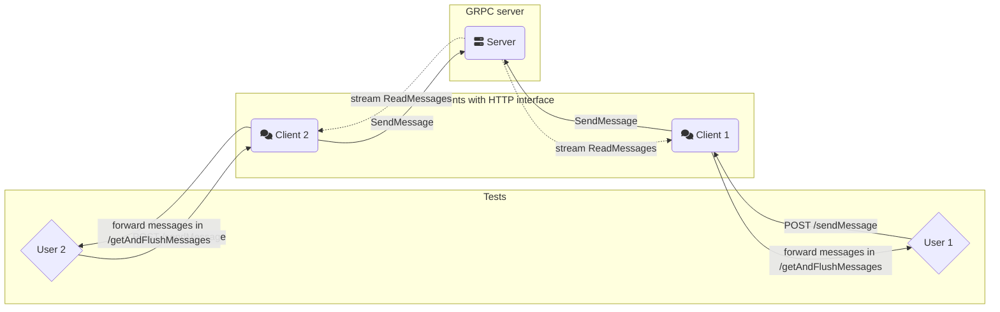
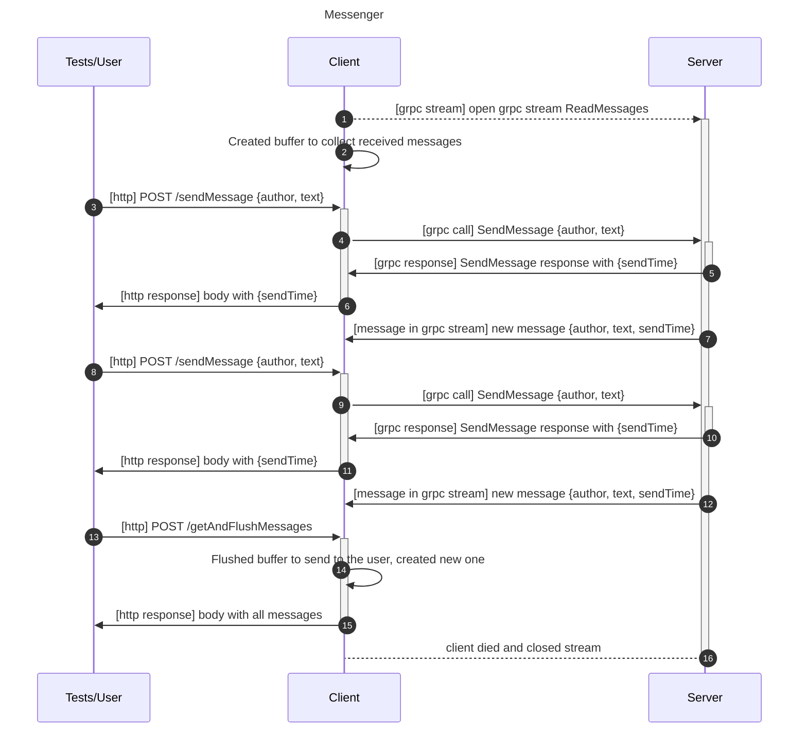

# Практика gRPC

## Мессенджер с одним чатом

В рамках практики предлагается реализовать очень простые сервер и клиент мессенджера с одним общим чатом. У сервера будет два RPC-метода: послать сообщение в чат (SendMessage) и подключиться к чату и получать бесконечный поток сообщений из чата (ReadMessages). Сообщения, которые пришли на сервер до открытия стрима пересылать не надо. Подробные требования к gRPC серверу описаны в секции [Интерфейс взаимодействия с сервером](#Интерфейс-взаимодействия-с-сервером).

Клиент, соответственно, должен при включении открыть поток и скапливать в своём буфере пришедшие сообщения. Кроме того, через клиент мы должны уметь отправлять сообщения в чат с помощью http интерфейса.

Управление клиентом будет производиться через HTTP. Для этого в заготовках клиентов уже реализован HTTP сервер с двумя методами: `POST /sendMessage` и `POST /getAndFlushMessages`. Их более подробное описание можно найти ниже в документе.

Таким образом, в рамках этого задания вам нужно описать gRPC интерфейс и реализовать две компоненты: gRPC-сервер (далее **сервер**), gRPC-клиент + HTTP-сервер (**клиент**). HTTP вызовы к клиенту осуществляют тесты в `test_client.py`, для ручного тестирования клиента можно использовать простой `curl`, примеры можно найти ниже в этом документе.

Ниже представлена диаграмма коммуникации с одним серверов, двумя клиентами и двумя пользователями (тесты ходят в оба клиента, таким образом представляют два виртуальных пользователя в чате):


### Коммуникация между компонентами

На диаграмме ниже представлена последовательность вызовов и ответов между компонентами. Чтобы не переусложнять диаграмму, на ней представлен только один клиент, паттерн коммуникации при двух и более не отличается — пришедшие сообщения через SendMessage надо пересылать во все открытие стримы, таким образом клиенты будут получать даже свои сообщения, это нормально.



### Шаблон решения

В папке задания предоставлены заготовки только **клиента** на Python, Python + asyncio и Golang для решения этой задачи. Только шаблон на Python в папке `client` является официальным и проверен для текущих условий ДЗ, остальные шаблоны остались с прошлых версий условия и местами расходятся с текущим условием. Вы все равно можете их использовать, если поправите расхождения. Вы также можете писать на любом другом языке программирования, так как тестирование происходит через HTTP и gRPC.

### Интерфейс взаимодействия пользователя с клиентом

Тесты на сервер+клиент отправляют запросы клиенту, который представляет собой HTTP сервер, поддерживающий два вида запросов:

```
POST /sendMessage
Отправляет одно сообщение в общий чат.
Body:
{
    "author": "Ivan Ivanov",
    "text": "Hey guys"
}

Response:
{
    "sendTime": "..."
}

POST /getAndFlushMessages
Возвращает буферизированные сообщения, удаляя их из буфера.
Response:
[{
    "author": "Ivan Ivanov",
    "text": "Hey guys",
    "sendTime": "..."
},{
    "author": "Petr Petrov",
    "text": "Hey Ivan",
    "sendTime": "..."
}]
```

Примеры с curl:
```
$ curl -X POST localhost:8080/sendMessage -d '{"author": "alice", "text": "hey"}'
{"sendTime":"2021-09-12T10:25:22.454093428Z"}


$ curl -X POST localhost:8080/getAndFlushMessages
[{"author":"alice","text":"hey","sendTime":"2021-09-12T10:25:22.454093428Z"},{"author":"alice","text":"hey guys","sendTime":"2021-09-12T10:25:41.296997047Z"}]
```

### Интерфейс взаимодействия с сервером
Обратите внимание, что мы тестируем сервер отдельно (чтобы вы могли получить частичные баллы), поэтому необходимо соблюсти наши требования к названиям и содержимому, а именно:
- сервис должен называеться `MessengerServer` и реализовывать два метода: `SendMessage` и `ReadMessages`
- тело вызова `SendMessage` должно содержать поля `author`, `text`, а ответ должен иметь поле `sendTime`
- вызов `ReadMessages` не должен содержать полей (можно реализовать Empty сообщение без полей или воспользоваться существующим в библиотеке), а сообщения в стриме должны иметь все три вышеупомянутых поля: `author`, `text`, `sendTime`
- поле `sendTime` должно иметь тип `google.protobuf.Timestamp`.

Примеры с grpcurl:
```
Из папки 02-practice-grpc:

# В первом окне терминала
$ grpcurl -proto messenger/proto/messenger.proto -plaintext localhost:51075 mes_grpc.MessengerServer/ReadMessages
# Устанавливается бесконечное соединение, команда не заканчивается, пока сервер не порвёт соединение или вы не нажмёте CTRL+C в терминале

# Во втором окне терминала
$ grpcurl -proto messenger/proto/messenger.proto -d '{"author": "alice", "text": "hey"}' -plaintext localhost:51075 mes_grpc.MessengerServer/SendMessage
{
  "sendTime": "2023-09-17T09:05:24.242089Z"
}

# В первом окне должно появиться сообщение из стрима
{
  "author": "alice",
  "text": "hey",
  "sendTime": "2023-09-17T09:05:24.242089Z"
}

```

### Компоненты задания
1. **(2 балла)** Описать gRPC интерфейс сервера в `messenger.proto`
2. **(4 балла)** Реализовать gRPC сервер мессенджера
3. **(4 балла)** Реализовать gRPC клиент и встроить его в HTTP-приложение клиента.
4. README в папке с решением с описанием структуры решения (где какой код лежит), какие именно методы реализованы на сервере и клиенте, как они устроены в паре предложений. Обязательно укажите, какие компоненты были выполнены. При отсутствии README проверка производиться не будет.

### В каком порядке делать?
#### Реализуем `messenger.proto`
Напишите свой `messenger.proto` в `messenger/proto/`, содержащий все proto сообщения и определение сервиса.

Скомпилируйте прото файл с помощью `protoc` в нужный для вас язык. В шаблонах лежит `compile.sh`, можно прочитать его и воспользоваться.

#### Реализуем сервер

Реализуйте сервер, соответствующий сгенерированному интерфейсу. Заготовки для сервера нет. Сервер предлагается реализовать с нуля, используя [gRPC Basics Tutorial](https://grpc.io/docs/languages/python/basics/) и примеры различных сервисов в [Гитхаб-репозитории gRPC](https://github.com/grpc/grpc/blob/master/examples) для вашего языка программирования. Тестировать и отлаживать сервер предлагается с помощью [grpcurl](https://github.com/fullstorydev/grpcurl). Примеры команд есть выше, ниже в бонусной секции про grpcurl и в тестах на сервер.

Сервер рекомендуется расположить в файле `server/server.py`, так как примеры команды далее будут предполагать, что сервер находится там, и вам будет удобнее их копировать.

В docker compose файле используются переменные окружения для настройки сервера и клиентов. gRPC сервер должен запускаться по адресу `0.0.0.0:$MESSENGER_SERVER_PORT`, где `MESSENGER_SERVER_PORT` — переменная окружения, по умолчанию равная `51075`.

Метод `ReadMessages` должен быть реализован как **бесконечный** поток сообщений. Grpc-клиент вызывает этот метод один раз при включении, и считывает сообщения из потока по мере их поступления. При поступлении нового сообщения на сервер, сервер рассылает это сообщение всем подключенным клиентам. Каждый клиент должен получать сообщения в том порядке, в котором они поступили на сервер. Если некоторое сообщение было доставлено до момента, когда клиент подключился на прослушивание сообщений через `ReadMessages`, этот клиент не должен получить это сообщение.

#### `server.dockerfile`
Напишите `messenger/server.dockerfile` для вашего сервера, чтобы его можно было запустить при тестировании. Вероятнее всего, можно воспользоваться одним из `client.dockerfile` из шаблона.

Единственное требование, которое есть в докерфайлу — нужно, чтобы `CMD` или `ENTRYPOINT` запускали ваш сервер и слушали на указанном в переменной окружения `MESSENGER_SERVER_PORT` порту.

#### GRPC клиент с собственным HTTP интерфейсом

Реализуйте gRPC клиент, который осуществляет gRPC-вызовы и соответствующим образом обрабатывает результат. Рекомендуется использовать заготовку в папке `client`. В заготовке уже реализован HTTP-сервер для принятия HTTP-запросов от пользователя. Вам осталось заполнить места, помеченные TODO. Также клиент можно реализовать не используя заготовку, на любом языке программирования. В таком случае обязательно используйте переменные окружения:
- `MESSENGER_SERVER_ADDR` — адрес gRPC сервера для клиента, чтобы подключиться к серверу, есть в заготовке
- `MESSENGER_HTTP_PORT` — порт для запуска HTTP-сервера вашего клиента, есть в заготовке

#### `client.dockerfile`
Поправьте шаблонный или напишите свой `messenger/client.dockerfile` для вашего клиента, чтобы его можно было запустить при тестировании.

Опять же, единственное требование — `CMD/ENTRYPOINT` должен запускать ваш клиент, слушать HTTP на порту `MESSENGER_HTTP_PORT` и открывать gRPC соединение по адресу `MESSENGER_SERVER_ADDR`.


#### Локальное тестирование

Проверьте локально, что ваши тесты проходят, лучше сразу в [докере](#docker). Если `docker-compose` на что-то ругается, то поправьте конфигурацию как вам необходимо.

Локально запустить можно так же, как в CI:
```bash
# Соберёт все упомянутые в docker-compose.yml образы
docker compose build
# Запускаем в бэкграунде сервер и клиенты
docker compose up -d server client1 client2
# Запускаем тесты на сервер
docker compose run tests -k test_server
# Запускаем все тесты
docker compose run tests
# Если что-то не проходит, можно посмотреть в логи контейнеров
docker compose logs server
docker compose logs client1
docker compose logs client2
# Убить все бегущие контейнеры
docker compsoe down
```

#### Открываем PR
Откройте Pull Request в своём приватном репозитории, добавьте на PR лейбл `hw/02-practice-grpc` и дождитесь, что тесты зелёные.

### Комментарии про потоки
HTTP-сервер в grpc-клиенте однопоточный, то есть он обрабатывает не более одного запроса в каждый момент времени. Однако в grpc-клиенте необходимо создать фоновый поток, который будет скапливать сообщения от сервера. Таким образом, информация, передающаяся между ними должна быть потокобезопасной. 

Grpc-сервер должен быть реализован многопоточно, то есть мочь обрабатывать сразу несколько grpc-запросов. В туториале и репозитории с примерами достаточно примеров многопоточных серверов.


## Запуск заготовок и тестов

Во избежание вопросов про импорты и структуру папок/файлов, авторское решение на Python имеет следующую структуру:
```
messenger
├── __init__.py
├── client
│   ├── __init__.py
│   ├── client.py
│   └── requirements.txt
├── client.dockerfile
├── proto
│   ├── __init__.py
│   ├── compile.sh
│   ├── messenger
│   │   └── proto
│   │       └── messenger.proto
│   ├── messenger.proto
│   ├── messenger_pb2.py
│   ├── messenger_pb2.pyi
│   └── messenger_pb2_grpc.py
├── server
│   ├── __init__.py
│   ├── requirements.txt
│   └── server.py
└── server.dockerfile
```

Однако, мы не предъявляем никаких требований к вашей структуре решения. Единственное требование — ваши `client.dockerfile` и `server.dockerfile` должны собираться и в ENTRYPOINT запускать ваш клиент и grpc-сервер соответственно.

#### Без виртуальных окружений
```
cd 02-practice-grpc
python -m messenger.server.server
python -m messenger.client.client
MESSENGER_HTTP_PORT=8081 python -m messenger.client.client

cd tests
MESSENGER_TEST_SERVER_ADDR=localhost:51075 MESSENGER_TEST_CLIENT1_ADDR=localhost:8080 MESSENGER_TEST_CLIENT2_ADDR=localhost:8081 pytest -vvs .
```

#### С виртуальными окружениями - OUTDATED
Заготовка клиента на python:
```
python3 -m virtualenv messenger/client/env  # нужен python версии хотя бы 3.8
source messenger/client/env/bin/activate
pip install -r messenger/client/requirements.txt

MESSENGER_SERVER_ADDR=localhost:$MESSENGER_SERVER_PORT python client.py 
```

Заготовка клиента на golang:
```
cd messenger/client-go
go mod download -x

MESSENGER_SERVER_ADDR=localhost:$MESSENGER_SERVER_PORT go run main.go
```

Запуск тестов:
```
cd tests
# можно использовать общее окружение с вашим клиентом и сервером, тогда положите его в корень папки с заданием
python3 -m virtualenv env  # нужен python версии хотя бы 3.8
source env/bin/activate
pip install -r requirements.txt

MESSENGER_TEST_CLIENT1_ADDR=localhost:8080 MESSENGER_TEST_CLIENT2_ADDR=localhost:8081 pytest -vvs .
```

### Docker
Соберите все свои сервисы:
```
docker compose build server client1 client2
```

При изменении одного из них достаточно пересобрать только его:
```
docker compose build server
```

client1 и client2 используют один и тот же образ для запуска, поэтому при изменении клиента можно пересобрать только одного из них:
```
docker compose build client1
```

Запустите сервер и клиентов:
```
docker compose up -d server client1 client2
```

Сборка и запуск тестов:
```
docker compose build tests
docker compose run --rm tests
```

Если что-то не работает, запустите сервер и клиентов без флага `-d[etach]`, чтобы видеть все ошибки:
```
docker compose up server client1 client2
```

## Бонус
### [grpcurl](https://github.com/fullstorydev/grpcurl) 101

Установка grpcurl:
`sudo tar -xf grpcurl_1.8.7_linux_x86_64.tar.gz -C /usr/local/bin`
`brew install grpcurl`

Выжимка из `grpcurl -help` опций, которые пригодятся в этой домашке:
```
grpcurl [flags] [address] [list|describe] [symbol]

list
   If 'list' is indicated, the symbol (if present) should be a fully-qualified
service name. If present, all methods of that service are listed. If not
present, all exposed services are listed, or all services defined in protosets.

-proto value
   The name of a proto source file. ...
-plaintext
   Use plain-text HTTP/2 when connecting to server (no TLS).
-d string
   Data for request contents. If the value is '@' then the request contents are
   read from stdin. ...
-v
   Enable verbose output.
-vv
   Enable very verbose output.
```

Уже собранные команды, которые пригодятся:

```
grpcurl -proto proto/messenger.proto -plaintext localhost:51075 list
> Messenger

grpcurl -proto proto/messenger.proto -plaintext localhost:51075 list Messenger
> Messenger.ReadMessages
> Messenger.SendMessage

grpcurl -proto proto/messenger.proto -plaintext localhost:51075 Messenger.ReadMessages
# пустой вывод, пока не будут отправлены какие-либо сообщения
> {
>   "author": "alice",
>   "text": "hello",
>   "sendTime": "2022-08-12T14:35:41.461204767Z"
> }
> {
>   "author": "alice",
>   "text": "hello again",
>   "sendTime": "2022-08-12T14:35:42.792868160Z"
> }
>...  # соединение никогда не закрывается, сообщения продолжают поступать

grpcurl -proto proto/messenger.proto -d '{"author": "alice", "text": "hello"}' -plaintext localhost:51075 Messenger.SendMessage
> "sendTime": "2022-08-12T14:35:41.461204767Z"
```

### Многопоточное программирование в Питоне 101
Как только в программе появляется больше одного потока и эти потоки начинают обращаться (неважно, на чтение или запись) к одним и тем же данным (одной и той же переменной), необходимо защищать доступ к этим переменным примитивами синхронизации. Подробности на курсе многопоточного программирования. Самый простой примитив синхронизации -- мьютекс, в питоне `threading.Lock`. Поток может захватить мьютекс, записать данные в ячейку, и отпустить мьютекс. Гарантируется, что мьютекс может быть захвачен не более чем одним потоком в каждый момент. Пример:

```
import threading

data = 5
lock = threading.Lock()

# код потока:
lock.acquire()
data = 7
lock.release()

# то же самое, с помощью context manager (синтаксический сахар для строчек выше)
# это предпочтительный вариант
with lock:
   data = 7
```

Grpc-клиент имеет два потока (main и фоновый поток, который будет поглащать). Единственные данные, которые разделяют эти потоки -- это `stub` и объект класса `PostBox`. Можно подсмотреть в документации питоновской библиотеки для grpc, что `stub` является потокобезопасным, то есть разные потоки могут вызывать любые методы у этого объекта. Класс `PostBox` тоже реализован в потокобезопасном стиле: любые обращения к переменной `self._messages` защищены локом. Поэтому при реализации клиента вам не нужно будет добавлять собственных примитивов синхронизации.

Grpc-север должен быть многопоточным. Это значит, что обработчики запросов `SendMessage`, `ReadMessages` могут быть вызваны одновременно несколькими клиентами. 

Документация, которая вам точно понадобится:
https://docs.python.org/3/library/threading.html#threading.Thread
https://docs.python.org/3/library/threading.html#threading.Lock

При реализации сервера рекомендуется использовать `queue.SimpleQueue`. Эта очередь потокобезопасна по-умолчанию, то есть, чтобы достать или положить элемент, не нужно захватывать мьютекс -- он встроен в очередь. Более того, вызов метода `SimpleQueue.get` блокируется и неактивно ждет до тех пор, пока в очереди не появится новый элемент. Для этого `queue.SimpleQueue` использует внутри себя условные переменные.

https://docs.python.org/3/library/queue.html#simplequeue-objects

Заметьте, что если вы решите использовать несколько `SimpleQueue` и решите складывать их в один список из разных потоков, вам необходимо защитить сам список мьютексом.

Если вы не хотите использовать `SimpleQueue`, вы также можете использовать активное ожидание или сырые условные переменные для своей реализации.

https://docs.python.org/3/library/threading.html#condition-objects

Если у вас возникают проблемы, пишите в чат. Любые вопросы про многопоточность принимаются, так как задание на grpc, а не на многопоточность.


### tmux 101
Вы можете сделать задание без следующей информации, но с tmux это будет удобнее.

В процессе разработки и тестирования вам понадобится держать как минимум 4 открытых терминала: с сервером, двумя клиентами и окном для отправки сообщений клиентам через curl или запуска автоматических тестов.

tmux (от 'terminal multiplexor') это консольная утилита, позволяющая позволяет открыть несколько терминалов внутри одного окна. Это может быть удобнее, чем держать четыре независимых окна.

Другой популярный вид использования tmux -- это работа на удаленном сервере. Терминалы, созданные в tmux продолжают существовать в фоновом режиме, даже если вы случайно отключились от сервера. Поэтому вы можете подключить к серверу заново, подключиться к существующей сессии tmux и продолжить работу. tmux это must-have в ежедневном арсенале программиста, поэтому может быть удобно опробовать работу с tmux уже сейчас.

`sudo apt install tmux`

Полезные команды:
```
tmux - создать новую сессию с виртуальными терминалами
CTRL+B % - поделить окно пополам вертикально
CTRL+B " - поделить окно пополам горизонтально
CTRL+B arrow - навигация между окнами
CTRL+B z[oom] - открыть текущее под-окно на весь экран терминала, или вернуть его обратно
CTRL+B [ - перейти в режим скроллинга
CTRL+B ESC - выйти из режима скроллинга
CTRL+B d[etach] - выйти из tmux обратно в командную строку, при этом все запущенные программы продолжат выполняться в фоновом режиме
```

Типичный флоу для 4 окон:
```
cd 02-practice-grpc/messenger
CTRL+B " - поделили горизонтально пополам
CTRL+B % - поделили верхнее окно вертикально пополам
CTRL+B ↓ - перешли на нижнее окно
CTRL+B % - поделили нижнее окно вертикально пополам

Запустить в каждом из окон север, клиент 1, клиент 2, и использовать последнее окно для запуска тестов или curl. В последнем окне не забудьте `cd tests`.

Окно с тестами часто удобно зазумить: CTRL+B z

Чтобы проскроллить вывод от тестов: CTRL+B [, выйти из режима скроллинга: ESC.
```
