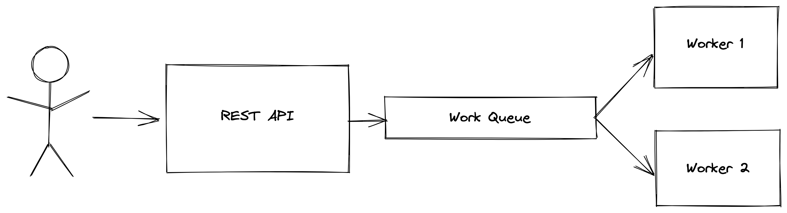

# Практика с RabbitMQ

## Описание

В рамках данного домашнего задания вы научитесь работать с брокером сообщений [RabbitMQ](https://rabbitmq.com/getstarted.html). Вам предлагается реализовать сервис для генерации описания к изображениям. Пользователь может загрузить изображение, после чего ваш сервис должен будет сгенерировать описание к изображению, сохранить результат обработки в файл и вернуть описание пользователю при запросе.


### Архитектура сервиса

Обычно Message Queue используется для того, чтобы избежать немедленного выполнения ресурсоемкой задачи, без необходимости ждать ее завершения. Вместо этого мы планируем выполнить задачу позже. Например, данный паттерн часто применяется для работы с видео. В нашем примере все еще можно было использовать прямое взаимодействие между REST API сервисом и сервисом генерации описаний, но использование Message Queue дает такие преимущества, как обработка отказов, если один из воркеров вдруг упадет, то сообщение не потеряется, а будет обработано другим воркером. Еще одним преимуществом использования очереди сообщений для коммуникации между сервисами является возможность масштабировать число обработчиков горизонтально в зависимости от нагрузки. Мы будем использовать следующую архитектуру для нашего сервиса:




1. REST API сервис принимает запросы от пользователя и отправлет их в очередь RabbitMQ
2. Воркеры забирают сообщения из очереди, обрабатывают их и сохраняют в docker volume (см. docker-compose.yml)


### Интерфейс сервиса
```
POST /images
Отправляет изображение на сервер и возвращает его id. Возвращаемые id не обязаны быть последовательными, но обязаны быть уникальными.

Body:
{
    "image_url": "shorturl.at/notNY",
}

Response:
{
    "image_id": int
}
```

```
GET /images
Возвращает id всех обработанных воркерами изображений.

Response:
{
    "image_ids": List[int]
}
```

```
GET /images/<image_id>
Возвращает описание для данного изображения, если оно уже было обработано, в противном случае возвращает код 404

Response:
{
    "description": str
}
```

В файле server/server.py вам предложена заготовка сервера с готовой реализацией REST API на Flask. Если по каким-то причинам вы не хотите использовать эту заготовку, вам придется реализовать REST API самостоятельно.
### Описание шаблона
Присутствуют следующие папки:
- `server` - папка, содержащая код REST API сервиса 
- `worker` - папка, содержащая код логики обработки изображений
- `tests` - папка с тестами 

### Оценивание
1. (4 балла) Реализуйте логику отправки сообщения в RabbitMQ и обработки сообщений из RabbitMQ. Это проверяют тесты `test_post_image`, `test_get_image`, `test_get_image_error`, `test_unique_ids`, `test_captions_generated_on_workers`.
2. (3 балла) В предыдущем пункте сервер может отвечать на запросы, следя за директорией с описаниями. Реализуйте логику передачи id обработанных изображений напрямую серверу (то есть ответ на запрос `GET /images` должен быть корректен даже если сервер не может получить список файлов в директории). Передавать описания не нужно. Подсказка: почитайте [этот туториал](https://www.rabbitmq.com/tutorials/tutorial-six-python.html) и **не забывайте о потокобезопасности**. Нужно пройти тест `test_no_listdir` и тесты из пункта 1.
3. (3 балла) В предыдущих пунктах отправка сообщений в очередь ненадежна: при отказах сети сообщения могут бесследно исчезнуть. Реализуйте логику обработки подобных отказов. Подсказка: почитайте [этот туториал](https://www.rabbitmq.com/tutorials/tutorial-seven-java.html) или [этот пример](https://github.com/pika/pika/blob/main/examples/asynchronous_publisher_example.py). Нужно пройти тест `test_fault_tolerance` и тесты из пункта 1.
4. Опишите архитектуру вашего решения в файле `solution.md`. При отсутствии этого файла проверка производиться не будет.

## В каком порядке делать?
1. Реализуйте логику обработки запроса и отправки сообщения в очередь `add_image` в server/server.py

2. Реализуйте логику обработки сообщений в worker/worker.py. Ваша реализация должна поддерживать обработку отказов, в случае, если воркер упадет. Код для генерации описания к изображению лежит в worker/caption.py.

3. Добавьте сохранение результата обработки в файл '/data/{image_id}.txt'

4. Реализуйте метод `get_processing_result` в server/server.py.

5. Реализуйте метод `get_image_ids` в server/server.py, используя передачу обработанных id серверу через дополнительную очередь.

6. Изучите концепцию publisher confirms и реализуйте обработку отказов для publisher. Ваше решение должно обрабатывать почти все сообщения, которые были получены сервером, даже в случае если сеть ляжет на некоторое время в ходе отправки сообщений брокеру. Почти все в данном контексте значит, что может пройти некоторое время между получением и сохранением сообщения на диск.

7. При необходимости поправьте Dockerfile и docker-compose.yml файлы для своей конфигурации

8. Проверьте локально, что ваши тесты проходят

9. Откройте Merge Request в своём приватном репозитории и дождитесь, что тесты зелёные

## Запуск заготовок и тестов

Соберите все свои сервисы:
```
docker-compose build
```

Запустите RabbitMQ, сервер и воркеры:
```
docker-compose up --force-recreate --scale worker=2 rabbitmq web worker
```

После можете запустить тесты в отдельном окне:
```
docker-compose run pytest
```
