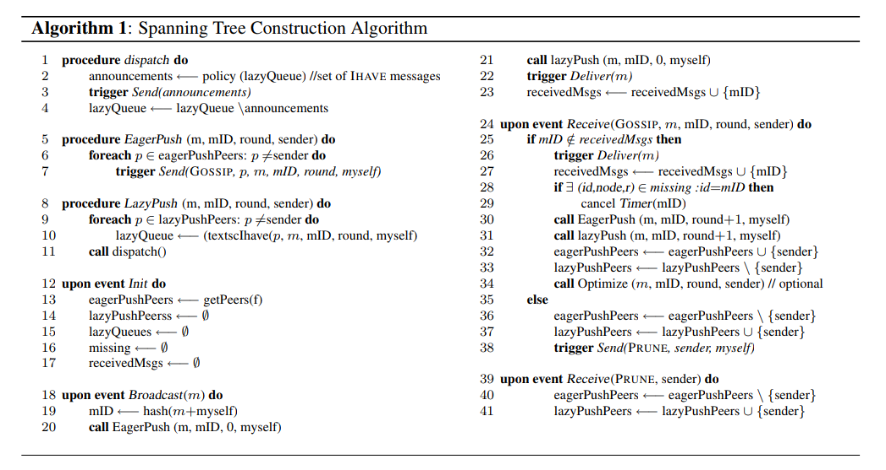
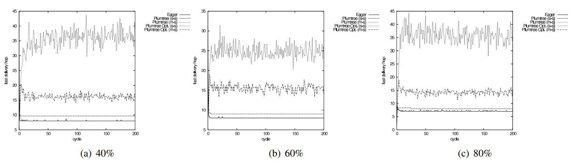
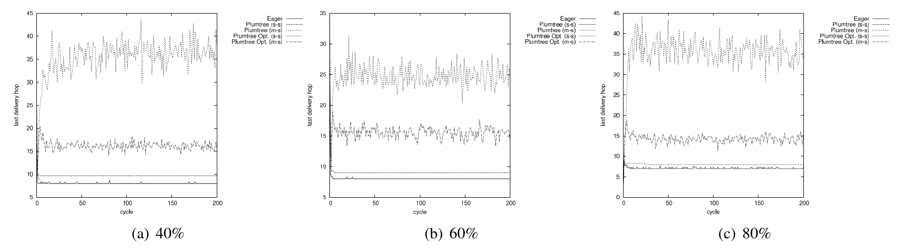

# Gossip, Broadcast деревья, plumtree

Много систем требуют очень масштабируемые системы рассылки, например, можно
даже посмореть на наш телеграм канал, всем вам на все устройства должно дойти
то или иное сообщение. И телеграм поддерживает такую инфраструктуру на десятки
тысяч каналов, некоторые из них содержат миллионы пользователей. Чтобы это
масштабировать с ростом пользователей, нужно использовать надёжные протоколы
доставки (на самом деле тут ещё важен порядок доставки сообщений, что немного
усложняет процесс, но об этом в курсе будет потом). С другой стороны, не очень
хочется увеличивать количество пересылок, так как двусвязность или n-связность
графа достигается сильным увеличением количества ребёр.

Gossip протокол, как Вы уже знаете, берёт случайно t других узлов и посылает
им сообщения. И при любом t получается, что
вероятность того, что сообщение не доставится, падает экспоненциально. Тем не
менее, чтобы реализовать gossip протокол, нужно чтобы каждый узел знал о всех
других узлах (или, как минимум, спросить о случайных узлах у какого-то сервиса),
что весьма накладно при изменении конфигурации. Часто gossip
протоколы используют так называемые [partial views](https://citeseerx.ist.psu.edu/viewdoc/download?doi=10.1.1.190.3289&rep=rep1&type=pdf)
для того, чтобы обойти это ограничение.

Другие оптимизации, которые делают в gossip протоколах -- ленивый push. При этой
оптимизации как только узел получает сообщение, то он рассылает id сообщение
другим случайно выбранным узлам, чтобы узнать, а было ли сообщение им
доставлено. И только если не было, то уже посылает само сообщение.

Все broadcast протоколы оценивают по трём параметрам:

* Reliability. Вероятность, с которой сообщение доставится из начального узла
другому живому с учётом, что любой узел в системе может упасть.
* Relative Message Redundancy (RMR). Это то, во сколько мы больше сообщений
потратили, чтобы доставить всем. Вычисляется, как (m/(n - 1)) - 1, где m --
количество сообщений, а n -- количество узлов.
* Last Delivery Hop (LDH). Максимальное количество прыжков, которое
потребовалось для доставки сообщения до последнего узла.

_Упражнение:_ посчитайте все три метрики для обычного gossip протокола.
Такой протокол ещё называется eager push протокол.

# Plumtree

К счастью, есть протоколы где все три метрики достаточно хорошо соптимизированы.
В современных пересылках используют древесные структуры с некоторыми проверками,
что те или иные сообщения доставились, а также перестройки/починки деревьев,
тем самым гарантируя надёжность и одновременно скорость протоколов.
Один из таких протоколов -- [plumtree](https://core.ac.uk/download/pdf/32330596.pdf).

<p align="center"></p>

Поговорим о правой части архитектуры. [Peer Sampling Service](http://lpdwww.epfl.ch/upload/documents/publications/neg--1184036295all.pdf)
это сервис, который выдаёт каким-нибудь образом f сервисов, с которыми
есть связь. Он также должен гарантировать, что сеть связна, то есть для
каждого узла найдётся тот, который о нём знает, а также каждый узел должен
быть соединён хотя бы с одним другим. Из теории случайных графов можно
заключить, что с большой вероятностью со случайным выбором узлов нужно брать не
такое большое f, чтобы граф узлов стал связным. Тем не менее, все теоретические
модели скрывают очень сильно структурные целостности сетей и реальность немного
сложнее. В статье [Peer Sampling Service](http://lpdwww.epfl.ch/upload/documents/publications/neg--1184036295all.pdf)
показаны различные методики как бороться со структурностью в общем случае. Одна
из интересных оптимизаций заключается в том, что можно брать случайные
подмножества логарифмического размера уже известных узлов, и соединяться с теми,
с которыми было самое дальнее расстояние, оно работает немного лучше, чем чисто
случайная модель. А в статье [HyParView: a membership protocol for reliable gossip-based
broadcast](https://asc.di.fct.unl.pt/~jleitao/pdf/dsn07-leitao.pdf) рассказано
о том, как эти подмножества соседей поддерживать. Типично в таких статьях
рассматривают десятки тысяч узлов и подмножества соседей от 5 до 30 узлов
частенько опуская теоретические выкладки из-за невозможности описать строго
математически модель.

В любом случае нужен какой-то сервис, который понимает топологию системы, кто
с кем может соединяться. Для корректности plumtree будет достаточно любого
связного графа узлов, но для практической быстроты нужны статистические свойства
случайности выборов узлов.

Дерево строится путём подражания на [алгоритм Прима](https://en.wikipedia.org/wiki/Prim%27s_algorithm)
при первом broadcast сообщения или инициализации. Каждая вершина поддерживает
eagerPushers, это те узлы, которым надо разослать сообщение, а lazyPushers --
те, которые должны были уже получить сообщение, которое рассылается. Изначально
eagerPushers инициализируются соседями из Peer Sampling Service, после
начинается broadcast из одной вершины и продолжается пока все сообщения не
доставятся. Если вершина уже получала сообщение, то оно отсылает обратно PRUNE
сообщение, которое убирает из eagerPushers адресата и добавляет в lazyPushers.
В итоге за раз мы построим минимальное остовное дерево уменьшающее суммарную
задержку.

<p align="center"></p>

Теперь при broadcast мы должны посылать сообщения всем eagerPushers, а
lazyPushers будут вершинами, которым в определённой манере (время от времени)
посылаются идентификаторы сообщений, чтобы проверять, что сообщения
доставлены. В этой части вы сами вольны выбирать как вы будете посылать
идентификаторы lazyPushers. Эти идентификаторы называются IHave. Заметим,
что алгоритм построения продолжает работать, просто после изначального
полученного дерева оно перестанет добавлять новые узлы в eagerPushers, пока
какой-то узел не упадёт.

# Починка деревьев

В дереве если вершина или узел недоступны, то оно разбивается на несколько
компонент, поэтому надо уметь чинить или перестраивать дерево.

Если какой-то узел получает IHave сообщение и не имеет этого сообщения у себя,
то запускается таймер (время истечения может быть конфигурируемо). Если по
истечению времени сообщение всё ещё не пришло, то берётся первый узел, который
прислал IHave и посылается Graft сообщение -- оно служит для восстановления
сообщения, а также служит индикатором того, чтобы добавить узел в eagerPushers.

<p align="center"></p>

Циклы могут образоваться, но алгоритм конструкции и рантайма уберёт эти циклы
как только появятся дублирующиеся сообщения.

# Изменения состояний

Если какой-то узел просто выходит из системы, это эквивалентно просто тому,
что узел недоступен, алгоритм сам себя починит. На схеме plumtree протокола это
NeighborDown. Также надо удалить все IHave сообщения у eagerPushers и
lazyPushers.

При NeightborUp мы просто добавляем узел всем в eagerPushers и дальше алгоритм
сам себя восстанавливает до дерева.

<p align="center"></p>

# Оптимизации

Алгоритм хорошо оптимизирован под первое посланное сообщение, которое, к
сожалению, прикреплено к изначальной конфигурации. При добавлении новых вершин
мы уже не поддерживаем минимальное остовное дерево, да и задержка между узлами
может меняться.

<p align="center"></p>

Мы начинаем "переклеивать" две вершины, если мы получили сообщение достаточно
далёкое по количеству прыжков. threshold контролирует максимальное количество
прыжков против против перенасыщения отправок сообщений от определённых узлов,
так как деревья с маленьким диаметром страдают от того, что достаточно много
вершин имеют большие степени.

# Быстрота и статистики

В бенчмарках использовалось 10000 узлов, для peer sampling использовалось
[HyParView](https://asc.di.fct.unl.pt/~jleitao/pdf/dsn07-leitao.pdf) c 4
соседями у каждой вершины. threshold был поставлен равным 3 для single sender
(s-s), 7 для multi-sender (m-s). m-s содержит два изначальных истока.

Relative Message Redundancy, как и ожидается, будет нулём почти всегда при
таком маленьком количестве падений.

<p align="center"></p>

Last Delivery Hop с оптимизациями имеет максимальный прыжок в районе 7-8, когда
eager push только лишь стабильнее имеет максимальный прыжок равный 7.

<p align="center"></p>

Количество сообщений хоть и остаётся таким же (потому что в эксперименте
использовалась стратегия сиюминутного отправления lazyPush), но количество
сообщений с телом уменьшилось в 4 раза.

<p align="center"></p>

При убивании 50 узлов после 100 итерации, все метрики почти не просаживаются.

<p align="center"></p>

При убивании многих узлов LDH не сильно просаживается без оптимизаций, но с
оптимизациями становится хуже.

<p align="center"></p>

Также количество сообщений быстро возвращается в норму.

<p align="center"></p>

Reliability начинает падать при 50+% умерших узлов, а починка дерева происходит
почти всегда одинаково быстро.

Также не семинаре мы посмотрели немного [реализацию](https://github.com/sile/plumtree)
plumtree и рассказали о следующем домашнем задании по реализации broadcast.

Такие мультикаст рассылки применяются достаточно редко на пользователях из-за
возможной сильной их нестабильности или отключённости из сети, плюс для проверок
живости надо посылать дополнительные пакеты, тем не менее, если у вас подключено
несколько устройств для одного сервиса (например, дополнительные часы), то
такие рассылки имеют место быть. В реальности всё немного сложнее и идеи из
plumtree подходят скорее для целостной серверной инфраструктуры.

# IP Multicast

Multicast нужен для того, чтобы посылать трафик только определённым устройствам. Наверное, самый простой
пример multicast систем -- роутеры, которые должны доставить сам сообщение до
вашего устройства или прислать push уведомление на все нужные.
В отличие от unicast, когда сервер посылает по очереди всем и пытается найти
нужного адресата и broadcast, когда нужно прислать абсолютно всем в сети, multicast
более настраиваемый на IP уровне. Давайте посмотрим на пример как работают IP multicast:

Во-первых, как и в broadcast, у multicast есть отдельные адреса, они располагаются
от 224.0.0.0/4 до 239.255.255.255, также они называются multicast группами.
Некоторые из них находятся в глобальной сети, некоторые (например, 224.0.0.1)
используются локально. Чтобы подключиться к системе, надо сделать соединение с
одной из групп и после этого отправитель уже будет знать о Вас, как только Вы
закроете, разорвёте или долго не будете отвечать на пинги соединений, с Вами
закроют соединение.

IP Multicast используется только с UDP и чтобы отправить сообщение по multicast,
нужно выставить опции IP_MULTICAST_TTL

```python3
# Set the time-to-live for messages to 1 so they do not
# go past the local network segment.
ttl = struct.pack('b', 1)
sock.setsockopt(socket.IPPROTO_IP, socket.IP_MULTICAST_TTL, ttl)
```

А сервер должен принимать устройства в multicast систему

```python3
# Tell the operating system to add the socket to
# the multicast group on all interfaces.
group = socket.inet_aton(multicast_group)
mreq = struct.pack('4sL', group, socket.INADDR_ANY)
sock.setsockopt(
    socket.IPPROTO_IP,
    socket.IP_ADD_MEMBERSHIP,
    mreq)
```

Далее они начинают общаться по протоколу [IGMP](https://en.wikipedia.org/wiki/Internet_Group_Management_Protocol),
у нас нет задачи его разобрать, скажем только, что самое полезное, что он умеет
делат это посылать запросы принадлежности и устанавливать timeout.

В файлах [socket_multicast_sender.py](./multicast/socket_multicast_sender.py) и
[socket_multicast_receiver.py](./multicast/socket_multicast_receiver.py) можно
посмотреть полноценные примеры.

К сожалению, multicast системы не получили должного внимания и развития в
интернете, Вы максимум встретите их у своих провайдеров или в роутерах (и то,
уже далеко не всегда). Так получилось из-за негомогенности систем в мире -- у
кого-то очень хорошая пропускная способность, у кого-то достаточно
посредственная, что создаёт проблемы типа "а какое качество стоит посылать", "а
умеют ли все браузеры декодировать этот поток", "а поддерживают ли все стойки
на пути этот протокол" и так далее. Тем не менее, одна из немногих стабильных
multicast систем это IPTV, для интернет трансляций телевидения -- там смогла
устояться стабильная инфраструктура.

# Что насчёт индустрии?

Такие компании как Twitch, Youtube, Netflix, Telegram и тд используют
огромные трафики Unicast систем. Зато это легче им позволяет настраивать
качество и тд. Например, если мы зайдём на youtube и начнём проигрывать какое-то
видео, мы увидим XHR (XMLHttpRequests) запросы

<p align="center"></p>

Никто не знает [точно](https://stackoverflow.com/questions/19238471/how-does-youtubes-html5-video-player-control-buffering), но
кажется Google использует [DASH](https://en.wikipedia.org/wiki/Dynamic_Adaptive_Streaming_over_HTTP)
(Dynamic Adaptive Streaming over HTTP) протокол для доставки видео через свою
[Javascript библиотеку Shaka-Player](https://github.com/google/shaka-player).

В целом DASH работает с чанками видео по 2-4 секунд, которые можно ещё и настраивать в
зависимости от битрейта, пропускной способности, которые передаются
через HTTP. Этот протокол пришёл на замену
[RTMP](https://en.wikipedia.org/wiki/Real-Time_Messaging_Protocol), который
использовался во Flash, сильного развития в VOD (Video On Demand) он не получил
из-за того, что flash был проприетарным и сложным в обновлении и обнаружении
проблем, также невозможно было настраивать качество потока. Также сам Стив Джобс
был против этого и вышел
со своим решением под названием [HLS](https://en.wikipedia.org/wiki/HTTP_Live_Streaming) (HTTP Live Streaming), который до сих пор используется
в IPhone, IPad, Safari. Концептуально технически это тоже самое, что и DASH,
но чанки уже размером 10 секунд, DASH умеет встраивать практически неотключаемую
рекламу, уметь бороться с копирайтами (Digital Rights Management), также DASH
стандартизирован и больше поддерживает различных видео форматов.

Если смотреть по наиболее популярным сервисам, то распределение протоколов
следующее:

* DASH: YouTube, Netflix, Amazon Prime Video, Facebook
* HLS: DailyMotion, Twitch (там чуть чуть сложнее, внутри своя версия RMTP
перегоняется в формат HLS), Apple TV

## Полезные ссылки

- [Оригинальная статья о plumtree](https://core.ac.uk/download/pdf/32330596.pdf)
- [Реализация](https://github.com/sile/plumtree) на языке Rust
- [Peer Sampling Service](http://lpdwww.epfl.ch/upload/documents/publications/neg--1184036295all.pdf)
- [HyParView: a membership protocol for reliable gossip-based
broadcast](https://asc.di.fct.unl.pt/~jleitao/pdf/dsn07-leitao.pdf)

- [Multicast communication](https://pymotw.com/3/socket/multicast.html)
- [Twitch Live Streaming](https://blog.twitch.tv/en/2017/10/10/live-video-transmuxing-transcoding-f-fmpeg-vs-twitch-transcoder-part-i-489c1c125f28/)
- [How video streaming works on the web: An introduction](https://medium.com/canal-tech/how-video-streaming-works-on-the-web-an-introduction-7919739f7e1)
- [The Way Online Video Streaming Works Has Changed](https://www.panopto.com/blog/the-way-video-works-online-has-changed/)
