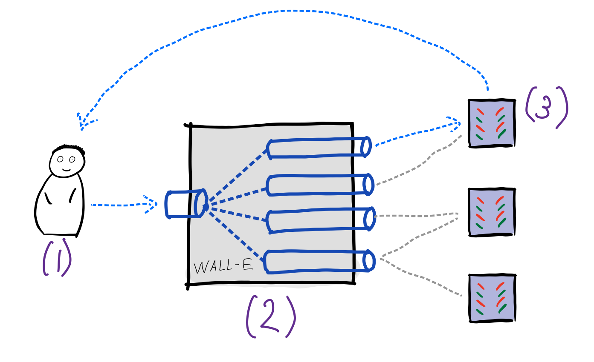
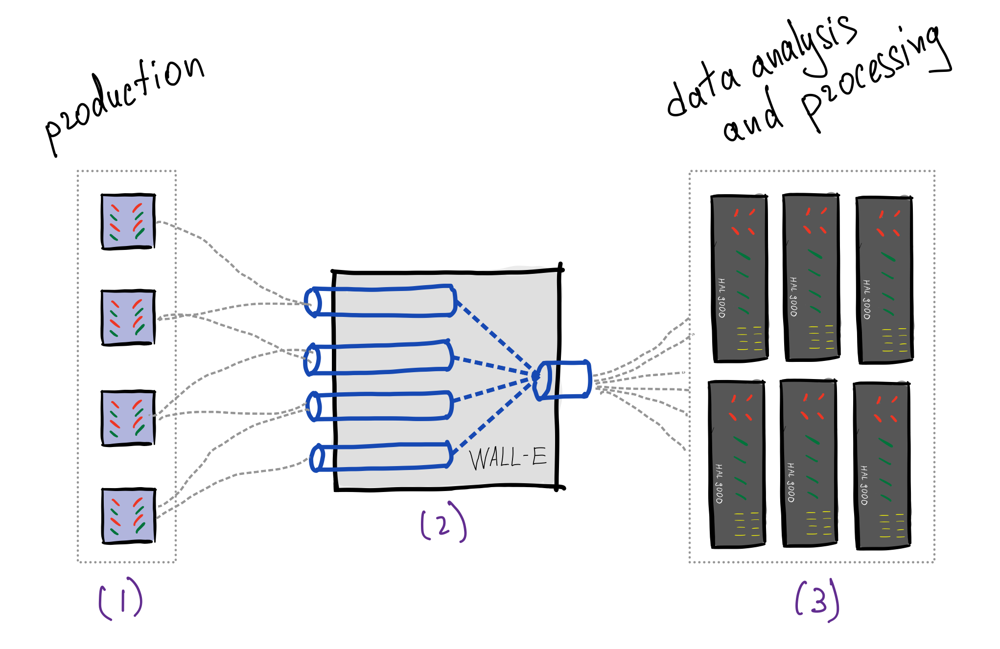
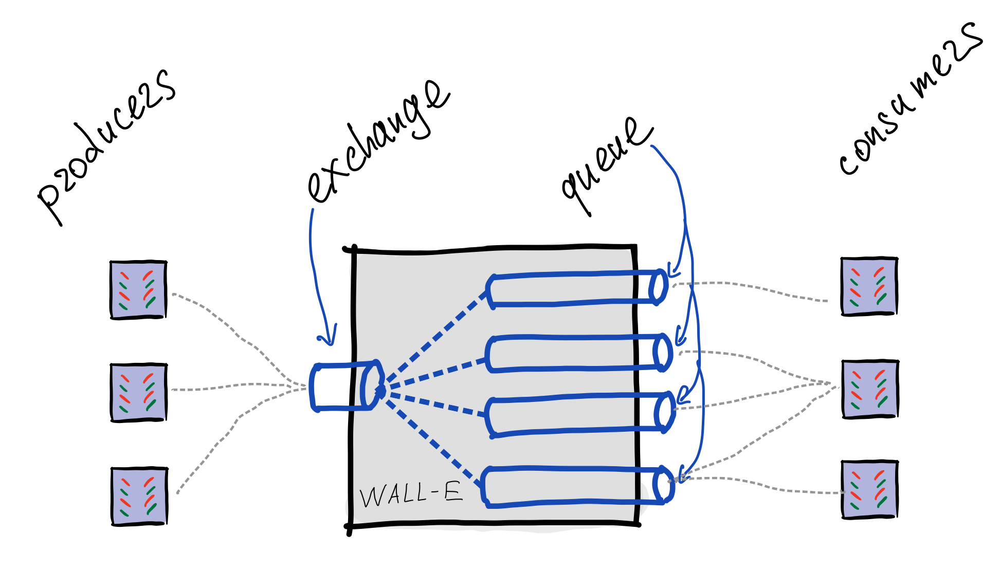
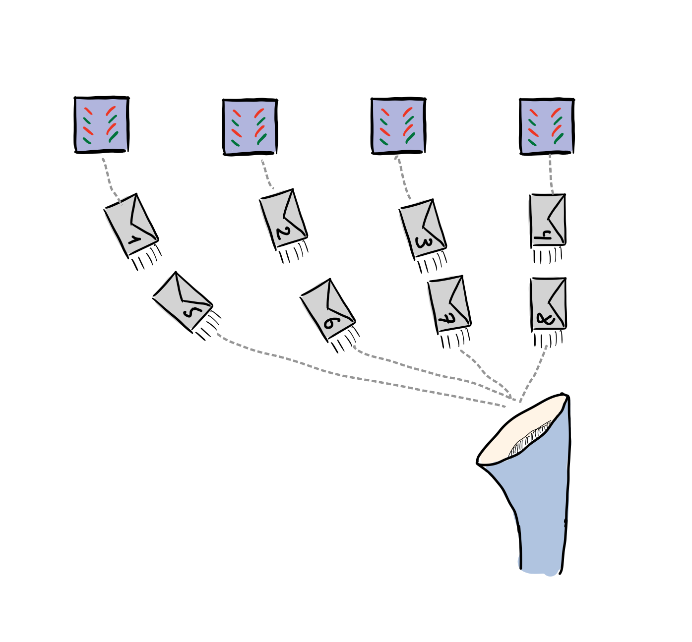

# Очереди сообщений и publish-subscribe

## Что такое Message Queue?

Message queue, или mailbox -- технология, позволяющая в некотором смысле упростить межпроцессное взаимодействие, происходит оно по сети между разными машинами или же локально на одной машине.

Здесь стоит заметить, что парадигмы очереди сообщений и publish/subscribe являются родственными: одно можно выразить через другое и наоборот.

## Мотивация

Если вы используете HTTP-запросы, то вы тем самым блокируете исполнение до того, как вы получите ответ от сервера. Также ваша информация может быть утеряна из-за недоступности сервера, из-за чего вам необходимо реализовать логику retry для того, чтобы убедиться, что информация будет доставлена.

Архитектура на основе очередей обеспечивает решение этой проблемы путем добавления очереди сообщений между компонентами РС (например, сервисами), в которой хранится информация передаваемая между ними. Архитектура на основе очередей обеспечивает полностью асинхронную связь и слабо связанную архитектуру.

Если сервис выходит из строя, то он получит сообщение, как только станет доступным.

## Примеры использования

Для message queue есть много различных применений:

- Асинхронная обработка запросов
- Доставка сообщений
- Real-time доставка данных
    - В частности, доставка логов с продакшен машин в базу данных

Поговорим поподробнее про каждый из этих сценариев.

[https://www.theinsaneapp.com/2021/03/system-design-and-recommendation-algorithms.html](https://www.theinsaneapp.com/2021/03/system-design-and-recommendation-algorithms.html)

[Рекомендации на потоке](https://habr.com/ru/company/econtenta/blog/276661/)

[Building Reliable Reprocessing and Dead Letter Queues with Apache Kafka](https://eng.uber.com/reliable-reprocessing/)

### Асинхронная обработка запросов

Архитектура приложения может выглядеть следующим образом:

Пользователь (1) отправляет сообщение-запрос в брокер сообщений. Брокер (2) определяет очередь, к которой относится запрос и записывает в конец этой очереди. Сервер (3) по мере возможностей забирает сообщения из очереди, обрабатывает их и дальше отправляет результат либо сразу пользователю, либо через тот же брокер, либо пишет результат в хранилище.

### Доставка данных

Также message queue можно использовать там, где до боевого окружения необходимо доставить много разного рода данных.

Примером может служить следующая ситуация: сервера в продакшен-окружении отвечают на запросы пользователей. При этом, раз в некоторое время (допустим, 10-15 минут) происходит обновление данных (например, данные о пробках в картах). Для того чтобы упростить архитектуру, можно поставить брокер сообщений, в одну из очередей которого продьюсеры данных пишут оперативные данные, а сервера из продакшен-окружения читают из нужных им очередей.

Из-за наличия уже написанных message broker-ов задача доставки данных до продакшена решается очень легко и просто.

Стоит отдельно отметить *доставку логов*. Допустим, в боевом окружении происходит очень много событий, которые мы отслеживаем. Хочется иметь одно место, в которое эти логи будут стягиваться, чтобы над ними делать аналитику (например, Clickhouse). Для этого тоже можно использовать брокеры сообщений. Наглядный пример перед глазами -- VK и их архитектура доставки логов. Здесь рекомендуется прочитать [первоисточник](https://habr.com/ru/company/vk/blog/430168/).

## Внутренности

Существует несколько протоколов, позволяющих реализовывать message queue. Здесь мы быстро посмотрим на AMQP (*Advanced Message Queuing Protocol*). Как всегда, интересующиеся могут почитать 40-страничную спецификацию и 63-страничное описание всех возможных типов сообщений.

### **Транспорт сообщений**

Протокол является бинарным протоколом над стэком TCP/IP. Таким образом из коробки у протокола есть порядок сообщений, целостность и надежность доставки.

### **Логика обработки**

Протокол работает на уровне *узлов* (*peers*). Каждый узел имеет свою роль -- он может быть *клиентом* (*client*) или *сервером* (*server*). Сервер отвечает за обработку логики очередей сообщений, реализуя функции точки обмена (*exchange*) и самой очереди (*queue*); клиент же может как *отправить* (*produce*) сообщение в очередь, так и *забрать* (*consume*) сообщение из очереди.

Продюсер подготавливает и отправляет сообщение точке обмена. Она, в свою очередь, изучает содержимое сообщения и на основании известных ей правил, отправляет сообщение в одну из очередей. С точки зрения реализации, очередь может храниться на диске или в оперативной памяти.

Консьюмер же подписывается на очередь сообщений, читая из нее сообщения. Для этого он подключается к точке обмена и говорит ей, на какие очереди он хочет подписаться. После этого, при появлении нового сообщения, очередь отправляет консьюмеру это сообщение.

Когда консьюмер получил сообщение, он должен либо отправить подтверждение (ack), либо отрицательное подтверждение (nack), показывающее, смог ли консьюмер обработать это сообщение. Если пришел ack, то сообщение удаляется из очереди, и обработка следующего сообщения переходит к следующему консьюмеру, подписанному на ту же очередь (такая схема называется round robin).

Если пришел nack, то сообщение может быть отброшено, отправлено другому консьюмеру или отправлено обратно продюсеру, в зависимости от настроек точки обмена и пожеланий продюсера.

### **Гарантии протокола**

Если message broker, который вы используете, в полной мере реализует AMQP, то у вас есть гарантия, что сообщения в очереди будут переданы консьюмерам в порядке их поступления в очередь. То есть, если есть всего один продюсер, то его сообщения придут в очередь в том же порядке, что и он их отправил (по причине того, что протокол работает поверх TCP). Если же продюсеров несколько, то гарантируется порядок для сообщений каждого из них, но порядок между ними не гарантируется.

## Реализации

### Kafka vs RabbitMQ

[RabbitMQ против Kafka: два разных подхода к обмену сообщениями](https://habr.com/ru/company/itsumma/blog/416629/)

[Выбор MQ для высоконагруженного проекта](https://habr.com/ru/post/326880/)

[Kafka, RabbitMQ или AWS SNS/SQS: какой брокер выбрать?](https://habr.com/ru/post/573358/)

[RabbitMQ vs Kafka Series Introduction - Jack Vanlightly](https://jack-vanlightly.com/blog/2017/12/3/rabbitmq-vs-kafka-series-introduction)

Kafka:

- Persistent
- Custom, on top of tcp/ip
- Simple routing approach
- Kafka does not support routing; Kafka topics are divided into partitions which contain messages in an unchangeable sequence + Dynamic routing
- Consumer scaling via partitions
- Pull model

Rabbitmq:

- Once ack - removed
- Several protocols, amqp by default
- Four different routing options: direct, topic, fanout, and header exchange
- Message priority
- Consumer scaling via increasing consumers number
- Push model (pull not recommended)

### **Use cases for RabbitMQ**

В общем, если вам нужен простой/традиционный брокер сообщений pub-sub, очевидным выбором является RabbitMQ, так как он, скорее всего, будет масштабироваться лучше, чем вам когда-либо понадобится. Если у вас достаточно простые требования к системе, то выбирайте RabbitMQ, например, если хранение и потоковая передача не являются обязательными.

Есть две основные ситуации, в которых стоит выбрать RabbitMQ. Для длительных задач, когда нужно запускать надежные фоновые задания. А также для связи и интеграции внутри приложений и между ними, т.е. в качестве посредника между микросервисами, где системе просто необходимо уведомить другую часть системы, чтобы начать работать над задачей, такой как обработка заказов в интернет-магазине (размещенный заказ, обновление статуса заказа, отправка заказа, оплата и т. д.).

### **Use cases for Apache Kafka**

В общем, если вам нужна платформа для хранения, чтения (повторного чтения) и анализа потоковых данных, используйте Apache Kafka. Он идеально подходит для систем, которым необходимо постоянно хранить сообщения. Также могут быть выделены два основных варианта использования для анализа данных (отслеживание, прием, ведение журнала, безопасность и т.д.) или обработки в реальном времени.

## Примеры

### Work Queues

См. папку work_queues

### Topics

См. папку topic

### Dead letter queues

См. папку dead_letter
