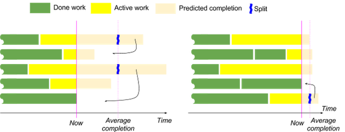

# Внутренности MapReduce систем

Парадигма MapReduce была придумана в 2003-2004 году в компании Google и была
изначально предназначена для большой обработки текстов. Давайте немного повторим
то, как эта система устроена.

Операция map это просто функция из одного элемента в другой элемент, у которого
есть первичный ключ. Reduce это коммутативная и ассоциативная агрегация всех
элементов по ключу. Чтобы эти операции совершить, надо разбить весь вход на
куски данных и отправить их на машины, чтобы они выполнялись в параллель, а весь
выход операции map идёт в операцию shuffle, которая по одним и тем же ключам
определяет записи на одинаковые хосты. В итоге получается, что мы можем спокойно
увеличивать количество worker'ов для map операций и с увеличением количества
данных мы лишь будем линейно утилизировать количество машин, то же самое с
операцией reduce -- мы можем добавлять машины с ростом увеличения количества
ключей линейно, не боясь того, что мы не можем позволить на одной какой-то
машине больше памяти или диска.

Если мы хотим посчитать количество вхождений всех слов в террабайтах данных, то
map операция это просто "word" -> "word, 1", а reduce это сумма всех вторых
значений.

Если обращаться к оригинальной статье по MapReduce, то архитектура выглядела
следующим образом:

Давайте обозначим, что worker'ы это те хосты/контейнеры, которые
выполняют операции, а master (сейчас это принято называть scheduler или leader)
это сервис, который ответственный за всю метадату о выполнении операций, где
хранятся промежуточные данные и тому подобное. Теперь давайте поймём, почему
MapReduce система действительно хорошо осела в методах обработки данных, это
происходит по ряду причин:

* Как уже писалось выше, map и reduce это операции, которые расширяемы с ростом
числа данных по количеству серверов, то есть полная горизонтальная
масштабируемость. Также присутствует и вертикальная масштабируемость -- данные
на одном worker'е можно обрабатывать в параллель в несколько потоков, чтобы
снижать суммарное количество worker'ов и уменьшать время инициализации и разброс
* MapReduce можно сделать fault tolerant по worker'ам. Master проверяет
heartbeat'ом, что все worker'ы живы и если какой-то из них таймаутится, то считается,
что worker недоступен и перевыполняет операцию на том же входе, после этого все
операции reduce берут данные из нового worker. То есть от операций ожидается
идемпотентность
* Master пишет в файловую систему чекпоинты и если Master падает, то
поднимается другой и вычитывает эти чекпоинты, таким образом потери мастеров
тоже в какой-то степени могут быть fault tolerant
* Очень много операций можно выразить через map и reduce, например, join и даже
sort при должном партицировании и небольшими модификациями записи

# Проблемы MapReduce

Существует на первый взгляд несколько проблем с оригинальной MapReduce
технологией, вот некоторые из них:

* Если, как в самом простом примере MapReduce с подсчётом слов, начинать
действительно писать все данные как "word, 1", то для часто встречаемых записей
мы будем писать очень много одинаковых данных. В действительности многие reduce
операции можно использовать в качестве combiners на map стадии -- как
комбинировать одинаковые ключи, гарантируя корректность программ и тем самым
сильно уменьшая размеры intermediate данных. Комбайнеры используются либо в
отсортированных данных, где не надо использовать дополнительную память
(что происходит достаточно редко), либо назначают лимит по памяти, который
хранит обратный индекс и делает combine операции, сбрасывая этот индекс, если
объем превышает эту память. Также можно использовать исторические данные о
combiner'ах и/или аппроксимировать в реальном времени нужное количество памяти
для хорошей утилизации, например, через алгоритм HLL++ (упомянем в современных
развитиях MapReduce)
* При очень больших данных и количества операций мастер может быть перегружен.
Система Yandex.Tables содержит только лишь один мастер для отслеживания всего
происходящего на кластере, поэтому много времени убивается на то, чтобы его
разгрузить, например, хранить копии метаданных на воркерах и передавать список
репликации самим reduce воркерам. В Google Dataflow эту проблему решили тем, что
каждая операция имеет своего одного мастера, утилизируя всю мощь системы Borg,
которая может автоматически выдавать новые машины и перешедуливать хосты в
режиме реального времени
* При настоящем пользовательском падении какого-нибудь worker'а на редких данных
тратится суммарно много ресурсов на всё остальное, да и вообще операция не
завершается. На практике это решается "костыльно" -- ставятся signal handlers
и посылаются мастеру сообщения в духе "last gasp", как только мастер видит
пользовательский фейл, то прекращает всё исполнение
* Сложно находить ошибки в коде операций map и reduce, так как всё исполнение
происходит на десятках тысяч машин. В Google Dataflow эту проблему решили просто
юнит тестированием, где данных очень мало и можно написать кода, чтобы всё
происходило на 1 машине, в Yandex.Tables поднимается несколько сервисов для
локального запуска
* Если какой-то worker тормозит по выполнению или даже так, что нашлась какая-то
запись, которая занимает очень много времени на каком-то worker'е, то reduce
операция не может начаться, чем самая последняя законченная map операция. Это
может порождать очень долгие времена окончания или даже сильные проблемы с
пониманием, а закончится ли операция или нашлась какая-то запись, которая
программу повисла. Эту проблему можно решать многими способами, например, в
оригинальной статье предлагалось сделать backup tasks (или, как их называют чаще
сейчас, speculative execution workers), когда большинство
worker'ов завершили свою работу, то оставшиеся можно продублировать для
уверенности, что нет проблем с машинами и дождаться любой из обычной и
продублированной. Другое решение заключается в том, что можно разбить долгие
worker'ы на ещё более мелкие и выполнять уже их. И, наверное, самое элегантное
решение заключается в том, чтобы переливать данные из достаточно долгих
worker'ов в достаточные быстрые и в real time поддерживать засечки аппроксимации
окончания работы каждого из воркеров и удостоверяться, что это время примерно
одинаковое. Такой подход называется Liquid Sharding, и мы его рассмотрим ниже
* В изначальной статье по MapReduce количество запускаемых машин и лимиты по
памяти выставлялись вручную, это ограничение решается написанием собственного
шедулера (или использование автоматических систем как Borg) и аппроксимацией
нужности количества ресурсов из исторических данных, в том числе от прошлых
запусков и текущей прогрессии выполнения.

# \*Современные направления MapReduce

Технология MapReduce была придумана более 15 лет назад и с тех пор очень сильно
развилась. Например, как уже написано, полностью отказались от ручного
настраивания количества worker'ов и памяти, теперь это всё высчитывается и
аппроксимируется автоматически. Также в чистом виде MapReduce как парадигма
устарела, сейчас стараются отказаться от этого словосочетания в пользу
"Data Pipeline Processing", где используются множества операций, в том числе и
Map, Reduce, Join, JoinReduce, Sort, Filter, Flatten, GroupBy, MapMany,
MapAtMostOne, SideInput, InitializeReplica, etc. Примерами могут служить Spark,
Google Cloud Dataflow.

После этого составляется граф всех операций, который пользователь указал,
оптимизируется сам граф (например, склейками операций или через оптимизации
вида peephole), где сильно используются теоретические и инженерные результаты,
например, при склейке не должно быть циклов или графы не должны сильно большими
и быть хорошо распараллеливаемыми. Оптимизация графа может происходить по
историческим данным от прошлых запусков с профайлом новых данных по количеству
входа-выхода тех или иных операций.

После оптимизации графа идут настройки вертикальной и горизонтальной
масштабируемости, то есть надо понимать в какой момент надо увеличивать или
уменьшать количество worker'ов, сколько надо аллоцировать потоков, какие
процессоры и диски у тех или иных хостов. Сколько занимает fixed cost у
операций, как лучше оптимизировать закон Амдала, как лучше утилизировать
кластер, что делать с медленными машинами, как предсказывать время завершения и
так далее.

Ещё одна интересная деталь заключается в том, как оптимизировать комбайнеры,
сколько им надо выделять памяти, сколько уникальных элементов всего на воркере,
помогает ли комбайнер вообще, что некоторые системы решают, например, с помощью
алгоритмов семейства HyperLogLog и теорией из потоковых алгоритмов.

Также ещё вопросы возникают, а можно ли читать меньше данных, читать не всё
и использовать идемпотентность worker'ов как свойство для оптимизации, а не
только как fault tolerance.

Одно из развитий это так же Relational Data Processing, где стараются SQL
запросы превратить в такой Data Pipeline и получать быстрые результаты для
аналитики, такие системы встречаются даже и в open source, например, Hive.
Яндекс и Google имеют свои аналоги.

Ещё одно из сложных направлений -- предоставление гарантий. Так как железо
нестабильно, время исполнения сильно зависит от данных и погоды на кластере
(например, в датацентре ночью больше ресурсов доступно), то сложно предугадывать
и давать какие-то гарантии по тому, когда pipeline закончится. Этот вопрос
сейчас наиболее близок к решению в Google Dataflow из-за очень умного движка
оптимизаций, который старается все неровности данных и машин сглаживать как
можно лучше.

Многие вопросы не имеют однозначных ответов и используются продвинутые
алгоритмы, комбинаторные оптимизации и даже методы машинного обучения для
предсказания аномалий и распределения данных.

Стоит понимать, что из-за роста числа данных такие системы являются очень
популярными среди всех, кто хоть как-то работает с обработкой данных в программировании, например,
поисковые индексы строятся через data pipeline processing, топ видео в Youtube
в регионах считаются так же, да даже файловые системы считают квоты и проверки
на консистентность таким же образом, любая
статистика, которая не требует сиюсекундного обновления хорошо ложится на такую
парадигму. Скорее всего многие из Вас, кто стажировался или будет стажироваться,
в том или ином виде столкнётся с такой системой, и удивительный факт заключается
в том, что в своей базовой основе лежит парадигма MapReduce, идеи из которой
ничем в целом и не заменились.

# The Tail at Scale

Как уже писалось выше, существует достаточно часто встречающаяся проблема в
высоконагруженных системах как stragglers или tail latency. Представьте, что
система отвечает 10ms почти всегда, но на 99 перцентили 1 секунду. Так как
запросы параллелятся на множетсво серверов (шардов из прошлого семинара), то
если Вы зададите запрос на 100 машин, то теперь вероятность того, что
пользователь будет ждать 1 секунду равна 0.63, это уже совсем неприемлемо. В
общем случае с этим придётся жить, но существуют несколько хороших тактик, даже
не очень относящиеся к теме сегодняшнего семинара

* Hedged requests. Обычно если какая-то реплика не отвечает достаточно долго,
то можно задать запрос в другую реплику и дождаться ответа, например, если
прошло 80% времени от timeout и сервер не отвечает, то можно задать тот же
запрос в другую реплику. Как правило, ещё устанавливают максимальное количество
дополнительных запросов, чтобы при случайной деградации системы не становилось
ещё хуже всем сразу.
* Tied requests. Это минимальный метод балансировки, когда запросы задаются на
несколько реплик, а та, кто первый его захватила, посылает другим сигнал о том,
что запрос можно не выполнять. Как мы рассказывали на прошлом семинаре, даже
запрос в две случайные реплики с выбором одной сильно уменьшает максимальную
загруженность. В Google в распределённой файловой системе GFS такая техника
давала 18% ускорение на медиане и 40% ускорение на 99-99.9.
* Selective Replication. Будем горячие данные просто больше реплицировать.
* Probation. Будем смотреть за слишком медленными машинами и проверять их на
живость время от времени, чтобы возможно вернуть в строй.
* Degradation. При слишком сильной нагрузке будем деградировать систему, если
так вообще можно, например, в поисковых системах вернуть хороший результат быстро
тоже неплохо в отличие от идеального результата, но в 10 раз дольше. Практика
показывает, что даже деградация 5-10% не сильно влияет на качество, но сильно
уменьшает высокие квантили.

А теперь поговорим о том, как с этим борются в распределённых системах.

# Liquid Sharding

Давайте разберём одно из элегантных решений проблем с неравномерностью
исполнения данных на стадиях, что они могут отложить начала следующих,
под названием [Liquid Sharding](https://cloud.google.com/blog/products/gcp/no-shard-left-behind-dynamic-work-rebalancing-in-google-cloud-dataflow), который
был предложен компании Google в их современном аналоге MapReduce под названием
Google Cloud Dataflow.

В первую очередь, давайте поймём, почему такое может происходить:

* Некоторые данные могут хоть и изначальную маленькую величину, но их обработка
может занимать долгое время. Такую проблему ещё любят называть "проблемой тёмной
материи" (Dark Matter Problem)
* Серверы могут иметь неравномерные конфигурации, где-то быстрее работает
процессор или диск, а на других может тормозить сеть
* Просто какие-то неравномерности из-за нестабильности окружения

Во всех фреймворках как Hadoop, Spark, Flink, за исключением Cloud Dataflow,
партицирования для map операции выполняется заранее, перед запуском любого из
сегментов, и не изменяется во время выполнения. Количество сегментов обычно либо
указывается пользователем, либо определяется системой эвристически, например, на
основе оценки размера данных или просто количества входных файлов.

Очень распространенная проблема производительности на этапах map, с которой
сталкиваются все фреймворки, -- это _stragglers_ (с англ. отставшие), когда
обработка небольшого количества сегментов занимает намного больше времени, чем у
остальных.

Straggler'ы могут легко доминировать во время выполнения шага map, сводя на нет
большую часть преимуществ распараллеливания. Они также могут тратить ресурсы и
увеличивать затраты, так как другие worker'ы вынуждены долгое время
бездействовать (idle state), прежде чем они смогут начать работу на следующем
этапе.

В итоге получается так, что если есть две стадии, утилизация ресурсов происходит
плохо, плюс время исполнения сильно растёт.

Индустрия и академия долго боролись с этим эффектом, как уже было указано выше,
но давайте ещё раз всё просуммируем:

* Многие фреймворки предоставляют ручки для настройки количества частей, на которые разбивается вход. Например, такая есть в [Spark](http://spark.apache.org/docs/latest/tuning.html#level-of-parallelism).
Не расширяется со временем, так как данные меняются и надо постоянно следить за
тем, чтобы оно было вручную настроено. Даже [пишутся](https://blog.cloudera.com/how-to-tune-your-apache-spark-jobs-part-2/)
отдельные блоги для того, чтобы научить вручную тюнить этот параметр
* Некоторые фреймворки идентифицируют медленных worker'ов и помечают свои машины
как плохие, превентивно удаляя их из пула рабочих. Это решение предназначено
только для straggler'ов на уровне железа и не совсем адаптировано для облачных
сред
* [Speculative Execution](https://en.wikipedia.org/wiki/Speculative_execution)
или backups, которые мы разбирали выше
* Выборка или аналогичные методы могут помочь оценить распределение данных,
чтобы разделить данные более равномерно. Однако сбор таких статистических данных
часто бывает дорогим, недостаточно точным или устаревшим. Более того, как
отмечалось выше, отставание может произойти, даже если распределение данных
сбалансировано, из-за несбалансированной сложности обработки различных частей
данных
* В академических кругах были исследованы некоторые более сложные методы устранения
дисбаланса данных, такие как [SkewTune](http://nuage.cs.washington.edu/pubs/sigmod2012-kwon-correct.pdf), которые полностью материализует необработанный
ввод данных отставшего пользователя, собирает статистические данные о нем и
распределяет его более равномерно. Это шаг в правильном направлении, однако
стоимость полного чтения остальной части ввода отставшего пользователя может
быть непомерно высокой, в частности, что делает метод бессмысленным, если для
отставшего уже преобладает стоимость чтения ввода

К сожалению, практика показывает, что ручных эвристик недостаточно для
оптимального перформанса и динамически меняющиеся системы наиболее мощны в
оптимизациях.

В соответствии с этим Google Dataflow продолжает регулировать разделение данных
во время выполнения, используя технику, аналогичную _work stealing_ или
_work shedding_. Мастер постоянно отслеживает прогресс каждого worker'а и
выявляет straggler'ов (например, тех, у кого прогнозируемое время завершения выше
среднего). Затем Google Dataflow просит этих worker'ов отдать часть своей
необработанной работы (например, поддиапазон файла или ключевой диапазон входных
данных) более быстрым. Затем он распределяет эти новые рабочие элементы на
простаивающих worker'ов. Процесс повторяется для следующих идентифицированных
отставших. Объем работы для раздачи выбирается таким образом, чтобы работник
завершил работу достаточно быстро и перестал быть отставшим.

Такой метод вызывает некоторые трудности и сильное внимание к деталям, например:

* Сохранность данных. Например, при разбивке данных нельзя, чтобы никакая запись
не продублировалась или не потерялась. Сложности возникают, например, когда
данные уже начинают вычитываться в тот же момент, когда и происходит разделение.
Авторы статьи пишут, что wait-free алгоритм разбивки был важен для хорошей
скорости операции разделения
* Сложное тестирование и очень аккуратный дизайн учитывая сколько различных
засечек может иметь вход данных (который ещё и может быть пользовательским) и
как отрезки можно разбивать
* Ещё одна сложность в том, как предсказывать время окончания, это может быть
сделано как аппроксимация уже обработанных данных или что-то более интересное,
как какие-нибудь модели машинного обучения

Плюсы такого метода достаточно ясны:

* Суммарное уменьшение времени работы
* Уменьшение затрат и лучше утилизация worker'ов
* Лучшая способность к предсказыванию времени окончания, так как те самые
stragglers очень сильно портили эту статистику

В итоге пайплайны оптимизируют своё время исполнения в среднем на 25%. Нет
дополнительных worker'ов и данные очень красиво переливаются из одних в другие
максимально утилизируя всевозможные выданные ресурсы.

До (две стадии map и reduce):

После (две стадии map и reduce, белые пятна обозначают idleness у worker'а):

# Полезные ссылки

1. [Оригинальная статья по MapReduce](https://static.googleusercontent.com/media/research.google.com/en//archive/mapreduce-osdi04.pdf)
1. [Tail at Scale](http://people.csail.mit.edu/matei/courses/2015/6.S897/readings/tail-at-scale.pdf)
1. [Google Cloud Dataflow Documentation and Features](https://cloud.google.com/dataflow/docs)
1. [Статья о Liquid Sharding](https://cloud.google.com/blog/products/gcp/no-shard-left-behind-dynamic-work-rebalancing-in-google-cloud-dataflow)
1. [Apache Spark Tutorial](https://cloud.google.com/blog/products/gcp/no-shard-left-behind-dynamic-work-rebalancing-in-google-cloud-dataflow)
1. [Apache Hive](https://hive.apache.org/)
1. [SkewTune](http://nuage.cs.washington.edu/pubs/sigmod2012-kwon-correct.pdf)

