# Время, модели согласованности и разрешение конфликтов

В рамках данного материала мы затронем вопрос измерения времени в распределенных системах,
гарантии моделей согласованности и подходы для разрешения конфликтов.

## Время и часы

### Несовершенство физических часов

Мы обращаемся к времени очень часто: нам нужно понимать, какое событие произошло раньше,
какая версия объекта является более новой, и в основе многих алгоритмов лежат таймауты.

И как правило мы опираемся на показания физических часов, измеряющих число прошедших секунд, но эти часы несовершенны...
Часы на разных узлах показывают разное время. Более того, часы на одном компьютере могут "идти" с разной скоростью в зависимости от температуры, фазы луны и многих других факторов.

Для часов можно определить скорость дрейфа (clock drift) относительно показания других часов. Эта величина измеряется в ppm (parts per million): точность N ppm означает, что за миллион тактов разница часов составит не более N тактов. Например, при точности 40 ppm разница показаний за год составит не более `365 * 24 * 60 * 0.000040 = 21` минуту.

Человечество придумало много подходов для генерации временных тактов. Стандартная точность для популярных [кварцевых часов](https://en.wikipedia.org/wiki/Crystal_oscillator) составляет 20 - 50 ppm. Существует и более точный подход: [атомные часы](https://en.wikipedia.org/wiki/Atomic_clock) (atomic clock) измеряют периоды излучения атома цезия-133 с ppm `1e-14` (1 секунда в 3 миллиона лет). Атомные часы достаточно дорогие и их устанавливают в GPS спутниках.

Чтобы держать разницу показаний часов в допустимных границах, часы необходимо синхронизировать друг с другом. Одним из популярных протоколов для синхронизации времени считается [NTP](https://en.wikipedia.org/wiki/Network_Time_Protocol) (network time protocol). Узлы системы выстраиваются в древовидную структуру, в самом верху &mdash; узлы с наиболее точными часами (reference clock). Остальные узлы общаются со своими соседями и выравнивают свое время относительно, учитывая время, затрачиваемое на сетевые походы. 

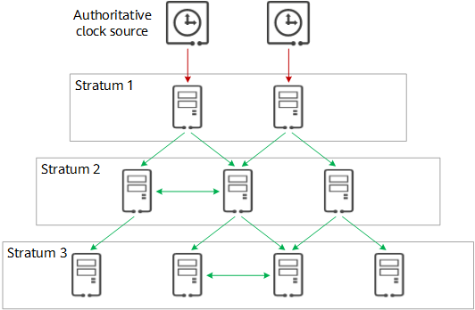

Однако NTP не позволяет достичь идеальной синхронизации часов и вполне разумным считается отставание времени на разных серверах в пределах 1 &ndash; 100 миллисекунд, что в некоторых случаях неприемлемо много.

Инженеры Google при разработке глобально-распределенной базы данных [Spanner](https://dl.acm.org/doi/pdf/10.1145/2491245) пошли дальше: разработали TrueTime API, которое позволяет синхронизировать время с большей точностью. В каждом датацентре Google находятся атомные часы, к которым обращаются сервера из этого датацентра для синхронизации локального времени. Более того, показания атомных часов синхронизируются через GPS спутники. Также API предоставляет необычную модель получения времени: когда происходит запрос времени, возвращается не один показатель, а два: гарантируется, что актуальное показание часов находится в диапазоне `[earliest; latest]`. Размер временного отрезка как правило не превышает 7 мс.


### Логические часы Лэмпорта

Мы поняли, что показателям физического времени доверять нельзя. Но если вспомнить, что мы хотели использовать показания времени для упорядочивания событий в системе,
можно попробовать отказаться от физического времени в угоду **логического**.

Попробуем построить частичный порядок событий, с помощью которого мы будем понимать, какое событие произошло раньше другого. Для выстраивания такой связи нам не нужно знать физическое время, когда произошло событие, достаточно уследить за логической связью.

Введем **частичное** отношение *happened before*: событие $A$ произошло до события $B$ ($A \to B$), если выполняется одно из условий:
- $A$ и $B$ произошли на одном узле, и $A$ произошло раньше (мы можем уследить за этим в рамках одного узла);
- если $A$ это отправка сообщения некоторым узлом $N_1$, а $B$ это событие получения данного сообщения некоторым узлом $N_2$;
- существует событие $C$, что $A \to C$ и $B \to C$ (транзитивность).

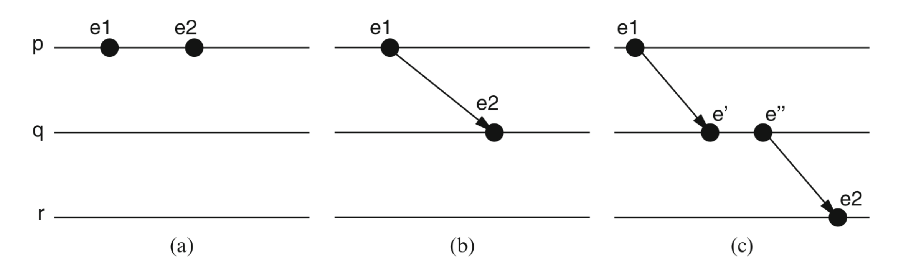

Возможна ситуация, когда $a$ и $b$ несравнимы: не выполняется ни $a \to B$, ни $b \to A$. Тогда события считаются параллельными (concurrent): $A \parallel B$. 

Именно эту идею [использует](https://lamport.azurewebsites.net/pubs/time-clocks.pdf) Leslie Lamport для логических часов (которые позже назовут часы Лэмпорта).

Введем функцию $C(a)$, которая назначает каждому событию $a$ в системе число &mdash; логический таймстемп, когда данное событие было создано. От этой функции мы хотим следующее: 

$$a \to b \implies C(b) < C(b)$$ 

То есть, если $b$ логически следует из $a$, то таймстемп $b$ больше таймстемпа $a$.

Для определения такой функции на каждом узле в нашей системе будем поддерживать числовой счетчик времени, который будет увеличиваться при наступлении нового события:
- Изначально счетчик на каждом узле равен 1.
- Когда на узле генерируется локальное событие, счетчик увеличивается на 1 и полученное число назначается таймстемпом события.
- Когда узел $N_1$ получает некоторое сообщение от другого узла $N_2$, локальный счетчик $N_1$ обновляется по правилу: $C_{N_1} = \max(C_{N_1}, C(msg)) + 1$, где $C(msg)$ равен таймстемпу события в полученном сообщении. 

Последнее правило гарантирирует следующее: таймстемп события "сообщение доставлено" будет больше таймстемпа события "сообщение отправлено".

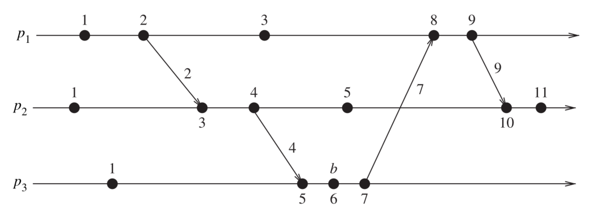

Отлично. Храня один локальный счетчик на каждом узле и рядом с каждым сообщением, мы научились определять, какие события произошли раньше других.

Однако есть существенный недостаток: единственная гарантия, предоставляемая данным порядком, это $a \to b \implies C(a) < C(b)$. 

Если $C(a) < C(b)$, это в том числе может сигнализировать о $a \parallel b$. Например, в случае, когда $a$ и $b$ это локальные события на разных узлах.

Более того, $C(a) = C(b)$ не гарантирует, что $a = b$. Уникальность событий можно получить, добавив к таймстемпу номер узла, где было создано данное событие: пара $\{C(e), node_e\}$ уникально идентифицирует событие и пары можно сравнивать покомпонентно, не теряя happens before. 

### Векторные часы

Расширив идею часов Лэмпорта, можно получить векторные часы, которые предоставляют больше гарантий.

На каждом узле будем хранить вектор из N числовых значений ($N$ &mdash; число узлов в системе). Как можно догадаться, $i$-ое значение в векторе будет соответствовать логическому таймстемпу узла $i$ по мнению текущего узла:
- Изначально все значения в локальном векторе $V$ равны 0, кроме одного: $V[i] = 1$, где $i$ это номер узла.
- Когда на узле $i$ создается новое событие, необходимо сделать $V[i] = V[i] + 1$.
- Когда узел $P$ отправляет сообщение $m$ на узел $Q$, необходимо обновить счетчик узла $Q$: $V_Q[i] = \max(V_Q[i], m.V[i]) \ \forall i$ и после этого $V_Q[Q] = V_Q[Q] + 1$. Полученный вектор назначается таймстемпом события "сообщение получено".

Как можно заметить, логика обновления счетчиков очень похожа на логику обновления в часах Лэмпорта. 

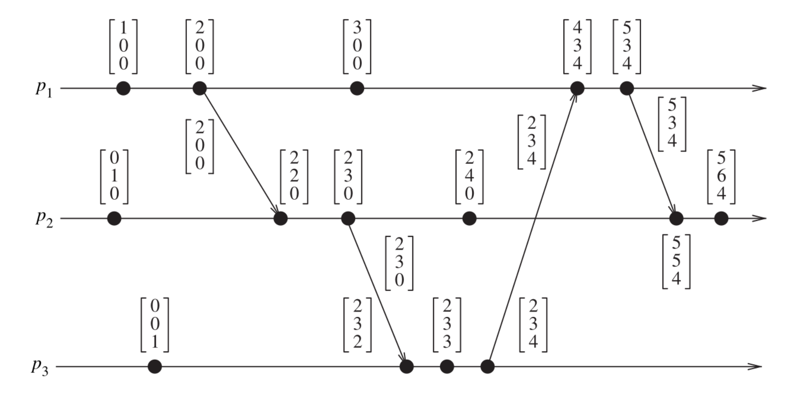

Сравнение векторов происходит покомпонентно:
- $V_a = V_b \iff V_a[i] = V_b[i] \ \ \forall i \in \{1, 2, \dots, n\}$
- $V_a \leqslant V_b \iff V_a[i] \leqslant V_b[i] \ \ \forall i \in \{1, 2, \dots, n\}$
- $V_a < V_b \iff V_a \leqslant V_b \land V_a \neq V_b$
- $V_a \parallel V_b \iff V_a \not \leqslant V_b \land V_b \not \leqslant V_a$

Благодаря таким часам, знак $\implies$ из утверждений про часы Лэмпорта можно заменить на $\iff$:
- $V(a) < V(b) \iff a \to b$
- $V(a) = V(b) \iff a = b$
- $V(a) \parallel V(b) \iff a \parallel b$

Отдельно обратим внимание, теперь если $V(a) < V(b)$, то мы наверняка можем быть уверены, что событие $a$ произошло до события $b$.

Недостатком векторных часов является его размер. Вместе с сообщением теперь необходимо "таскать" вектор, размер которого линейно зависит от числа участников в системе. Если в системе тысячи узлов, а типичное сообщение имеет размер 100 байт, мы существенно увеличим накладные расходы. В качестве оптимизации, можно не хранить нулевые значения (превратить вектор в map) и добавить процесс синхронизации узлов, в рамках которого все узлы будут обнулять оговоренные счетчики.

Идея векторных часов используется в Amazon Dynamo:

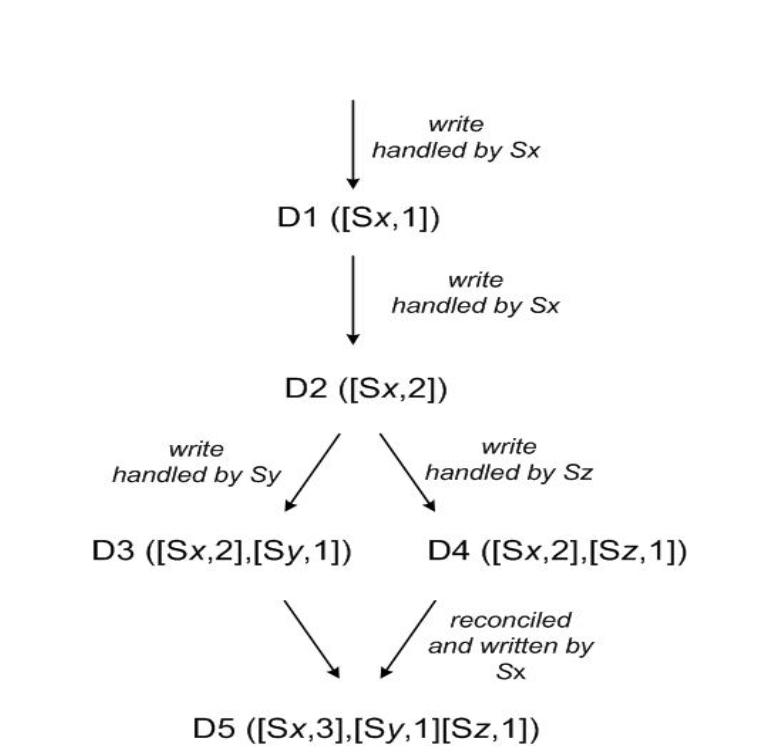

*Пояснение к иллюстрации можно найти во второй половине секции 4.4 [оригинальной статьи](https://www.allthingsdistributed.com/files/amazon-dynamo-sosp2007.pdf)*.

## Модели согласованности

Когда мы работаем с распределенной системой, мы хотим, чтобы данная система внешне вела себя как один компьютер.
Однако внутри себя данная система состоит из нескольких узлов, которые могут изменять общее состояния. Более того, зачастую система позволяет делать конкурентные запросы. 

Было бы разумно ввести семантику конкурентных запросов: какие гарантии мы получаем касательно данных, которые будут возвращены? Учитывая, что узлы хранят собственную копию состояния, необходимо определить, какое поведение считается допустимым при обработке конкурентных запросов на запись и чтение. 

Модель консистентности (согласованности) это контракт между распределенной системой и её клиентом, позволяющий понять, какие гарантии предоставляет система.

Часто говорят, что при наличии отказов сети всегда появляется компромисс: хотите вы чтобы ваша система была строго согласованной и не возвращала нерелевантные значения при чтении, или чтобы она всегда была доступна и вы могли получить ответ на свой запрос даже в случае split brain'a. Можно это отнести к выводам из [CAP теоремы](https://en.wikipedia.org/wiki/CAP_theorem).

Разумно хотеть от системы, чтобы она всегда действовала так, будто конкурентных запросов не существует и система действует как единый узел. Однако чем строже модель согласованности, тем сложнее этого добиться (что сказывается на ограничениях и скорости работы системы). 

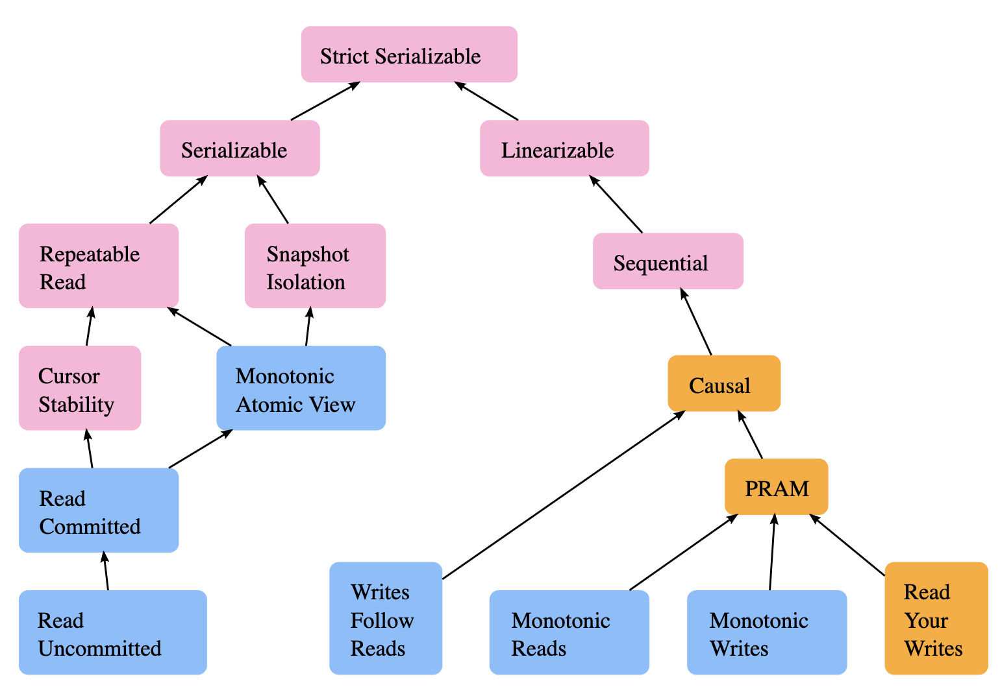

*Левая часть посвящена моделям консистентности транзакций (изменение нескольких ячеек данных), правая &mdash; изменению одного значения*.

С описанием многих моделей консистентности можно ознакомиться на ресурсе [Jepsen](https://jepsen.io/consistency) (схема кликабельна), мы затронем лишь несколько из них.

### Causal Consistency

Причинная согласованность требует, чтобы все причинно-следственные события появлялись в том же порядке на всех узлах. 

Рассмотрим ситуацию с тремя узлами: узел A отправляет другим узлам сообщение "Поедим?". Узлы B и C отвечают узлу A "да" и "нет" соответственно. Causal consistency позволяет узлам узлу B наблюдать сообщения в порядке "Поедим?", "да", "нет", узлу C &mdash; в порядке "Поедим?", "нет", "да". Однако никакой узел не должен наблюдать сообщения "да" и "нет" до сообщения "Поедим?".

Данную модель согласованности можно получить, используя часы Лэмпорта.

### Sequential Consistency

Leslie Lamport [определяет](https://www.microsoft.com/en-us/research/uploads/prod/2016/12/How-to-Make-a-Multiprocessor-Computer-That-Correctly-Executes-Multiprocess-Programs.pdf) Sequential модель согласованности следующим образом:

> the result of any execution is the same as if the operations of all the processors were executed in some sequential order, and the operations of each individual processor appear in this sequence in the order specified by its program.

Менее формально, SC предполагает, что все операции выполняются согласно некоторому полному порядку, который согласован с локальными порядками выполнения операций на каждом из узлов.

Рассмотрим систему из двух узлов, выполняющие операции над двумя переменными x и y, значения которых изначально равны 0. На представленной схеме описаны несколько возможных результатов исполнения и один невозможный (в рамках SC):

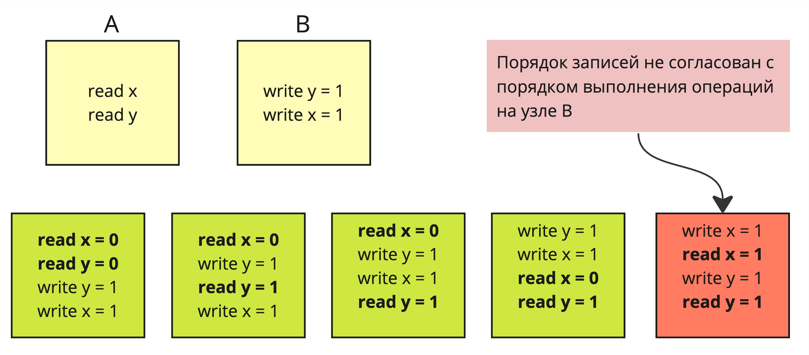

В sequential модели процесс может сильно опережать или отставать от других узлов. Из этого следует, что реплика может возвращать информацию произвольной давности. Однако если узел A применил некоторую операцию узла B, он уже не сможет "наблюдать" состояние, актуальное до применения данной операции.

### Linearizability

#### Отступление про истории (history)

Рассмотрим систему, поддерживающую базовый набор операций: запись и чтение. Операции требуют некоторое время на обработку, то есть у каждой операции есть время её начала и время окончания выполнения (когда мы получаем `ok`). Также наша система будет поддерживать возможность конкурентных операций, время выполнения которых пересекается.

Введем понятие истории (history): список операций, где у каждой операции есть запись о её начале и о её окончании. 

История позволяет отразить логику выполнения конкурентных операций. Рассмотрим следующую диаграмму, на которой нанесены операции, выполняющееся ненулевое время:

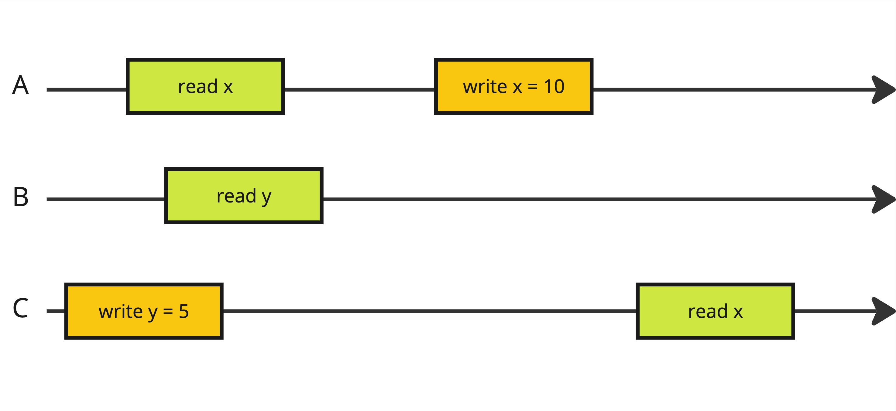

Для данной диаграммы можно выписать следующую историю:
```
C: write y = 5
A: read x
B: read y
C: ok [write]
A: ok [read]
B: ok [read]
A: write x = 10
A: ok [write]
C: read x
C: ok [read]
```

#### Линеаризуемость

Формально свойство линеаризуемости определяется в [Linearizability: A Correctness Condition for Concurrent Objects](https://cs.brown.edu/~mph/HerlihyW90/p463-herlihy.pdf). 

Назовём историю последовательной (sequential history), если после каждого начала операции сразу же следует ответ на данную операцию. Важно учитывать, что по умолчанию, когда говорят про линеаризацию, имеют ввиду работу с одним объектом.

Например, следующая история не является последовательной, так как в ней есть пересекающиеся операции:
```
read X
write X
ok [read]
ok [write]
```

Назовём историю H линеаризуемой, если она *эквивалентна* некоторой корректной последовательной истории H', где H' состоит из тех же событий, но возможно расположенных в другом порядке с ограничением, что если операция op1 заканчивается раньше начала операции op2 в H, такой же порядок сохраняется и в H'. Другими словами, история линеаризуема, если все ответы на операции корректны в соответствии с последовательным реордерингом, сохраняющим порядок непересекающихся операций.

Наконец, назовём объект линеаризуемым, если все истории, которые он порождает, являются линеаризуемыми. Другими словами, неважно как и когда клиенты выполняют запросы, результат их выполнения можно представить таким образом, будто запросы шли одним за другим.

Рассмотрим пример с очередью. Например, следующая история не линеаризуема:
```
A: push 0
A: ok [push 0]
B: push 1
C: pop
B: ok [push 1]
C: ok [1]
```

История не линеаризуема, так как операция `pop` на узле C началась после завершения операции `push 0` на узле A, а значит результатом `pop` должен быть `0` (по семантике очереди).

Следующая история является линеаризуемой:
```
A: write 0
A: ok [write 0]
B: write 1
C: read
B: ok [write 1]
C: ok [0]
```

так как мы можем делать реордеринг пересекающихся операций и можем привести рассмотренную историю к последовательной:
```
A: write 0
A: ok [write 0]
C: read
C: ok [0]
B: write 1
B: ok [write 1]
```

#### А теперь менее формально

Если у клиентов системы появляется внешний (по отношению к системе) канал общения, по которому они могут передавать друг другу информацию о прочитанных значениях / событиях, гарантий Sequential Consistency может не хватить. 

Линеаризуемость помогает учесть наличие внешнего канала общения и предполагает, что операции выполняются атомарно, в порядке, согласованном с порядком выполнения операций в реальном времени. Для внешних клиентов результаты обработки выглядят так, будто они применяют атомарные операции к единственной копии объекта.

Если операция A в реальном времени заканчивается раньше, чем начинается операция B, значит обработка операции B должна происходить над состоянием после применения операции A.

На практике, линеаризуемая модель согласованности запрещает подобные ситуации:


*Пример из книги Designing Data-Intensive Applications, Martin Kleppman*

Данную ситуацию можно описать следующей историей:
```bash
# set 0
A: write 1
A: ok [write]
B: read
B: ok [1]
C: read
C: ok [0] # (!)
```

Также важно учитывать, что для конкуррентных операций результат выполнения может быть не определен:

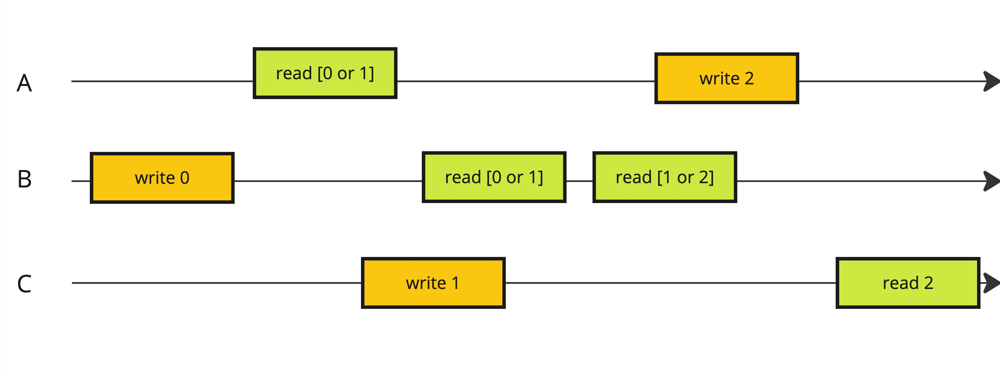

Но если одна операция чтения вернула новый результат, все последующие чтения тоже должны его возвращать:


Чтобы понять концепцию "продолжающих" чтений, стоит помнить о том, что у каждой операции должен быть момент, когда данная операция будет атомарно применена на всех узлах системы:

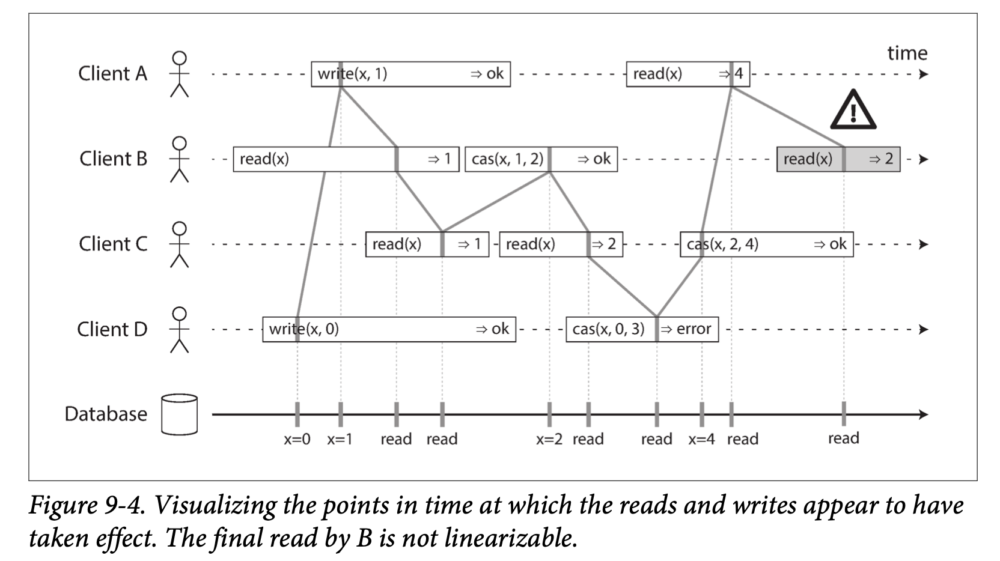

*Пример из книги Designing Data-Intensive Applications, Martin Kleppman*

Для достижения описанных гарантий на практике прибегают к механизму взятия блокировок и алгоритмам консенсуса.

### Linearizability vs Sequential Consistency

Сперва может быть непонятно, чем Sequential Consistency отличается от линеаризуемости.

Когда мы говорим про систему, состоящую из нескольких реплик, для обеих моделей согласованности справедливо следующее:
- Модель должна демонстрировать поведение, будто клиент работает с одной копией.
- Операция чтения должна возвращать **наиболее актуальное** записанное значение, для всех клиентов.
- **Все последующие** операции чтения должны возвращать один и тот же результат до следующей операции записи, для всех клиентов.

Отличие данных моделей согласованности заключается в определении понятий "наиболее актуальное" и "все последующие".

"наиболее актуальное" и "все последующие" для Sequential Consistency:
- Результаты операций на одном клиенте: определяются временем на сервере (порядок инструкций в программе).
- Результаты операций на разных клиентах: **не определяются временем**, может быть reordering.
- То есть логика с сохранением результата последующего вызова актуальна только в рамках одного клиента.
- Если прочитать значение от лица одного клиента, а потом прочитать это же значение от лица другого клиента,
  второе чтение может вернуть менее актуальное значение, чем первое чтение.

Для линеаризуемости мы требуем, чтобы результаты операций даже на разных клиентах были согласованы с временем, то есть reordering недопустим.

## Разрешение конфликтов

В качестве примера давайте рассмотрим следующие задачи:
- реализовать коллаборативный редактор (Google Docs);
- реализовать синхронизацию календаря на разных устройствах при условии, что устройства иногда уходят "в оффлайн";
- посчитать число просмотров популярного сайта (google.com).

Для решения подобных задач можно прибегнуть к подходам автоматического разрешения конфликта. Данные алгоритмы способны работать в системах, где записи генерируются на нескольких узлах, клиенты могут уходить в "оффлайн", и в итоге синхронизированное состояние должно быть доставлено всем клиентам.

Подход Operational Transformation (OT) требует наличия центрального сервера, занимающегося синхронизацией данных. OT способны лучше передавать намерение операций при возникновении конфликтов, но довольны сложны в реализации, поэтому не будут рассмотрены в данном материале. 

Convergent CRDT (Conflict-free Replicated Data Types), или же State-based CRDT, структуры позволяют обойтись без центрального сервера и идея заключается в том, что можно определить удобную операцию Merge для двух состояний, применяя которую мы будем автоматически разрешать конфликты (детерминированно).

Потребуем от операции Merge следующие свойства:
- коммутативность: merge(x, y) = merge(y, x);
- ассоциативность: merge(x, merge(y, z)) = merge(merge(x, y), z);
- идемпотентность: merge(x, x) = x.

Данными свойствами, например, обладают операции взятия максимума из двух элементов или операция объединения множеств.

Сразу рассмотрим примеры реализации примитивов с помощью данного подхода.

### G-counter, Grow-only counter

GCounter это монотонно увеличивающийся счетчик. Например, такой примитив подходит для подсчета числа визитов сайта google.com.

Чтобы определить суммарное значение счетчика, мы должны посчитать сумму всех известных счетчиков на репликах. Вопрос в том, как отличать показатели счетчиков с разных реплик и не "проиграть" из-за дублированных сообщений / реордеринга.

Вспомним идею векторных часов. На каждой реплике будем хранить вектор из счетчиков, i-ый компонент вектора будет соответствовать счетчику на i-ом узле.

- Когда узел хочет сделать инкремент счетчика, он увеличивает значение в своей компоненте и может разослать свой вектор остальным узлам.

- Когда узел получает вектор от другого узла, он делает операцию покомпонетного максимума своего вектора с полученным.

- Чтобы определить суммарное значение счетчика, узел считает сумму всех компонент вектора. 

Да, это значение может "отставать" от реальности, но в подобных задачах нам как правило не нужна высокая точность и достаточно согласованности в конечном счете.

### Increment/Decrement counter

Чтобы поддержать возможность декремента счетчика, необходимо взять два GCounter счетчика. В одном будем поддерживать сумму инкрементов, в втором &mdash; декрементов.

Чтобы определить актуальное значение счетчика, необходимо из суммы первого вектора вычесть сумму второго вектора.

### Grow-only set

Используем идею GCounter'а для реализации структуры данных set, разрешающее только добавление новых элементов.

В качестве Merge необходимо взять стандартную операцию объединения множеств. Готово.

Обратите внимание, что поддержать операцию удаления из множества просто так не получится из-за возможных реордерингов операций: `add x, remove x` легко превращается в `remove x, add x`, из-за чего состояние на репликах может разойтись.

### Коллаборативный редактор

С помощью CRDT можно получить даже коллаборативный редактор (Google Docs). Необходимо представить, что позиции букв в редакторе выражены некоторым рациональным числом, а при добавлении нового символа, ему назначается позиция, равная среднему значению двух соседних символов:

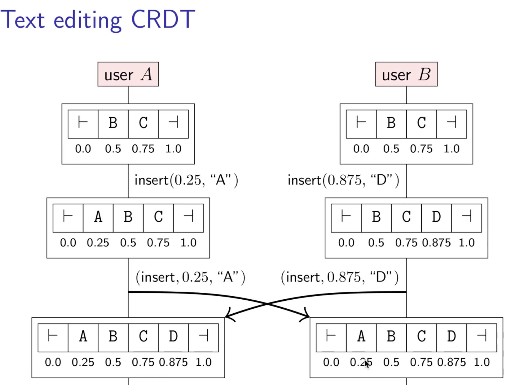

*Credits to Martin Kleppman*

Данный подход красивый, однако стоит помнить, что достаточно быстро вы упретесь в точность вещественной арифметики.

Изучить логику работы OT коллаборативного редактора можно [здесь](https://operational-transformation.github.io/).

### JSON

Фреймворк [automerge](https://automerge.org/) позволяет реализовать автоматические разрешение конфликтов над произвольным JSON объектом.

С помощью JSON вы сможете выразить почти все, что может потребоваться. Вопрос лишь в том, насколько быстро это будет работать...

### Другие примеры

Не будем пересказывать логику реализации других примитивов, так как лучше всего ознакомиться с оригинальными статьями, ссылки на которые есть в финальной секции.

CRDT структуры очень интересны и с помощью изящных приемов позволяют решить довольно сложные задачи.

## Дополнительные материалы

- [TrueTime API](https://sookocheff.com/post/time/truetime/)
- [Spanner, TrueTime & The CAP Theorem](https://storage.googleapis.com/pub-tools-public-publication-data/pdf/45855.pdf)
- [Time, Clocks, and the Ordering of Events in a Distributed System](https://dl.acm.org/doi/pdf/10.1145/359545.359563) &mdash; статья Лесли Лэмпорта про логические часы.
- [Timestamps in Message-Passing Systems That Preserve the Partial Ordering](http://cs.engr.uky.edu/~manivann/cs570/Fidge.pdf) &mdash; про векторные часы.
- [Jepsen Consistency Models](https://jepsen.io/consistency) &mdash; краткое описание моделей согласованности.
- [CSE Buffalo 26 consistency](https://cse.buffalo.edu/~stevko/courses/cse486/spring13/lectures/26-consistency2.pdf) &mdash; разница Lineriazability и Sequential Consistency.
- [Living without atomic clocks: Where CockroachDB and Spanner diverge](https://www.cockroachlabs.com/blog/living-without-atomic-clocks/)
- [CockroachDB's consistency model](https://www.cockroachlabs.com/blog/consistency-model/) &mdash; про линеаризуемость в глобально-распределенной СУБД CockroachDB.
- Designing Data-Intensive Applications, Martin Kleppman &mdash; хорошая книга, раскрывающая многие концепции распределенных систем.
- [Distributed Systems 8.1: Collaboration software](https://www.youtube.com/watch?v=OqqliwwG0SM) &mdash; Мартин Клеппман доступным языком рассказывает базовые подходы в CRDT и OT [видео].
- [An introduction to state-based CRDTs](https://www.bartoszsypytkowski.com/the-state-of-a-state-based-crdts/) &mdash; хорошая серия статей про CRDT.
- [Автоматическое разрешение конфликтов с помощью операциональных преобразований](https://habr.com/ru/articles/416961/) &mdash; неплохая статья на русском языке про OT.
- [To OT or CRDT, that is the question](https://www.tiny.cloud/blog/real-time-collaboration-ot-vs-crdt/) &mdash; про ситуации, когда CRDT хуже отражают намерение, или почему OT все еще жив.
