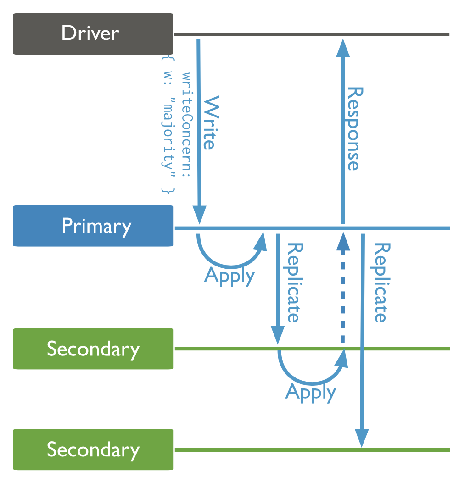

# Primary/Backup репликация

Мы уже затрагивали тему репликации, особенно репликации бинарных данных. Там мы занимались оптимизацией оверхеда занимаемого места. Сегодня мы поговорим не столько о методах хранения и оптимизации места при репликации, сколько об общих подходах к репликации чего угодно.

Чем, по большому счёту, является любое приложение? Каким-то автоматом. Конечным или нет, детерминированным или нет. Если говорить применимо к обычным серверным приложениям, то есть некоторый виртуальный автомат с каким-то своим текущим состоянием. Чтобы состояние изменилось, надо, чтобы автомату был подан какой-то ввод. Вероятно, помимо измененного состояния автомата ещё одним результатом будет какой-то вывод, в ответ на ввод.

Разберем пару конкретных примеров.
- Простейшая база данных это детерминированный автомат, состояния которого это данные в каком-то виде. Ввод для базы данных это какой-то запрос обновления или чтения данных, вывод это ответ на запрос, а измененное состояние после запроса — измененные данные базы данных.

- HTTP сервер это тоже автомат, этот пример на самом деле очень похож на предыдущий, так как любые данные на диске и состояние памяти под HTTP сервером это его состояние, ввод и вывод это запрос и ответ на него, а результатом выполнения запроса будет измененное (или нет) состояние.

- RabbitMQ воркер это тоже своего рода автомат, если под ним есть какое-то состояние и он не выполняет чисто служебную функцию перекладывания данных. Только ввод для автомата воркер получает сам (походами в очередь), а выводу быть не обязательно.

Если же состояния нет, то и реплецировать нечего. А если же есть, то будет нехорошо, если это состояние мы в какой-то момент потеряем, например, в случае отключения электропитания. Хотелось бы как-то и куда-то сохранять состояние нашего автомата.

## Подходы к реализации

Чтобы сохранить где-то иметь дубликат состояния автомата есть два естественных подхода — можно регулярно целиком копировать текущее состояние автомата или копировать изменяющий состояние ввод. Первый подход называют Full State Replication, второй Replicated State Machine. Первый часто проще в реализации, но требует больше ресурсов, чем второй. Например, такой подход можно использовать для быстрого небольшого in-memory KV — просто раз в несколько секунд дампить состояние базы на диск. Второй способ используется, как правило, в приложениях, где состояние довольно большое, например классические персистентные базы данных (о них поговорим ниже).

Существуют несколько моделей репликации:

- **Master-slave** или **primary-backup** модель является очень простой — существует какой-то постоянный основной сервис с каким-то состоянием и существует рядом его копия, на которую отправляется либо целиком новое состояние, либо какие-то изменяющие это состояние запросы. В случае падения мастера реплика заменяет его и клиент работает с ней.

- **Multi-master с распределенными блокировками**, для которых в основном используется Zookeeper. Эта модель уже сложнее — она использует распределенный сервис блокировок, который позволяет координировать действия большого числа мастеров без необходимости прямого взаимодействия между ними. В этом случае мастер смотрит в сервис блокировок и если на какое-то действие взята блокировка, то он сначала ждёт изменений и применяет их к себе, а потом выполняет своё изменение, или применяет их в обратном порядке, если порядок применения не важен.

- **Distributed fault tolerant replicated state machine.** Эта модель про честную распределенную систему, где с помощью алгоритмов консенсуса реплицируется лог операций, а потом идентичный лог операций (по построению) применяется к равноправным детерминированным автоматам. По этой модели работает Zookeeper.

## Где используется и в каком виде

### PostgreSQL
PostgreSQL является одной из наиболее популярных систем управления SQL базами данных. В ней можно выбрать технический способ реализации репликации, но по большому счёту все они об одном и том же — Master-Slave репликация изменяющих запросов в базу, то есть `INSERT, UPDATE, DELETE, ALTER, ...`.

Мастер работает в режиме чтения и записи, то есть клиент может прийти к нему с любым запросом. Запросы, изменяющие состояние СУБД (данных или настроек), реплицируется в виде write-ahead-log, то есть сначала запрос попадает на диск, потом применяется к состоянию мастера, а потом асинхронно реплицируется.

Реплика работает только в режиме чтения, если мастер жив. Чтение с реплики часто используется в служебных целях — если в мастер пишет и читает основной сервис, то чтобы не нагружать мастер, то из реплики могут читать аналитики, индексаторы (перекачивающие данные в какие-то другие места) и любые другие служебные сервисы.

С недавнего времени PostgreSQL поддерживает Multimaster Replication, но если при синхронной репликации писать во много реплик, то это будет вызывать тормоза из-за локов, а при асинхронной надо будет резолвить конфликты транзакций руками или писать правила.

Источник: https://www.postgresql.org/docs/current/different-replication-solutions.html
### MongoDB
MongoDB это известная NoSQL база данных, модель данных которой несколько сложнее, чем просто JSON, но похожа. В ней в ранних версиях использовалась очень похожая модель на PostgreSQL, то есть [Master-Slave](https://docs.mongodb.com/v2.2/administration/master-slave/), но с версии 2.4 доступна только одна модель — Replica Set. На самом деле, эта модель отличается от простого Master-Slave простыми соображениями:
- при одном мастере read-only копий может быть сколько угодно
- при падении мастера копии могут как-нибудь выбрать нового мастера

Из интересного, у операции записи есть контролируемая семантика реплицирования операции — в момент записи можем указать, сколько синхронных копий мы хотим сделать перед тем, как получить ответ от мастера. Остальные реплики скопируют операцию асинхронно. Подробнее написано вот тут: https://docs.mongodb.com/manual/core/replica-set-write-concern/

Источник: https://docs.mongodb.com/manual/replication/

### ClickHouse

ClickHouse это open-source аналитическая СУБД, её очень любят использовать для аггрегационных запросов по каким-нибудь логам. Её основные преимущества — язык SQL-like, эффективное сжатие данных, очень быстрые аналитические запросы. В ClickHouse используется Multi-Master репликация, которая координируется через выделенный сервис блокировок — Zookeeper. Особенность ClickHouse — данные в нём (почти) неизменяемые, а данные в табличке хранятся сортированными по выбранному ключу. Поэтому реплицировать ClickHouse надо только INSERT и редкие ALTER запросы. Чтобы не мучаться с ALTER, он выполняется ON CLUSTER, то есть синхронно на всех доступных репликах. INSERT реплицировать в неизменяемой модели данных очень просто — нода, в которую произведена запись, сообщает через Zookeeper всем остальным репликам о том, что у неё появились новые данные. Другие реплики с метаданными из Zookeeper приходят за новой порцией данных и записывают их к себе, а асинхронная сортировка поставит данные на место в табличке.

Источник: https://clickhouse.tech/docs/en/engines/table-engines/mergetree-family/replication/

### VMware FT
Статья: https://pdos.csail.mit.edu/6.824/papers/vm-ft.pdf

Видео с разбором статьи на английском: https://youtube.com/watch?v=M_teob23ZzY

Этот пример использования Master-Slave репликации мы решили включить в семинар, так как он довольно необычен. Как правило, реплицируются какие-нибудь базы данных, а тут реплицируется целая виртуалка.

VMware занимается продуктами, связанными с виртуализацией, такими как виртуализация ОС на вашем домашнем компьютере или виртуализация маленьких серверов на большом железе. Когда мы покупаем виртуалку у какого-нибудь DigitalOcean за 5$ c 1 ядром и 1 гигабайтом оперативной памяти, конечно же нигде не стоит маленький компьютер с таким железом — наша машина _виртуализируется_, то есть на большом сервере с десятками ядер и сотнями гигабайт ОЗУ запускается некоторое приложение, которое симулирует поведение железной машины. Поверх этого симулятора запускается какая-нибудь операционная система и мы получаем свой виртуальный сервер. VMware в частности занимается разработкой таких движков виртуализации. Помимо того, что мы можем поставить диски в какой-нибудь RAID, нам бы хотелось увеличить отказоустойчивость не только для диска, но и для всего сервера.

Всё было бы относительно просто, если бы наше железо было детерминированным. Однако, как мы знаем, в железе есть non-deterministic операции, такие как прерывания, операция чтения времени или порядок выполнения инструкций при параллелизме. В этой статье есть ограничение на однопоточные машины, поэтому последний вид недетерминизма нас не очень волнует (быстрый поиск в гугле предлагает такую [статью](https://iacoma.cs.uiuc.edu/iacoma-papers/replay_itj.pdf) про deterministic multi-processor replay of concurrent programs).

Далее предлагается прочитать конкретные секции в [оригинальной статье](https://pdos.csail.mit.edu/6.824/papers/vm-ft.pdf), так как если бы писали это здесь, то это был бы не конспект, а прямой пересказ/перевод. В статье это написано довольно компактно и понятным языком. **Обязательной для чтения является вся секция 2**, но если интересно, можно прочитать ~~и все остальные~~ хотя бы секции 3 и 4.
