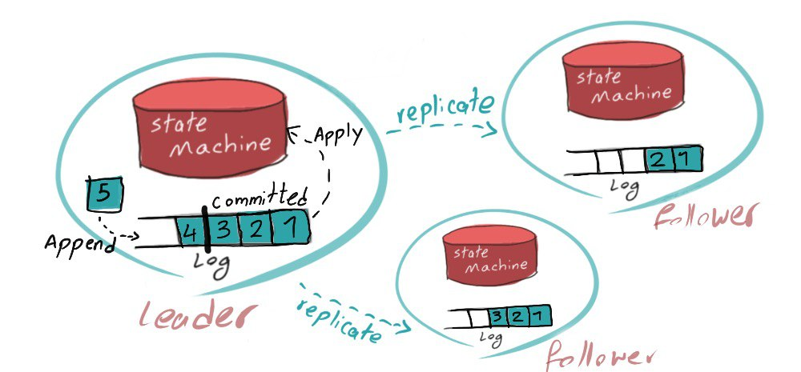
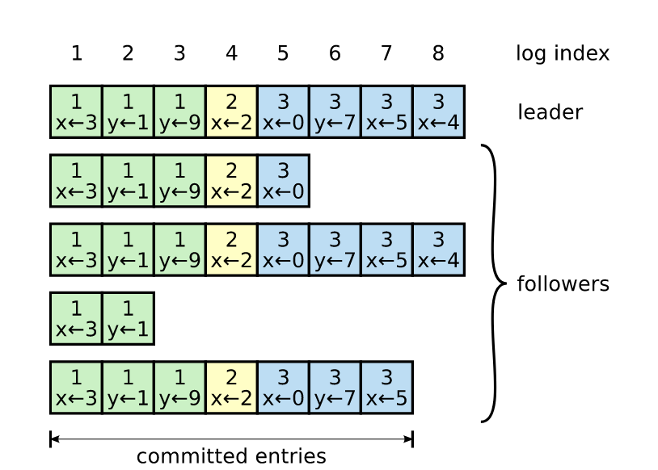

# Consensus

План:
- Вспомнить лекцию
- Посмотреть на Raft
- Написать простой KV с помощью библиотеки для Raft
- Посмотреть на ZooKeeper
- Попробовать etcd

## Консенсус

- [Слайды с лекции](https://github.com/osukhoroslov/distsys-course-hse/blob/master/2022/lectures/11-consensus.pdf)
- [Разделы 6 и 7 из курса Клеппмана про консенсус](https://www.cl.cam.ac.uk/teaching/2021/ConcDisSys/dist-sys-notes.pdf)

Вопросы:
- Про какие алгоритмы консенсуса вы слышали?
- Что такое задача Total Order Broadcast (Atomic Broadcast)?
- Для чего нужен консенсус?
- Приведите пример системы, которую можно реализовать на основе алгоритма консенсуса
- Вопросы из зала...

---

Если все запросы в системе обрабатывает один сервер, то внутри такого сервера можно реализовать произвольно сложную логику. Какие примеры нераспределенных систем вы знаете (которые обрабатывают запросы на одном сервере)?

Например, на локальном компьютере доступны следующие операции:
- Упорядочивание операций
- Блокировки (locks)
- Атомарные RMW-операции типа compare-and-swap (CAS)


С помощью этих операций несложно реализовать логику для любого из таких требований:
- Только один клиент должен вести запись в файл
- Только один узел в системе должен играть эту роль
- У каждого пользователя должно быть уникальное имя
- Баланс счёта не должен быть отрицательным
- Не должно быть продано больше товаров, чем есть на складе
- Реплицируемое хранилище должно обеспечивать линеаризуемость
- Транзакция не должна быть зафиксирована в системе частично

---

Что делать в случае отказа единственного сервера? Как запустить такую же систему на 3-х серверах и обеспечить её работоспособность в случае отказа одного из них?

Что такое Replicated State Machine?



С помощью RSM можно реализовать любую систему, которая может быть реализована на одном сервере.

Зачастую реализовывать консенсус самому не требуется, можно использовать готовые отказоустойчивые реализации, поддерживающие помимо RSM такие базовые абстракции и примитивы, как:
- Key-Value хранилище
- Выбор лидера
- Сервис блокировок
- Координатор транзакций
- Упорядоченная рассылка (total order broadcast)
- Линеаризуемые атомарные операции типа CAS (compare-and-swap)

Какие отказы не нарушают работу системы? Какие отказы нарушают работу системы?

Консенсус работает в модели, в которой:
- узлы могут переставать работать на неопределенное время
- сообщения в сети могут быть потеряны или задерживаться на неопределенное время

В такой модели гарантируется согласованность данных. Это довольно классическая модель, которая подходит для большинства распределенных систем.

Как с помощью консенсуса/RSM реализовать требования, которые мы рассматривали выше?

## Raft

https://raft.github.io/

На сайте есть симулятор, который позволяет посмотреть, как работает алгоритм и выбор лидера.

Также есть интерактивный сайт, который наглядно показывает как работает Raft: http://thesecretlivesofdata.com/raft/. На этом сайте есть хороший пример про Network Partition.



Есть ли какие-нибудь вопросы про то, как работает Raft?

## KV-хранилище на основе Raft

Репозитории в которых можно посмотреть на реализацию:
- https://github.com/hashicorp/raft
- https://github.com/etcd-io/etcd/blob/main/raft/README.md
- ещё есть https://github.com/eBay/NuRaft

Полезные ссылки:
- https://www.youtube.com/watch?v=EGRmmxVFOfE

Мы возьмем готовую реализацию использующую `hashicorp/raft` и gRPC, и реализуем свой KV Storage на ее основе: https://github.com/Jille/raft-grpc-example

Хотим реализовать простой KV Storage, который будет поддерживать следующие операции:
- `Get(key) -> value`
- `Set(key, value)`
- `CAS(key, old_value, new_value) -> value_before_update`

Реализация находится в папке `kv`.

Запустим наш код и попробуем выполнить несколько запросов. Делать запросы можно с помощью grpcurl:
```bash
# Удаляем старые данные и запускаем три узла
docker-compose down -v && docker-compose build && docker-compose up

# Смотрим IP адреса узлов
docker inspect raft1

# Делаем CAS запрос
grpcurl -proto proto/service.proto -d '{"query":"cas,num,10,20"}' -plaintext 172.22.0.3:50051 Example/Query

# Можно зайти в контейнер и посмотреть данные, сохраненные на диске
docker exec -t -i raft1 /bin/bash
```

## ZooKeeper


Wiki страница на русском, с моделью данных и примерами использования: https://ru.bmstu.wiki/Apache_ZooKeeper

Запустить ZooKeeper кластер можно локально с помощью docker-compose:
  https://dev.to/jv/zookeeper-cluster-with-docker-compose-jml

```bash
cd zookeeper
docker-compose up

# clean up
docker-compose down -v
```

Еще один блог про модель данных: https://medium.com/develbyte/zookeeper-namespace-and-operations-4bdbbee5ab37

Полезные ссылки:
- https://habr.com/ru/post/565976/
- https://habr.com/ru/post/487058/

Что можно сделать с ZooKeeeper?

- [ZooKeeper Programmer's Guide](https://zookeeper.apache.org/doc/current/zookeeperProgrammers.html)
- [Блог про ZooKeeper Use Cases](https://blog.acolyer.org/2015/01/27/zookeeper-wait-free-coordination-for-internet-scale-systems/)
- [Сборник официальных рецептов](https://zookeeper.apache.org/doc/current/recipes.html)
- [Реализация некоторых рецептов](https://apache.googlesource.com/zookeeper/+/refs/tags/release-3.8.0-1/zookeeper-recipes/)
- [Apache Curator, highlevel API framework for ZooKeeper](http://curator.apache.org/)
- [kazoo, Python library for ZooKeeper](https://kazoo.readthedocs.io/en/latest/)
- [ClickHouse Data Replication](https://clickhouse.com/docs/en/engines/table-engines/mergetree-family/replication/)

Применение ZooKeeper:
- Конфигурационный сервис
- Управление группой
- Выборы лидера
- Блокировки, семафоры, барьеры
- Счетчики, очереди
- Фиксация транзакций

## etcd

Относительно новое распределенное хранилище ключ-значение, которое используется в Kubernetes.

Подробнее про etcd в k8s: https://learnk8s.io/etcd-kubernetes


Ссылки:
- https://etcd.io/
- https://etcd.io/docs/v3.5/learning/why/
- https://etcd.io/docs/v3.5/learning/api/
- https://github.com/etcd-io/etcd/tree/main/etcdctl


Распределенные блокировки:
- https://martin.kleppmann.com/2016/02/08/how-to-do-distributed-locking.html
- https://github.com/etcd-io/etcd/blob/main/client/v3/concurrency/mutex.go

Выбор лидера:
- https://github.com/etcd-io/etcd/tree/main/etcdctl#elect-options-election-name-proposal
- https://github.com/etcd-io/etcd/blob/main/client/v3/concurrency/election.go

```bash
# Заходим в контейнер, в котором запущен etcd и установлен etcdctl
docker exec -t -i etcd_etcd_1 /bin/bash

# Можно подписаться на все обновления
etcdctl watch --prefix ""

# Взять блокировку с именем "mylock"
etcdctl lock mylock
```

Что насчет Two-Phase Commit? Как работает 2PC в общем случае? Как можно сделать 2PC с помощью etcd?

- клиент/координатор сообщает узлам, что надо сделать _prepare_
- узлы пишут свое решение в отдельные ключи
- координатор проверяет ключи, если кто-то не ответил в течение таймаута записывает за него ответ `no` (важно чтобы запись шла через CAS, чтобы узел не мог потом перезаписать это)
- если все записи `yes`, то делается _commit_ (фиксация) транзакции (например, координатор пишет принятое решение в отдельный ключ, который читают узлы)
- если хотя бы одна запись `no`, то транзакция откатывается
- если узел упал, то он вычитывает свое состояние перед падением из локального лога и, если он принял `yes`, но не успел отправить, то отправляет свой ответ
- если координатор упал, то после перезапуска он просто вычитывает состояние из etcd (если финальное решение еще не выписано, то выписывает его)
