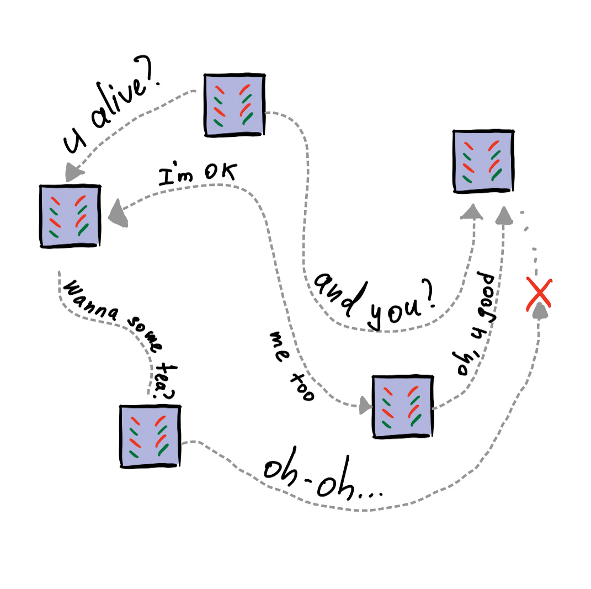
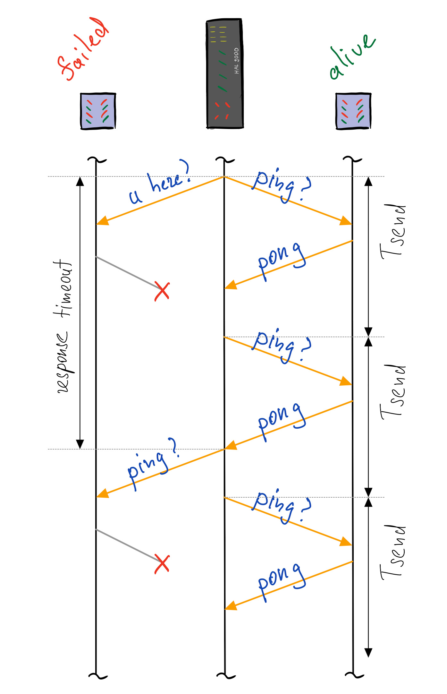
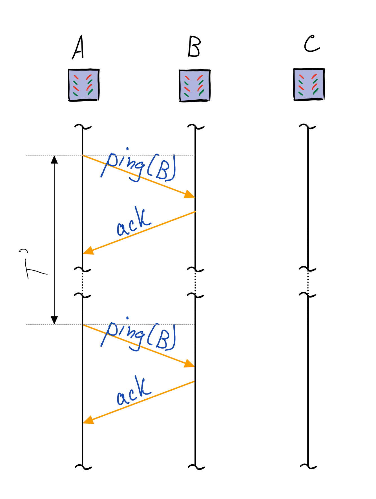
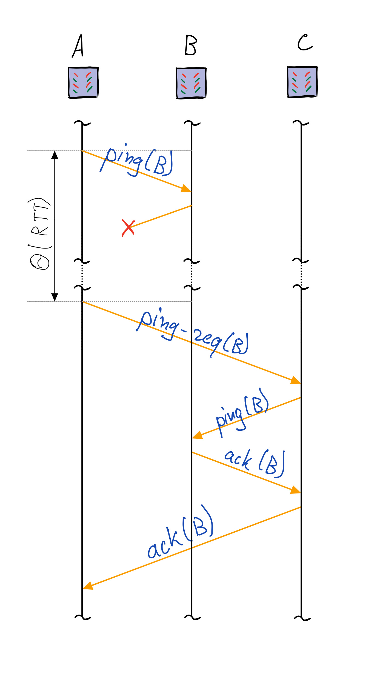
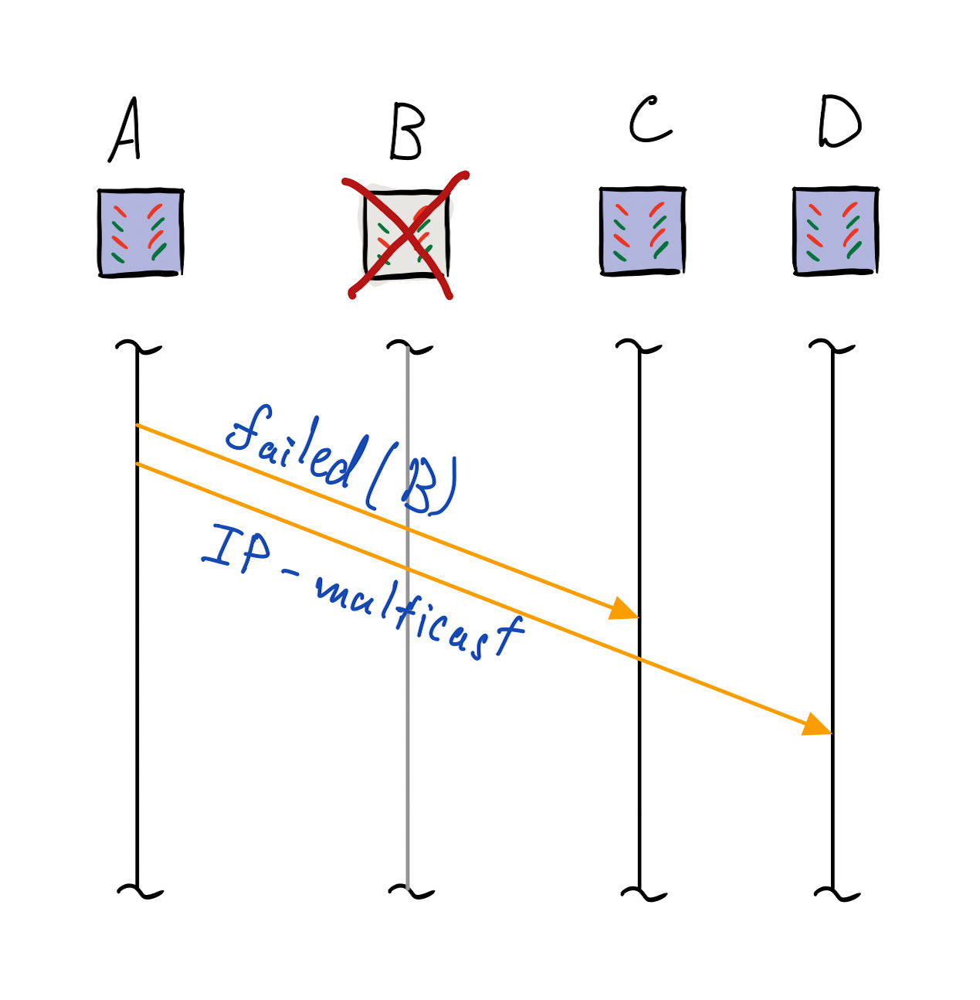
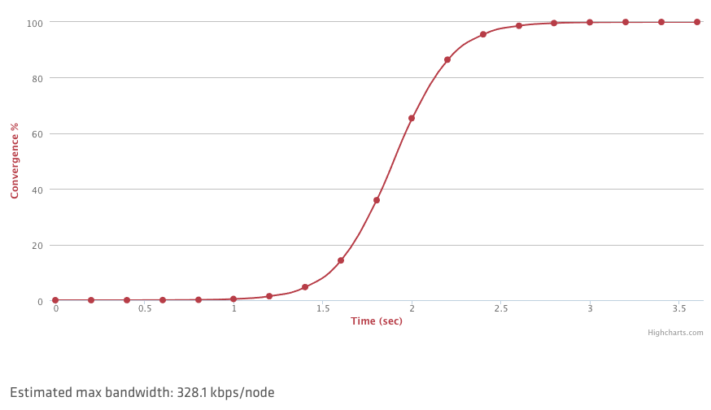
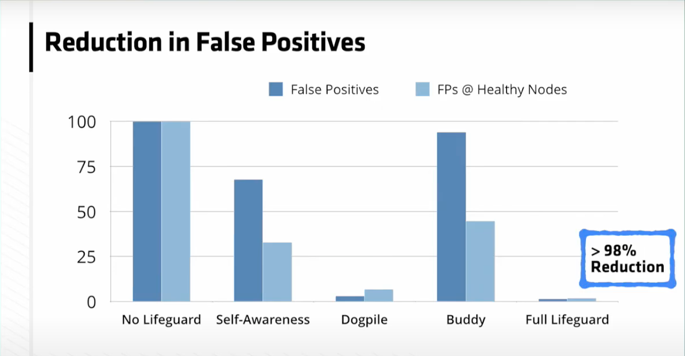

# Семинар 6. Group membership и детектор отказов.

В распределенных системах нужно постоянно мониторить отказы. Необходимость очевидна: чем быстрее и точнее мы понимаем, что сломалось -- тем быстрее мы можем это починить. В рамках этого семинара мы рассмотрим устройство SWIM и Lifeguard -- двух популярных детекторов.

## Виды отказов

Для начала определим отказы узлов, которые мы хотим детектить. Выделяют два больших типа:

- Византийские отказы (byzantine failure) -- узел системы может отправлять некорректные с семантической или синтаксической точек зрения сообщения.
- Отказы типа остановки (crash-stop failure) -- узел системы перестает работать и больше в систему не возвращается.

Пара слов о византийских отказах: их *гораздо* сложнее обнаруживать. Для системы, состоящей из 3f + 1 узлов, мы можем поймать только f отказов, причем доказано, что уже f+1 узел может обмануть любой теоретически возможный детектор.

Важно понимать, что детекторы отказов не отличают сбойный узел от узла, который потерял сетевую связность с другими узлами.

Сегодня мы разберем принципы, позволяющие строить детекторы отказов, а также посмотрим на внутреннее устройство протоколов SWIM и Lifeguard. При этом мы оставим за скобками вопрос византийских отказов.

Есть и более сложные модели отказов, которые мы не рассматриваем в рамках этого курса. Например:

1. [Visigoth Fault Tolerance](https://www.dpss.inesc-id.pt/~rodrigo/vft_eurosys15.pdf)
2. [Gray Failure: The Achilles’ Heel of Cloud-Scale Systems](https://www.microsoft.com/en-us/research/wp-content/uploads/2017/06/paper-1.pdf)
3. [Fail-Slow at Scale: Evidence of Hardware Performance Faults in Large Production Systems](https://www.usenix.org/conference/fast18/presentation/gunawi)
4. [Metastable Failures in Distributed Systems](https://dl.acm.org/doi/pdf/10.1145/3458336.3465286)

## Причины отказов

Предлагаем почитать следующие статьи:

1. [Why Does the Cloud Stop Computing? Lessons from Hundreds of Service Outages](https://ucare.cs.uchicago.edu/pdf/socc16-cos.pdf)
1. [What bugs cause production cloud incidents?](https://people.cs.uchicago.edu/~shanlu/paper/hotos19_azure.pdf)

Для более детального погружения можно разобрать конкретные [постмортемы](https://github.com/danluu/post-mortems).

## А что по доступности?

Часто можно увидеть заявления об уровне доступности в 99.999%, отчего может возникнуть вопрос: а почему бы не поставить 100%? Ответ: к сожалению, это недостижимая отметка -- железо, которое никогда не отказывает, стоит слишком много для практического использования. Для справки можете почитать книжку о SRE в компании Google, она действительно покрывает многие аспекты реального опыта и подробно объясняет, почему 100% невозможно достичь.

Ссылки:

1. [Thinking about Availability in Large Service Infrastructures](https://research.google/pubs/thinking-about-availability-in-large-service-infrastructures/) --
   опыт в компании Google
1. [SRE Books](https://sre.google/books/)

## Как можно было бы реализовать такой сервис?

Есть несколько вариантов, какой протокол можно использовать для определения отказов в РС.

Первым и самым примитивным является механизм ping-pong запросов:

Преимущества -- простая реализация. Недостатки -- большая нагрузка на сеть.

## SWIM

*S*calable *W*eakly-consistent *I*nfection-style Process Group *M*embership Protocol -- протокол, [опубликованный](https://www.cs.cornell.edu/projects/Quicksilver/public_pdfs/SWIM.pdf) в 2002 году. В то время масштабы были совершенно иные и только единичные институты и компании могли иметь около 100+ компьютеров, в статье примеры приведены только лишь на кластере из 55 машин, что в то время являлось огромным достижением.

Важно, что детекторы можно строить с weakly-consistent (то есть когда-нибудь машины кластера узнают) гарантиями.

SWIM в своём основании имеет алгоритм Gossip, но только спрашивается ровно один процесс. Каждый узел A выбирает одного случайного соседа B, которому он отправляет сообщение ping. Узел B, получивший такое сообщение, в ответ отправляет сообщение ack. Если же A видит ответ узла B, то B считается живым процессом. Такие раунды проходят с интервалом $T$, он фиксирован в протоколе и никогда не меняется, даже если сеть начинает деградировать повсеместно, эта одна из отличительных особенностей протокола, о недостатках которой мы поговорим ниже.

Каждый процесс поддерживает список всех известных для него участников системы. В отличие от heartbeats, где каждый узел посылает каждому узлу сообщение о том, что он жив, количество сообщений за один раунд в SWIM растет линейно от количества узлов.

В случае, если ответ не дошел, узел, отправивший изначально запрос, инициирует "дозвон" остальных узлов. В протоколе зафиксировано число $k$ -- количество узлов, которым будет отправлен запрос ping-req. При получении этого запроса, машина должна отправить ping машине под вопросом и ретранслировать ответ обратно. На практике $k$ выбирают константным -- оно выбрано так, потому что если процесс мёртв и не отвечает хотя бы двум независимым, то с большой вероятностью что-то не так с самим процессом. Авторы статьи предлагают брать $k$ равным трём.

В случае, если indirect pings, не сработали, то машина под вопросом объявляется отказавшей, и информация об этом отправляется всем остальным посредствам какого-нибудь gossip протокола (в простейшем случае -- IP Multicast).

Посчитаем вероятности. Пусть $n$ -- количество всего процессов в системе, $q_f$ -- дробная часть количества неотказавших процессов. Также предположим, что у всех процессов есть список всех других из $n$ узлов. Тогда вероятность того, что данный процесс будет выбран в качестве ping равна:

$$1-(1 - \frac{1}{n - 1})^{nq_f}$$

Так происходит, потому что всего живо $nq_f$ процессов, вероятность каждого выбрать не данного равна $1 - \frac{1}{n - 1}$, значит для выбора данного надо вычесть это число из единицы.

Отсюда имеем следующее среднее время детекции отказа при достаточно больших $n$:

$$\frac{T}{1 - e^{-q_f}}$$

При этом, каждый корректный узел может быть объявлен отказавшим из-за потери пакетов сетью. Пусть $q_{ml}$ -- вероятность доставки пакета (это число должно быть достаточно большим, на практике рассчитывают от 0.9-0.95). В статье авторы приводят следующую формулу для вероятности ложного срабатывания детектора из-за потерь пакетов:

$$q_f(1 - q_{ml}^2)(1 - q_fq_{ml}^4)^k\frac{1}{1 - e^{-q_f}}$$

Вывод этой формулы Вы можете посмотреть в [этой статье](https://www.cs.cornell.edu/projects/Quicksilver/public_pdfs/On%20Scalable.pdf), там ничего сложного, предел и простая логика о том, что ping не ответил и все из $k$ упавшие или не доставили хотя бы один из 4 процессов. Последний множитель отвечает за время, сколько мы должны ждать, чтобы процесс был выбран как ping target.

С помощью этой формулы можно подбирать $k$. Например, если 90% процессов работают при 90% доступности сети, то вероятность ложного срабатывания детектора равна около 0.02 при $k=3$. В целом 1-2% это достаточно стандартные числа для классического SWIM протокола в обнаружении ложноположительных результатов.

Когда какой-то процесс замечает, что другой узел является упавшим, то этот процесс начинает рассылать вместе с ping и ping-req запросами информацию о том, кого процесс считает упавшим. Это сделано для того, чтобы об этом обнаружении узнали остальные участники системы. Раунды Gossip позволяют распространять эту информацию достаточно быстро. Эта информация распространяется по дифференциальному уравнению по времени $t$ и математическое ожидание равно:

$$\frac{dx}{dt} = \left(\frac{2}{n} - \frac{1}{n^2}\right)x(n - x) \Rightarrow x = \frac{n}{1 %2B (n - 1)e^{-(2 - 1/n)t}}$$

Относитесь к этой формуле как к скорости распространения по разрезу с вероятностью соединения упавшего (инфицированного) и неупавшего процесса. Получается, что чтобы практически все знали об инфицированном достаточно $O(\log n)$ раундов, на практике берут строго логарифм, и SWIM за это время сходится с большой вероятностью.

Другим доказательством такой асимптотики является тот факт, что случайный граф, где из каждой вершины выходит $2 \log n$ случайных ребёр из каждой вершины с большой вероятностью будет [связным](https://mathoverflow.net/questions/60075/connectivity-of-the-erd%C5%91s-r%C3%A9nyi-random-graph).

В целом при интервале в 0.2 секунды и с 10% потерей пакетов и 10% упавшими узлами сходимость SWIM составит около 3.5 секунд, когда все узнают о состоянии всех других узлов:

## Suspicion Mechanism

Так как железо нестабильно, и иногда узлы могут просто уходить в себя на несколько секунд или просто срабатывать ложноположительные отказы из-за сети, то хочется как-то уменьшать такие проблемы. Конечно, можно увеличивать $k$, но такое решение спасает только от проблемы нестабильности сети, но не от проблемы того, что процесс решит подумать какое-то время. Для этого SWIM (и в последствии Lifeguard) вводит Suspicion механизм, когда другие узлы не сразу считают неответивший процесс упавшим, а "подозревают" его какое-то время. То есть если процесс A не получил подтверждение от процесса B, то A не считает B сразу упавшим, а только подозревает его. Одновременно процесс A рассылает свое подозрение всем остальным процессам при ping и ping-req запросах. Процессы, которые получили такое сообщение, тоже помечают B подозрительным. Подозрительные процессы считаются неупавшими, но если к ним задают ping запрос, и они отвечают, то всем рассылается Alive сообщение.

Далее у подозрительного процесса B есть время $T'$, которое используется для того, чтобы он ответил на ping утвердительно -- показал, что он жив. Это время берётся с запасом, чтобы знать с большой вероятностью, что кто-то сделает ping запрос к этому упавшему процессу.

1. Если процесс B показал, что он жив процессу C, то C начинает распространять эту информацию всем остальным (Alive).
1. Если процесс B в течение таймаута не ответил процессу, то начинается распространение подтверждения информации, о том, что процесс мёртв (Confirm).

У такого подхода есть проблема, что некоторые процессы могут не успеть получить подтверждение и считать процесс B мёртвым (и даже начинать это распространять). Для решения этой проблемы с каждым процессом связан счетчик incarnation number, который может увеличивать только сам процесс. Делает он это тогда, когда обнаруживает, что его подозревают. Также каждый процесс хранит в своём membership list последнее известное ему значение incarnation number другого процесса. Incarnation number добавляется в ответы на ping, и при распространении Alive, новое значение нивелирует все остальные сообщения с меньшими значениями. Сообщение Suspect нивелирует все "меньшие" Suspect и "не большие" Alive, а также все Confirm. А если уж пришло Confirm и не пришло никакое Alive до этого или Suspect, то процесс всё-таки будет считаться умершим. Выбирать $T'$ стоит как $C T \log n$ для достаточной константы $C$, чтобы знать, что сообщения Suspect всем доставятся и не раньше, чем начнётся распространение Confirm.

Такой механизм позволяет уменьшать ложноположительные срабатывания детектора, но в то же время может увеличивать время, когда упавший процесс правильно обнаруживается как упавший. Стоит отметить, что это является расширением протокола, а не его обязательной частью. Часто в реализациях этого протокола эту часть опускают из-за сложности.

SWIM долгое время (да и сейчас) является стандартом в обнаружении отказов в weak consistency модели. Например, система [Tarantool](https://slides.com/gerold103/swim-fosdem2020) использует его.

В системе [Serf](https://github.com/hashicorp/serf) этот алгоритм был долгое время основным методом обнаружения отказов. Было достаточно случаев жалоб пользователей, что при деградации сети или DDOS атаке SWIM не показывал себя лучшим образом. Многие процессы начинали мигать то рабочими, то нерабочими, и SWIM не подстраивался под такие аномалии. В том числе потому, что у этого протокола не существует никакого динамического изменения времен, и такой протокол очень уязвим к временным сложностям в сетевом взаимодействии. Поэтому разработчики Serf пришли к своему протоколу, который они назвали Lifeguard.

## Lifeguard

[Lifeguard](https://arxiv.org/pdf/1707.00788.pdf) в своей основе содержит SWIM с Suspicion Mechanism и некоторыми модификациями. Во-первых, на запросы ping-req при истечении 80% таймаута запроса будет возвращаться nack сообщение. Оно показывает, что что-то долго подозрительный процесс отвечает. Если пришёл ack после nack, то nack нивелируется. Во-вторых, каждый узел хранит о себе специальное число, которое называется $LHM$ (Local Health Multiplier). Это число не может быть меньше 0 и больше $S$ (авторы предлагают брать 8), и по умолчанию равно 0. Изменения этого числа происходят так:

1. -1, если нам ответили ack на ping или ping-req (всё хорошо)
1. +1, если ping не получил ответа (может быть проблема в нас?)
1. +1, если нас заподозрили в падении. Для этого надо дополнить Suspicion Mechanism, чтобы тот кто нас пингует попутно сообщал о том, что нас подозревают.
1. +1, если на ping-req нам не пришёл nack (значит до нас не дошло никакое подтверждение)

Значение $LHM$ линейно увеличивает интервал того, с какой частотой мы пингуем другие процессы, он вычисляется как $T \cdot (LHM + 1)$. Аналогично линейно увеличиваем таймаут ожидания ответов ack на запросы по ping, ping-req. Такой подход помогает лучше понимать своё состояние и достаточно быстро подстраиваться под оптимальные таймауты в зависимости от состояния сети на узле. Такая эвристика называется Local Health Aware Probe.

Другой эвристикой является небольшая модификация Suspicion Mechanism: мы увеличим таймаут при подозрении процесса A, и как только другие процессы начнут также подозревать A, начнём этот таймаут уменьшать, так как если уж и другие стали подозревать процесс, скорее всего проблема стабильна. Также мы введём минимальные и максимальные таймауты, и авторы предлагают уменьшать таймаут с логарифмическим шагом:

$$SuspicionTimeout = \max(Min, Max - (Max - Min)\frac{\log(C + 1)}{\log(k + 1)})$$

Где $C$ -- количество подтверждающих процессов о том, что процесс A подозрительный. Min и Max авторы советуют брать как $5 \log_{10}(n) T$ и $6 Min$ соответственно. Интуицию за константами можете посмотреть в оригинальной [статье](https://arxiv.org/pdf/1707.00788.pdf). Эту эвристику авторы назвали Local Health Aware Suspicion (на рисунке ниже Dogpile).

И последняя эвристика -- рассылать suspicion идентификатор при запросе ping. Как уже показано выше в Local Health Aware Probe это нужно для лучшего подстраивания таймаутов и на 1 раунд более быстрого распространения Alive сообщения. Эта эвристика называется Buddy System.

В итоге получается сильное сокращение ложноположительных результатов (>98%), как и по отдельности, так и вместе при практически любых конфигурациях падений:

Количество сообщений у Lifeguard протокола больше, так как надо посылать обратно nack. Время обнаружения тоже должно увеличиться, потому что надо дольше ждать, чем в стандартном Suspicion Mechanism. Автор в докладе рассказывает, что на медиане наблюдалось только 2% замедление обнаружения отказов, а также 7% и 16% на 99 и 99.9 перцентилях. А количество сообщений и данных увеличилось в среднем на 12% при достаточно нестабильной сети >20% падений и на только 3%, если система достаточно стабильна (не более 1% падений).

Этот протокол был внедрён в системы Serf и Consul и хорошо себя зарекомендовал. Советуем посмотреть доклады одного из авторов Lifeguard:

- [Making Gossip More Robust with Lifeguard](https://www.youtube.com/watch?v=u-a7rVJ6jZY)
- [Lifeguard: Failure Detection in the Era of Gray Failures](https://www.hashicorp.com/resources/failure-detection-in-the-era-of-gray-failures)

## Другие детекторы отказов

1. [The Phi Accrual Failure Detector](http://paperhub.s3.amazonaws.com/f516fdfa940caa08c679d3946b273128.pdf) — используется в [Cassandra](https://docs.datastax.com/en/cassandra-oss/3.0/cassandra/architecture/archDataDistributeFailDetect.html) и [Akka](https://doc.akka.io/docs/akka/current/typed/failure-detector.html)
2. [FALCON](https://www.cs.utexas.edu/falcon/papers/falcon-sosp11.pdf) и [Albatross](https://www.cs.utexas.edu/falcon/papers/albatross-eurosys2015.pdf) - надежные детекторы, которые никогда не ошибаются за счёт остановки или изоляции подозреваемых компонентов 
